# System Architecture — Google Photos Vague-Memory Retrieval

> Derived from the [problemstatement.md](file:///d:/DRIVE%20F/GRAD_GOOGLEPICS/DOCS/problemstatement.md). Every architectural decision traces back to a specific requirement in the reviewer brief.

---

## Table of Contents

- [1. System Overview](#1-system-overview)
- [2. Architecture Principles](#2-architecture-principles)
- [3. Technology Stack](#3-technology-stack)
- [4. High-Level System Diagram](#4-high-level-system-diagram)
- [5. Application Layers](#5-application-layers)
- [6. Database Schema](#6-database-schema)
- [7. AI Provider Abstraction](#7-ai-provider-abstraction)
- [8. Discovery Engine Pipeline](#8-discovery-engine-pipeline)
- [9. Image Indexing Pipeline](#9-image-indexing-pipeline)
- [10. Retrieval Engine Architecture](#10-retrieval-engine-architecture)
- [11. Research & Interview Subsystem](#11-research--interview-subsystem)
- [12. Testing & Analytics Subsystem](#12-testing--analytics-subsystem)
- [13. Page / Screen Map](#13-page--screen-map)
- [14. API Route Design](#14-api-route-design)
- [15. Repository Structure](#15-repository-structure)
- [16. Environment Variables](#16-environment-variables)
- [17. Data Flow Diagrams](#17-data-flow-diagrams)
- [18. Development Modes](#18-development-modes)
- [19. Security & Privacy Architecture](#19-security--privacy-architecture)
- [20. Implementation Phases](#20-implementation-phases)
- [21. Dependencies](#21-dependencies)
- [22. Development Assumptions](#22-development-assumptions)

---

## 1. System Overview

The system is a **single integrated web application** that serves two distinct but connected purposes:

| Domain | Purpose | Reviewer Requirement |
|--------|---------|---------------------|
| **Research Platform** | AI-powered discovery engine, evidence analysis, interview repository, problem definition | Requirements 1–4 |
| **Retrieval MVP** | Functional AI-native photo retrieval prototype with testing and metrics | Requirements 5–8 |

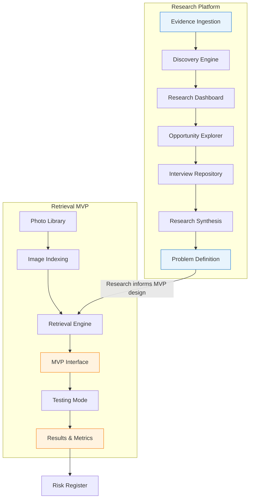

---

## 2. Architecture Principles

| Principle | Rationale | Source |
|-----------|-----------|--------|
| **Research-first, solution-agnostic** | MVP form factor is determined by research, not assumed upfront | §2, §19 |
| **Evidence provenance** | Every insight must trace back to source evidence | §5, §7, §35 |
| **AI provider abstraction** | No tight coupling to a single LLM/embedding provider | §37 |
| **Modular retrieval signals** | Each indexing signal is independent; no single representation assumed | §23, §25 |
| **Uncertainty-aware** | Soft confidence scores instead of hard binary filters | §26 |
| **Demo/Research mode separation** | Synthetic data never masquerades as real research | §41, §42 |
| **Privacy by design** | No silent external API calls with private photos | §40 |
| **Functional prototype** | Must be usable end-to-end, not just a static mockup | §20 |
| **Labeled information** | EVIDENCE / OBSERVATION / HYPOTHESIS / DECISION always distinguished | §35 |

---

## 3. Technology Stack

### Chosen Stack with Rationale

| Layer | Technology | Rationale |
|-------|-----------|-----------|
| **Framework** | Next.js 15 (App Router) | Full-stack React framework; SSR for dashboard, API routes for backend; recommended in §37 |
| **Language** | TypeScript | Type safety across the full stack; recommended in §37 |
| **UI Library** | React 19 | Component-based UI; recommended in §37 |
| **Styling** | Tailwind CSS v4 | Rapid, consistent styling; recommended in §37 |
| **Database** | SQLite via `better-sqlite3` + Drizzle ORM | Lightweight local-first for MVP; production-upgradeable to PostgreSQL; per §37 |
| **Vector Store** | Chroma (local) | Local vector DB for embeddings; no infra dependency; per §37 |
| **AI Providers** | Gemini / OpenAI / Groq (abstracted) | Provider abstraction layer; per §37 |
| **Image Understanding** | CLIP (via `@xenova/transformers`) + Multimodal LLM | Local embeddings + optional cloud multimodal; per §37 |
| **OCR** | Tesseract.js (local) | No external API needed for text extraction; per §37 |
| **Charts** | Recharts | Clean, readable data visualization; per §44 UX requirements |
| **State Management** | React Server Components + `nuqs` for URL state | Minimal client JS; evidence explorer filters via URL |
| **File Processing** | `sharp` (images), `exifr` (EXIF) | Metadata extraction pipeline; per §23 |

> [!NOTE]
> **Decision**: SQLite over PostgreSQL for MVP phase. This eliminates database server setup for reviewers and testers. Drizzle ORM enables migration to PostgreSQL/Supabase when needed without schema rewrites.

> [!NOTE]
> **Decision**: Chroma over pgvector for MVP. Local-only vector store avoids requiring PostgreSQL extensions. Can be swapped to pgvector in production.

---

## 4. High-Level System Diagram

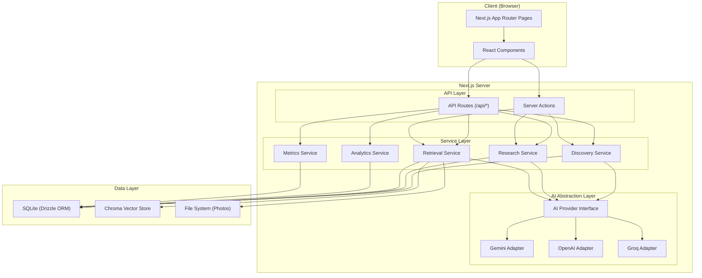

---

## 5. Application Layers

### Layer Responsibilities

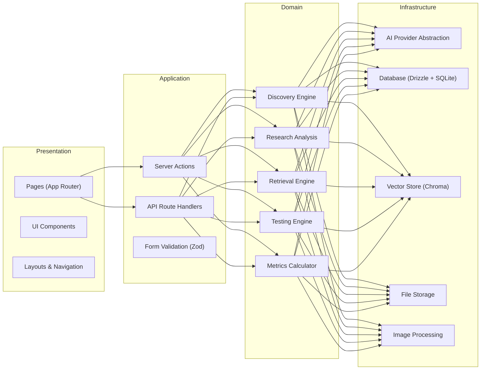

| Layer | Responsibility | Key Constraint |
|-------|---------------|----------------|
| **Presentation** | Rendering screens, user interaction, evidence labeling | Must apply EVIDENCE/OBSERVATION/HYPOTHESIS/DECISION labels (§35) |
| **Application** | Request handling, validation, orchestration | Enforce Demo vs Research mode separation (§42) |
| **Domain** | Business logic, pipeline execution, analysis | Solution-agnostic until research phase completes (§19) |
| **Infrastructure** | External services, storage, AI calls | Provider-abstracted; privacy-enforced (§37, §40) |

---

## 6. Database Schema

### Entity-Relationship Diagram

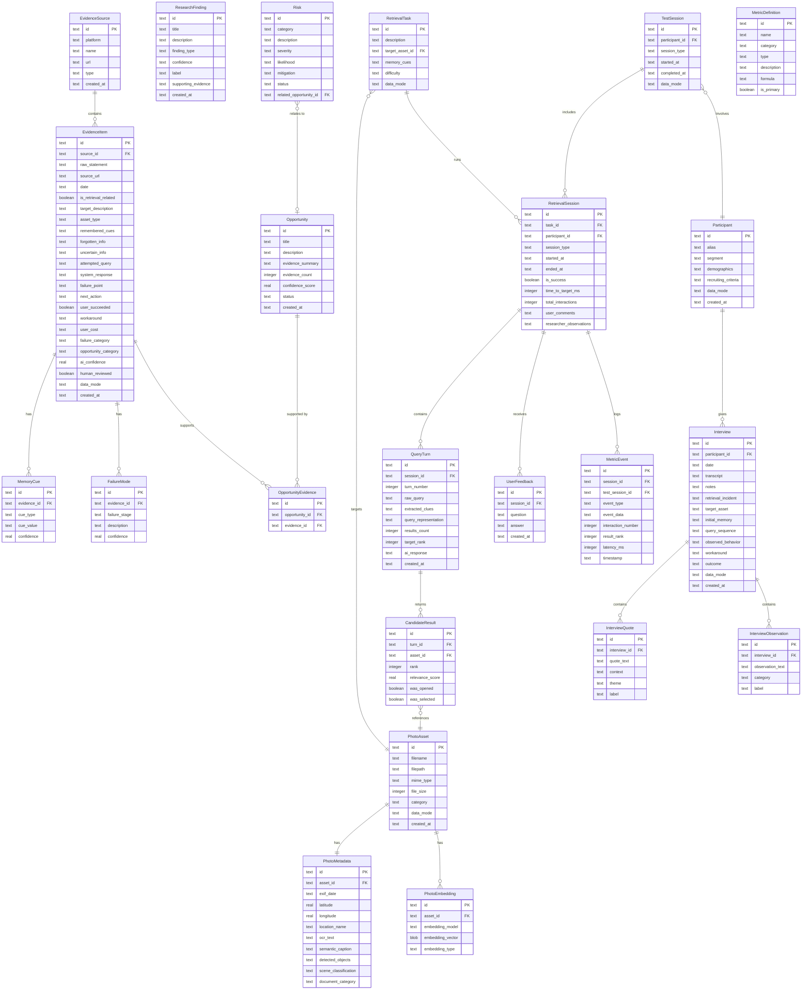

### Key Schema Decisions

| Decision | Rationale |
|----------|-----------|
| `data_mode` column on key tables | Separates DEMO vs REAL data without separate databases (§41, §42) |
| `label` column on quotes/observations | Enforces EVIDENCE/OBSERVATION/HYPOTHESIS/DECISION classification (§35) |
| `ai_confidence` as float | Supports confidence-graded display (§36) |
| Separate `PhotoMetadata` from `PhotoAsset` | Modular indexing signals; each signal populated independently (§23) |
| `embedding_type` on `PhotoEmbedding` | Supports multiple embedding models per asset (§24) |
| `session_type` on `RetrievalSession` | Distinguishes `baseline` vs `mvp` sessions for comparison (§27, §31) |
| `OpportunityEvidence` junction table | Many-to-many: each opportunity links to its supporting evidence (§8.5) |

---

## 7. AI Provider Abstraction

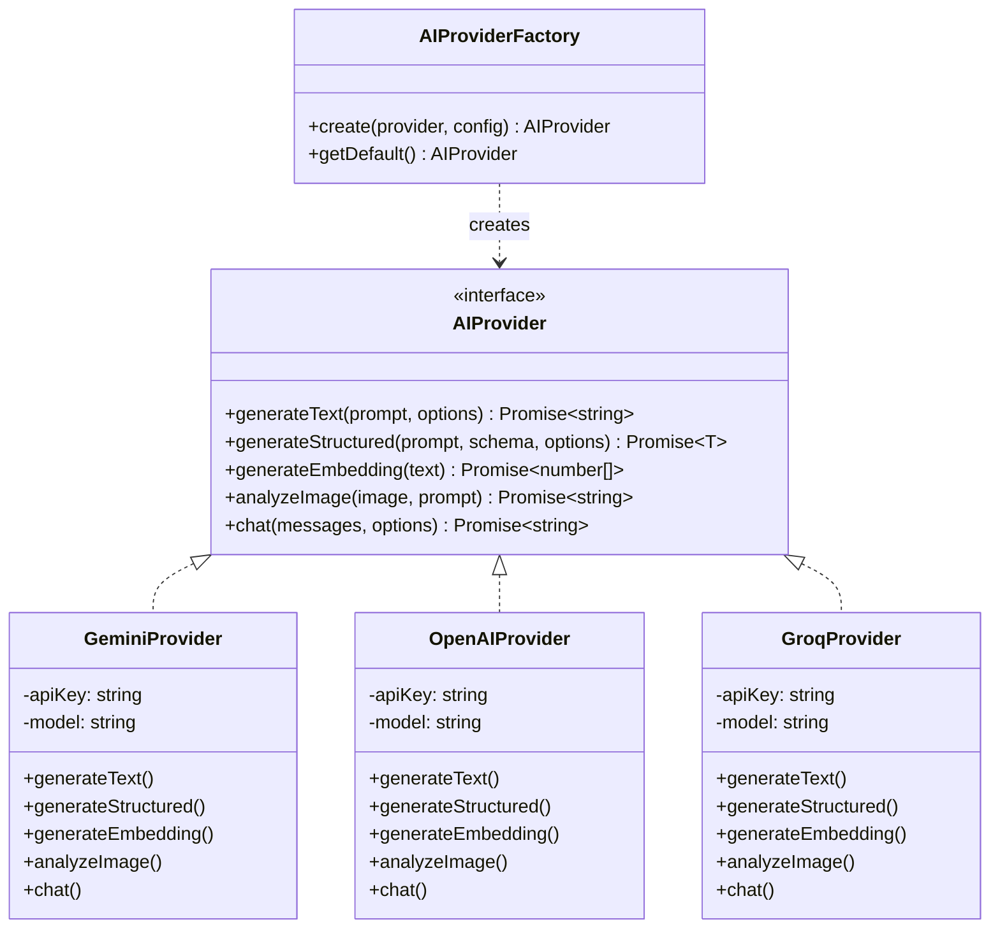

### Provider Capabilities Matrix

| Capability | Used By | Gemini | OpenAI | Groq |
|------------|---------|--------|--------|-----------|
| Text generation | Discovery, Research, Problem Definition | ✅ | ✅ | ✅ |
| Structured extraction | Evidence parsing, Interview coding | ✅ | ✅ | ✅ |
| Text embeddings | Evidence clustering, Query matching | ✅ | ✅ | — |
| Image analysis | Photo captioning, Object detection | ✅ | ✅ | ✅ |
| Chat/conversation | MVP retrieval refinement | ✅ | ✅ | ✅ |

### Embedding Strategy

| Use Case | Model | Dimension | Store |
|----------|-------|-----------|-------|
| Evidence text similarity | Provider text embedding | 768–1536 | Chroma |
| Photo semantic search | CLIP (`ViT-B/32` via Transformers.js) | 512 | Chroma |
| Photo caption search | Provider text embedding | 768–1536 | Chroma |

---

## 8. Discovery Engine Pipeline

*Implements §4–§8 requirements.*

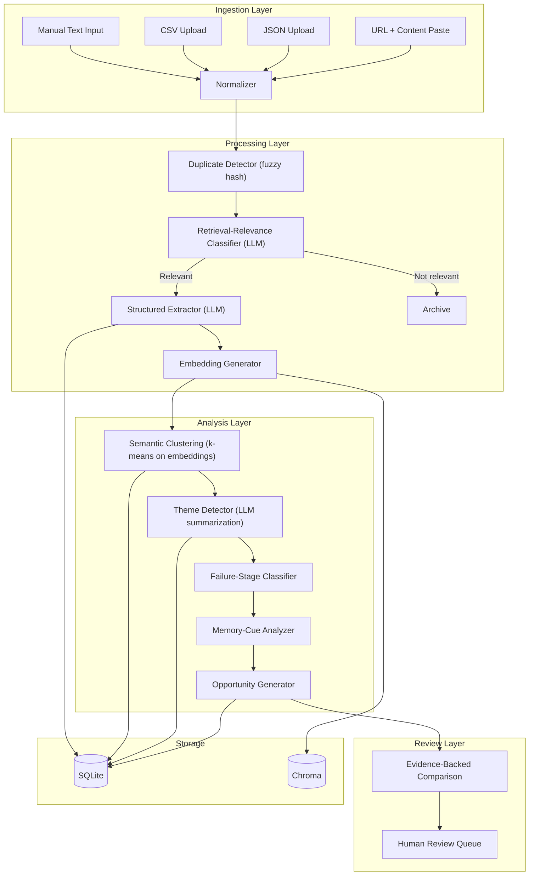

### Pipeline Stage Details

| Stage | Implementation | AI Used? | Output |
|-------|---------------|----------|--------|
| **Normalization** | Strip HTML, normalize whitespace, extract metadata | No | Clean text + metadata |
| **Dedup** | SimHash / MinHash similarity | No | Deduplicated evidence set |
| **Relevance Classification** | LLM zero-shot classification | Yes | `is_retrieval_related` boolean |
| **Structured Extraction** | LLM structured output (Zod schema) | Yes | Populates `EvidenceItem` fields per §5 schema |
| **Embedding** | Provider text embedding model | Yes | Vector stored in Chroma |
| **Clustering** | k-means on embedding vectors | No | Cluster assignments |
| **Theme Detection** | LLM summarization of clusters | Yes | Theme labels and descriptions |
| **Failure Classification** | LLM maps to taxonomy from §6.3 | Yes | `FailureMode` records |
| **Memory-Cue Analysis** | LLM maps to taxonomy from §6.1/§6.2 | Yes | `MemoryCue` records |
| **Opportunity Generation** | LLM synthesizes themes → opportunities | Yes | `Opportunity` records with evidence links |

### Evidence Extraction Schema (Zod)

```typescript
const EvidenceExtractionSchema = z.object({
  isRetrievalRelated: z.boolean(),
  targetDescription: z.string().optional(),
  assetType: z.enum(["photo", "video", "screenshot", "document", "receipt", "medicine", "place", "person", "food", "other"]),
  rememberedCues: z.array(z.object({
    type: z.string(),
    value: z.string(),
    confidence: z.number().min(0).max(1),
  })),
  forgottenInfo: z.array(z.string()),
  uncertainInfo: z.array(z.string()),
  attemptedQuery: z.string().optional(),
  systemResponse: z.string().optional(),
  failurePoint: z.string().optional(),
  nextAction: z.string().optional(),
  userSucceeded: z.boolean().optional(),
  workaround: z.string().optional(),
  userCost: z.enum(["time", "effort", "frustration", "abandonment", "no_result"]).optional(),
  failureCategory: z.string().optional(),
  opportunityCategory: z.string().optional(),
  aiConfidence: z.number().min(0).max(1),
});
```

---

## 9. Image Indexing Pipeline

*Implements §23 requirements.*

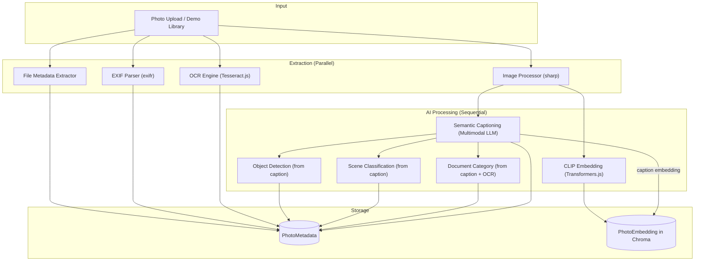

### Signal Modularity

Each signal is stored independently and queried independently during retrieval:

| Signal | Source | Storage | Used in Retrieval As |
|--------|--------|---------|---------------------|
| File metadata | `sharp` | SQLite `PhotoMetadata` | Filename match |
| EXIF date | `exifr` | SQLite `PhotoMetadata` | Temporal filter (soft/hard) |
| EXIF location | `exifr` | SQLite `PhotoMetadata` | Location filter (soft/hard) |
| OCR text | `tesseract.js` | SQLite `PhotoMetadata` | Full-text search |
| CLIP embedding | `@xenova/transformers` | Chroma | Semantic similarity |
| Caption | Multimodal LLM | SQLite `PhotoMetadata` | Text search + embedding |
| Caption embedding | Text embedding | Chroma | Semantic similarity |
| Objects | Extracted from caption | SQLite `PhotoMetadata` (JSON) | Object filter |
| Scene | Extracted from caption | SQLite `PhotoMetadata` | Scene filter |
| Document type | OCR + caption | SQLite `PhotoMetadata` | Category filter |

---

## 10. Retrieval Engine Architecture

*Implements §25, §26 requirements. Solution-agnostic shell — specific interaction pattern determined by research (§19).*

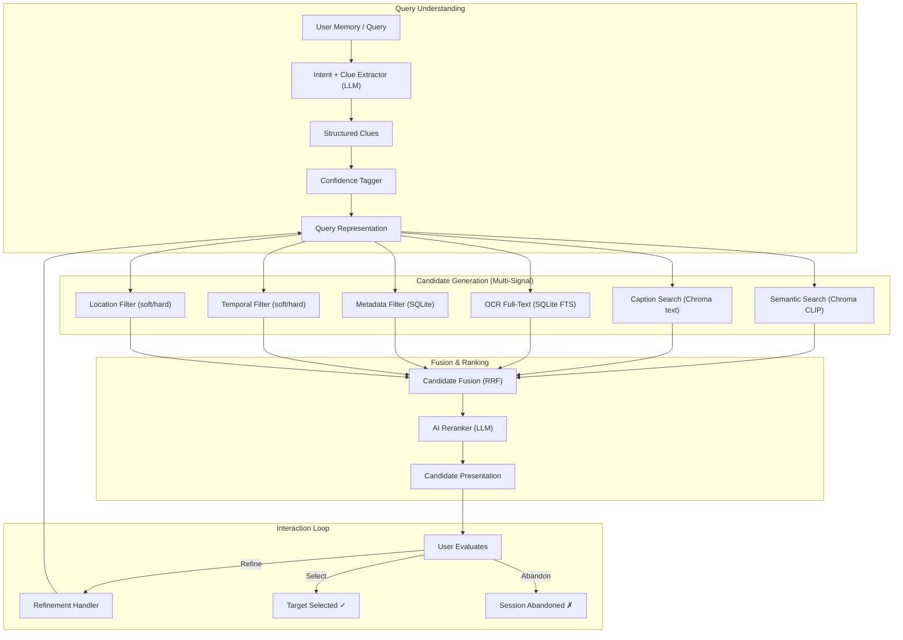

### Uncertainty Handling (§26)

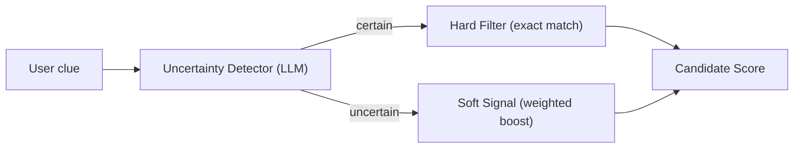

| Uncertainty Signal | Detection Pattern | Retrieval Behavior |
|-------------------|-------------------|-------------------|
| `"It was in Goa"` | No hedging language | Hard filter: `location = 'Goa'` |
| `"Maybe during 2022"` | Hedging: "maybe", "I think", "around" | Soft boost: weight `year ≈ 2022` with decay |
| `"I think Rahul was there"` | Hedging: "I think" | Soft boost: `person ≈ 'Rahul'` with reduced weight |

### Fusion Strategy: Reciprocal Rank Fusion (RRF)

```
score(asset) = Σ  1 / (k + rank_signal(asset))  ×  signal_weight  ×  confidence_modifier
              signal
```

Where:
- `k = 60` (standard RRF constant)
- `signal_weight` is per-signal importance (tunable)
- `confidence_modifier` is `1.0` for certain clues, `0.3–0.7` for uncertain clues

---

## 11. Research & Interview Subsystem

*Implements §12–§18 requirements.*

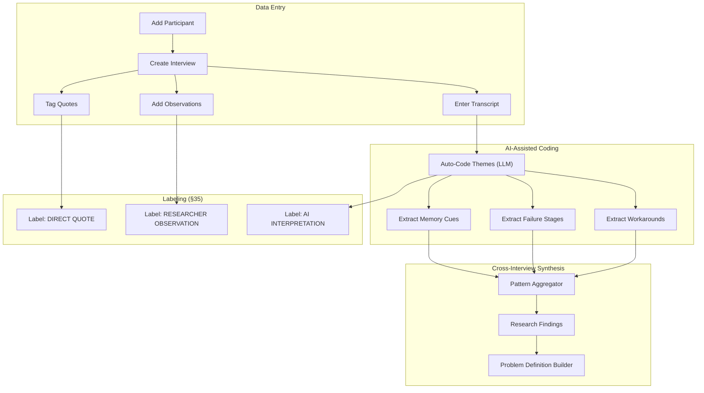

### Label Enforcement

Every piece of information stored in the research subsystem carries a mandatory `label` field:

```typescript
type InformationLabel = "EVIDENCE" | "OBSERVATION" | "HYPOTHESIS" | "DECISION";
type QuoteLabel = "DIRECT_QUOTE" | "RESEARCHER_OBSERVATION" | "AI_INTERPRETATION" | "HYPOTHESIS";
```

---

## 12. Testing & Analytics Subsystem

*Implements §28–§31, §43 requirements.*

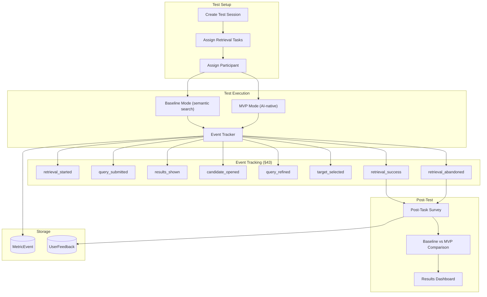

### Event Schema

```typescript
interface MetricEvent {
  id: string;
  sessionId: string;
  testSessionId: string;
  eventType: 
    | "retrieval_started" | "query_submitted" | "results_shown"
    | "candidate_opened"  | "query_refined"   | "filter_applied"
    | "ai_question_shown" | "ai_question_answered"
    | "target_selected"   | "retrieval_success" | "retrieval_abandoned"
    | "task_completed";
  eventData: Record<string, unknown>;  // Event-specific payload
  interactionNumber: number;
  resultRank: number | null;
  latencyMs: number | null;
  timestamp: string;
}
```

### Comparison Metrics (§31)

| Metric | Computation | Baseline vs MVP |
|--------|------------|-----------------|
| Success rate | `successful_sessions / total_sessions` | Side-by-side |
| Time to target | `ended_at - started_at` for successful sessions | Median comparison |
| Query/refinement count | Count of `query_submitted` + `query_refined` events | Mean comparison |
| Target rank | Rank of target asset in final result set | Mean comparison |
| Abandonment rate | `retrieval_abandoned / total_sessions` | Side-by-side |
| Subjective difficulty | Post-task survey rating | Mean comparison |

---

## 13. Page / Screen Map

*Implements §34 requirements. 16 screens in one integrated application.*

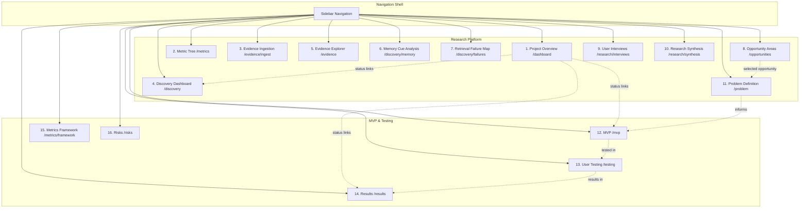

### Screen Detail Table

| # | Screen | Route | Primary Data | Key Interactions |
|---|--------|-------|-------------|------------------|
| 1 | Project Overview | `/dashboard` | Project status, stage, counts | Navigate to any section |
| 2 | Metric Tree | `/metrics` | Business metric decomposition | Expand/collapse nodes, edit branches |
| 3 | Evidence Ingestion | `/evidence/ingest` | Ingestion forms, upload status | Paste text, upload CSV/JSON, submit URLs |
| 4 | Discovery Dashboard | `/discovery` | Aggregate insights, charts | Filter by source, date, category |
| 5 | Evidence Explorer | `/evidence` | Individual evidence items | Filter, search, inspect, review |
| 6 | Memory Cue Analysis | `/discovery/memory` | Remember vs forget visualization | Toggle cue types, inspect evidence |
| 7 | Retrieval Failure Map | `/discovery/failures` | Failure funnel, stage breakdown | Click stage → see evidence |
| 8 | Opportunity Areas | `/opportunities` | Opportunity comparison table | Compare evidence counts, confidence |
| 9 | User Interviews | `/research/interviews` | Participant list, interview details | Add participant, enter transcript, tag quotes |
| 10 | Research Synthesis | `/research/synthesis` | Cross-participant patterns | View themes, agreement, differences |
| 11 | Problem Definition | `/problem` | Template + evidence links | Edit definition, link evidence |
| 12 | MVP | `/mvp` | Photo library + retrieval interface | Search, refine, select photos |
| 13 | User Testing | `/testing` | Test sessions, task assignment | Create session, assign tasks, run tests |
| 14 | Results | `/results` | Baseline vs MVP comparison | View metrics, charts, evidence |
| 15 | Metrics Framework | `/metrics/framework` | Metric definitions, values | Define primary/leading/diagnostic/guardrail |
| 16 | Risks | `/risks` | Risk register | Add/edit risks, link mitigations |

---

## 14. API Route Design

### Route Structure

```
/api
├── /evidence
│   ├── GET    /                    # List evidence (with filters)
│   ├── POST   /                    # Create evidence item
│   ├── GET    /:id                 # Get single evidence item
│   ├── PATCH  /:id                 # Update evidence item
│   ├── DELETE /:id                 # Delete evidence item
│   ├── POST   /ingest/text         # Ingest from text paste
│   ├── POST   /ingest/csv          # Ingest from CSV upload
│   ├── POST   /ingest/json         # Ingest from JSON upload
│   └── POST   /ingest/url          # Ingest from URL + content
│
├── /discovery
│   ├── GET    /overview             # Dashboard aggregates
│   ├── GET    /memory-cues          # Memory cue analysis
│   ├── GET    /failure-map          # Failure stage breakdown
│   ├── POST   /process              # Trigger pipeline on batch
│   └── GET    /clusters             # Semantic clusters
│
├── /opportunities
│   ├── GET    /                     # List opportunities
│   ├── GET    /:id                  # Get opportunity + evidence
│   ├── POST   /                     # Create opportunity
│   └── PATCH  /:id                  # Update opportunity
│
├── /research
│   ├── /participants
│   │   ├── GET    /                 # List participants
│   │   ├── POST   /                 # Create participant
│   │   └── GET    /:id              # Get participant details
│   │
│   ├── /interviews
│   │   ├── GET    /                 # List interviews
│   │   ├── POST   /                 # Create interview
│   │   ├── GET    /:id              # Get interview details
│   │   ├── PATCH  /:id              # Update interview
│   │   ├── POST   /:id/quotes       # Add quote
│   │   ├── POST   /:id/observations # Add observation
│   │   └── POST   /:id/analyze      # AI-assisted coding
│   │
│   ├── /synthesis
│   │   └── GET    /                 # Cross-interview analysis
│   │
│   └── /findings
│       ├── GET    /                 # List research findings
│       └── POST   /                 # Create finding
│
├── /problem
│   ├── GET    /                     # Get problem definition
│   └── PATCH  /                     # Update problem definition
│
├── /photos
│   ├── GET    /                     # List photo assets
│   ├── POST   /upload               # Upload photos
│   ├── POST   /seed                 # Load demo library
│   ├── GET    /:id                  # Get photo + metadata
│   ├── GET    /:id/image            # Serve photo file
│   └── POST   /index                # Trigger indexing pipeline
│
├── /retrieval
│   ├── POST   /search               # Execute retrieval query
│   ├── POST   /refine               # Refine previous query
│   └── POST   /clues                # Extract clues from text
│
├── /testing
│   ├── /sessions
│   │   ├── GET    /                 # List test sessions
│   │   ├── POST   /                 # Create test session
│   │   └── GET    /:id              # Get session details
│   │
│   ├── /tasks
│   │   ├── GET    /                 # List retrieval tasks
│   │   ├── POST   /                 # Create task
│   │   └── GET    /:id              # Get task details
│   │
│   └── /events
│       └── POST   /                 # Log metric event
│
├── /results
│   ├── GET    /comparison            # Baseline vs MVP
│   └── GET    /metrics               # Computed metrics
│
├── /metrics
│   ├── GET    /tree                  # Metric tree data
│   ├── PATCH  /tree                  # Update metric tree
│   ├── GET    /definitions           # Metric definitions
│   └── POST   /definitions           # Create metric definition
│
├── /risks
│   ├── GET    /                      # List risks
│   ├── POST   /                      # Create risk
│   └── PATCH  /:id                   # Update risk
│
└── /system
    ├── GET    /status                # App health + mode
    ├── POST   /reset                 # Reset all data
    └── GET    /config                # Non-secret configuration
```

---

## 15. Repository Structure

```
google-photos-retrieval/
│
├── app/                              # Next.js App Router
│   ├── layout.tsx                    # Root layout + sidebar nav
│   ├── page.tsx                      # Redirect → /dashboard
│   ├── dashboard/
│   │   └── page.tsx                  # Screen 1: Project Overview
│   ├── metrics/
│   │   ├── page.tsx                  # Screen 2: Metric Tree
│   │   └── framework/
│   │       └── page.tsx              # Screen 15: Metrics Framework
│   ├── evidence/
│   │   ├── page.tsx                  # Screen 5: Evidence Explorer
│   │   └── ingest/
│   │       └── page.tsx              # Screen 3: Evidence Ingestion
│   ├── discovery/
│   │   ├── page.tsx                  # Screen 4: Discovery Dashboard
│   │   ├── memory/
│   │   │   └── page.tsx              # Screen 6: Memory Cue Analysis
│   │   └── failures/
│   │       └── page.tsx              # Screen 7: Retrieval Failure Map
│   ├── opportunities/
│   │   └── page.tsx                  # Screen 8: Opportunity Areas
│   ├── research/
│   │   ├── interviews/
│   │   │   ├── page.tsx              # Screen 9: User Interviews
│   │   │   └── [id]/
│   │   │       └── page.tsx          # Interview detail
│   │   └── synthesis/
│   │       └── page.tsx              # Screen 10: Research Synthesis
│   ├── problem/
│   │   └── page.tsx                  # Screen 11: Problem Definition
│   ├── mvp/
│   │   └── page.tsx                  # Screen 12: MVP Retrieval Interface
│   ├── testing/
│   │   ├── page.tsx                  # Screen 13: User Testing
│   │   └── [sessionId]/
│   │       └── page.tsx              # Active test session
│   ├── results/
│   │   └── page.tsx                  # Screen 14: Results
│   └── risks/
│       └── page.tsx                  # Screen 16: Risks
│
├── components/
│   ├── ui/                           # Primitives (button, card, input, etc.)
│   ├── layout/                       # Sidebar, header, navigation
│   ├── evidence/                     # Evidence cards, filters, tables
│   ├── discovery/                    # Charts, funnel, memory analysis
│   ├── research/                     # Interview forms, quote tags
│   ├── retrieval/                    # Search interface, results grid
│   ├── testing/                      # Test runner, event logger
│   ├── metrics/                      # Metric tree, definitions
│   └── shared/                       # Labels, confidence badges, mode indicator
│
├── lib/
│   ├── ai/
│   │   ├── provider.ts              # AIProvider interface
│   │   ├── factory.ts               # AIProviderFactory
│   │   ├── gemini.ts                # Gemini adapter
│   │   ├── openai.ts                # OpenAI adapter
│   │   ├── groq.ts                  # Groq adapter
│   │   └── schemas/                  # Zod schemas for structured output
│   │       ├── evidence.ts
│   │       ├── clues.ts
│   │       └── interview.ts
│   ├── retrieval/
│   │   ├── engine.ts                # Retrieval orchestrator
│   │   ├── clue-extractor.ts        # Intent + clue extraction
│   │   ├── uncertainty.ts           # Confidence tagging
│   │   ├── candidate-generator.ts   # Multi-signal candidate generation
│   │   ├── fusion.ts                # RRF fusion
│   │   └── reranker.ts              # AI reranking
│   ├── research/
│   │   ├── interview-coder.ts       # AI-assisted interview coding
│   │   ├── synthesizer.ts           # Cross-interview synthesis
│   │   └── problem-builder.ts       # Problem definition generator
│   ├── discovery/
│   │   ├── pipeline.ts              # Full discovery pipeline orchestrator
│   │   ├── normalizer.ts            # Text cleaning
│   │   ├── deduplicator.ts          # SimHash dedup
│   │   ├── classifier.ts            # Relevance classification
│   │   ├── extractor.ts             # Structured extraction
│   │   ├── clusterer.ts             # Embedding clustering
│   │   └── theme-detector.ts        # Theme summarization
│   ├── embeddings/
│   │   ├── clip.ts                  # CLIP embedding via Transformers.js
│   │   ├── text.ts                  # Text embedding via AI provider
│   │   └── store.ts                 # Chroma client wrapper
│   ├── indexing/
│   │   ├── pipeline.ts              # Image indexing orchestrator
│   │   ├── metadata.ts              # File metadata extraction
│   │   ├── exif.ts                  # EXIF parser
│   │   ├── ocr.ts                   # Tesseract.js wrapper
│   │   └── captioner.ts             # Multimodal LLM captioning
│   ├── analytics/
│   │   ├── tracker.ts               # Event tracking client
│   │   ├── calculator.ts            # Metric computation
│   │   └── comparator.ts            # Baseline vs MVP comparison
│   ├── database/
│   │   ├── client.ts                # Drizzle + SQLite connection
│   │   ├── schema.ts                # Drizzle schema definitions
│   │   └── migrations/              # Database migrations
│   └── utils/
│       ├── ids.ts                    # UUID generation
│       ├── dates.ts                  # Date formatting
│       └── validation.ts            # Shared Zod schemas
│
├── api/                              # Next.js Route Handlers
│   ├── evidence/
│   ├── discovery/
│   ├── opportunities/
│   ├── research/
│   ├── photos/
│   ├── retrieval/
│   ├── testing/
│   ├── results/
│   ├── metrics/
│   ├── risks/
│   └── system/
│
├── data/
│   ├── seed/
│   │   ├── evidence.json             # Demo evidence items
│   │   ├── interviews.json           # Demo interview templates
│   │   └── tasks.json                # Demo retrieval tasks
│   └── demo-library/                 # Demo photo dataset
│       ├── travel/
│       ├── food/
│       ├── screenshots/
│       ├── medicines/
│       ├── receipts/
│       ├── documents/
│       ├── people/
│       ├── pets/
│       ├── events/
│       └── landmarks/
│
├── tests/
│   ├── unit/
│   ├── integration/
│   └── e2e/
│
├── docs/
│   ├── problemstatement.md
│   ├── architecture.md               # This document
│   ├── PROJECT_BRIEF.md
│   ├── RESEARCH_METHOD.md
│   ├── DISCOVERY_ENGINE.md
│   ├── METRIC_TREE.md
│   ├── INTERVIEW_GUIDE.md
│   ├── RESEARCH_FINDINGS.md
│   ├── PROBLEM_DEFINITION.md
│   ├── MVP_HYPOTHESIS.md
│   ├── MVP_ARCHITECTURE.md
│   ├── USER_TEST_PLAN.md
│   ├── USER_TEST_RESULTS.md
│   ├── METRICS.md
│   ├── RISKS.md
│   └── NEXT_ITERATION.md
│
├── public/
│   └── images/
│
├── .env.example
├── .env.local                        # (git-ignored)
├── .gitignore
├── drizzle.config.ts
├── next.config.ts
├── package.json
├── tailwind.config.ts
├── tsconfig.json
└── README.md
```

---

## 16. Environment Variables

```bash
# ─── Application ───────────────────────────────
APP_MODE=demo                         # "demo" | "research"
APP_PORT=3000
DATABASE_URL=file:./data/app.db       # SQLite file path
CHROMA_URL=http://localhost:8000      # Chroma vector store URL (if remote)
CHROMA_COLLECTION=photos              # Default collection name

# ─── AI Providers (configure at least one) ─────
AI_PROVIDER=gemini                    # "gemini" | "openai" | "groq"

# Gemini
GEMINI_API_KEY=
GEMINI_MODEL=gemini-2.0-flash
GEMINI_EMBEDDING_MODEL=text-embedding-004

# OpenAI
OPENAI_API_KEY=
OPENAI_MODEL=gpt-4o
OPENAI_EMBEDDING_MODEL=text-embedding-3-small

# Groq
GROQ_API_KEY=
GROQ_MODEL=llama3-70b-8192

# ─── Image Processing ─────────────────────────
CLIP_MODEL=Xenova/clip-vit-base-patch32   # Local CLIP model
OCR_LANGUAGE=eng                          # Tesseract language

# ─── Feature Flags ────────────────────────────
ENABLE_AUTO_INDEXING=true             # Auto-index on upload
ENABLE_AI_EXTRACTION=true             # AI pipeline in discovery
MAX_UPLOAD_SIZE_MB=50                 # Per-file upload limit
MAX_BATCH_SIZE=100                    # Evidence batch processing limit
```

---

## 17. Data Flow Diagrams

### End-to-End Research Flow

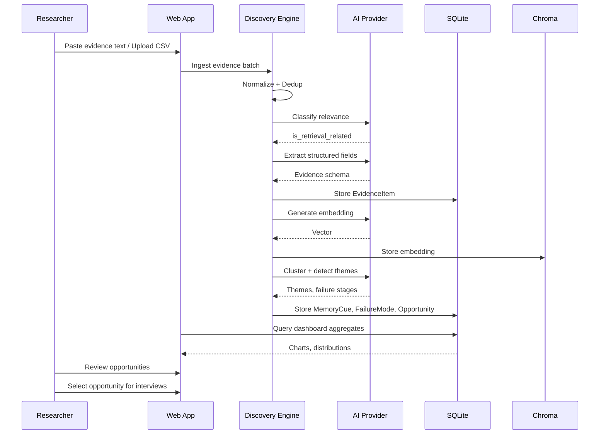

### End-to-End Retrieval Flow

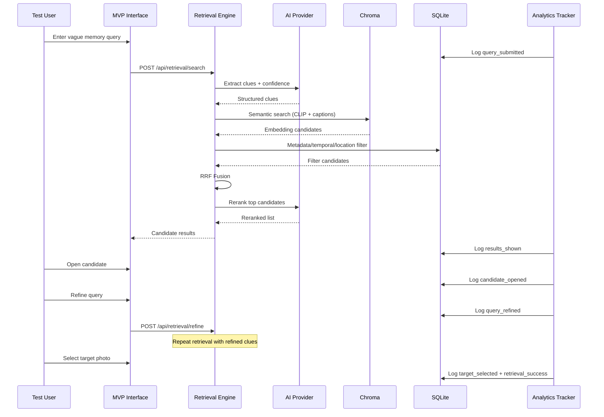

---

## 18. Development Modes

*Implements §41, §42 requirements.*

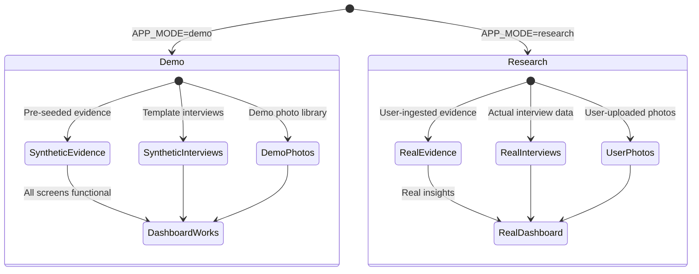

| Aspect | Demo Mode | Research Mode |
|--------|-----------|---------------|
| Evidence data | Pre-seeded synthetic | User-ingested real |
| Interview data | Template with placeholder content | Real transcripts and quotes |
| Photo library | Built-in demo dataset | User-uploaded + demo |
| Data labels | `⚠️ DEMO / SYNTHETIC DATA` badge | No badge |
| Pipeline processing | Runs on demo data | Runs on real data |
| Test results | Not meaningful | Meaningful |
| Mode switch | Settings toggle | Settings toggle |

---

## 19. Security & Privacy Architecture

*Implements §40 requirements.*

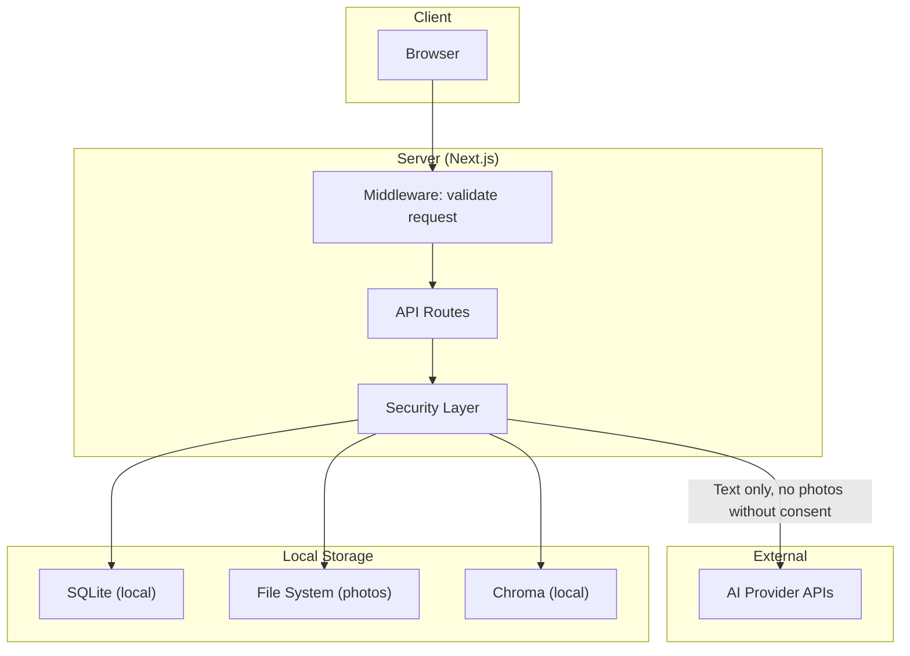

### Privacy Rules

| Rule | Implementation |
|------|---------------|
| No silent photo upload to external APIs | All AI image calls require explicit user action; gated by consent flag |
| API keys server-side only | `.env.local` (git-ignored); never exposed to client |
| Delete/reset capability | `POST /api/system/reset` — drops all user data |
| Minimal retention | Photos stored locally only; no cloud backup |
| No training usage declaration | Displayed in privacy notice on photo upload screen |
| EXIF stripping option | Optional EXIF removal before external API calls |

---

## 20. Implementation Phases

*Implements §49 requirements with estimated scope.*

```mermaid
gantt
    title Implementation Phases
    dateFormat X
    axisFormat %s

    section Phase 1: Foundation
    App shell + layout + nav       :p1a, 0, 1
    Database schema + migrations   :p1b, 0, 1
    Project Overview screen        :p1c, 1, 2
    Metric Tree screen             :p1d, 1, 2

    section Phase 2: Discovery Engine
    Evidence ingestion (4 methods) :p2a, 2, 4
    AI classification + extraction :p2b, 3, 5
    Evidence Explorer              :p2c, 4, 5
    Clustering + themes            :p2d, 4, 6
    Discovery Dashboard            :p2e, 5, 7
    Memory Cue + Failure Map       :p2f, 6, 7
    Opportunity Explorer           :p2g, 6, 7

    section Phase 3: Research
    Participant management         :p3a, 7, 8
    Interview CRUD + quotes        :p3b, 7, 9
    AI-assisted coding             :p3c, 8, 9
    Research Synthesis             :p3d, 9, 10

    section Phase 4: Problem Definition
    Problem Definition builder     :p4a, 10, 11

    section Phase 5: Retrieval Infra
    Photo upload + demo library    :p5a, 11, 12
    Image indexing pipeline        :p5b, 11, 13
    CLIP + embedding generation    :p5c, 12, 13
    Retrieval API                  :p5d, 13, 14

    section Phase 6: MVP
    MVP retrieval interface        :p6a, 14, 16
    Baseline comparison mode       :p6b, 15, 16

    section Phase 7: Testing
    Test session management        :p7a, 16, 17
    Event tracking                 :p7b, 16, 17
    Post-task survey               :p7c, 17, 18

    section Phase 8: Results
    Results dashboard              :p8a, 18, 19
    Metrics framework              :p8b, 18, 19
    Risk register                  :p8c, 19, 20
```

### Phase Deliverables

| Phase | Deliverable | Reviewer Requirement |
|-------|-------------|---------------------|
| **1. Foundation** | Working app shell with navigation, database, metric tree | Req 2 (metric decomposition) |
| **2. Discovery Engine** | Full evidence pipeline, dashboard, opportunity explorer | Req 1 (AI-powered discovery engine) |
| **3. Research** | Interview repository with AI-assisted coding and synthesis | Req 3 (5–6 user interviews) |
| **4. Problem Definition** | Evidence-backed problem definition builder | Req 4 (define the problem) |
| **5. Retrieval Infra** | Photo library, indexing pipeline, retrieval API | Req 5 foundation |
| **6. MVP** | Functional AI-native retrieval experience + baseline | Req 5 (functional AI-native MVP) |
| **7. Testing** | Structured test mode with event tracking | Req 6 (test with 3+ users) |
| **8. Results** | Comparison dashboard, metrics framework, risk register | Req 7 (success metrics), Req 8 (risks) |

---

## 21. Dependencies

### Production Dependencies

| Package | Purpose | Version |
|---------|---------|---------|
| `next` | Full-stack framework | ^15.0 |
| `react` / `react-dom` | UI library | ^19.0 |
| `typescript` | Type safety | ^5.6 |
| `tailwindcss` | Styling | ^4.0 |
| `drizzle-orm` | Database ORM | ^0.35 |
| `better-sqlite3` | SQLite driver | ^11.0 |
| `chromadb` | Vector store client | ^1.9 |
| `@google/generative-ai` | Gemini SDK | ^0.21 |
| `openai` | OpenAI SDK | ^4.70 |
| `groq-sdk` | Groq SDK | ^0.5.0 |
| `@xenova/transformers` | Local CLIP embeddings | ^2.17 |
| `tesseract.js` | Local OCR | ^5.1 |
| `sharp` | Image processing | ^0.33 |
| `exifr` | EXIF parsing | ^7.1 |
| `recharts` | Data visualization | ^2.13 |
| `zod` | Schema validation | ^3.23 |
| `nanoid` | ID generation | ^5.0 |
| `nuqs` | URL state management | ^2.2 |
| `papaparse` | CSV parsing | ^5.4 |
| `lucide-react` | Icon library | ^0.450 |

### Dev Dependencies

| Package | Purpose |
|---------|---------|
| `drizzle-kit` | Database migrations |
| `@types/better-sqlite3` | Type definitions |
| `vitest` | Unit testing |
| `@playwright/test` | E2E testing |
| `eslint` + `prettier` | Code quality |

---

## 22. Development Assumptions

| # | Assumption | Rationale | Fallback |
|---|-----------|-----------|----------|
| 1 | **SQLite is sufficient for MVP** | Single-user research tool; no concurrent writes needed | Migrate to PostgreSQL via Drizzle if needed |
| 2 | **Local CLIP embeddings are fast enough** | `ViT-B/32` runs on CPU in ~100ms per image | Fall back to API-based embeddings if too slow |
| 3 | **Tesseract.js handles OCR adequately** | Good enough for screenshots, receipts, documents | Swap to Google Cloud Vision or AWS Textract |
| 4 | **At least one AI provider API key is available** | Required for discovery engine and retrieval | Gracefully degrade: skip AI extraction, use manual coding |
| 5 | **Demo photo library is ≤500 images** | Sufficient for demonstrating retrieval; keeps indexing fast | Paginated indexing for larger libraries |
| 6 | **Chroma can run embedded or as local server** | No infrastructure dependency | Swap to in-memory vector store for tests |
| 7 | **Browser is modern (Chrome/Edge/Firefox latest)** | Uses modern JS features, no IE11 support | Not mitigated; document as requirement |
| 8 | **MVP interaction pattern is unknown pre-research** | Architecture supports chatbot, guided search, filter UI, or hybrid | Retrieval engine API is interaction-agnostic |
| 9 | **Single researcher/tester at a time** | No multi-user auth needed for MVP | Add auth layer if needed in production |
| 10 | **No real Google Photos API integration** | Privacy constraints; demo library is sufficient | Support Google Takeout import if needed |

---

> **Cross-reference**: This architecture implements all requirements from [problemstatement.md](file:///d:/DRIVE%20F/GRAD_GOOGLEPICS/DOCS/problemstatement.md) §1–§51. Each section above traces to specific problem statement sections noted in its header.
