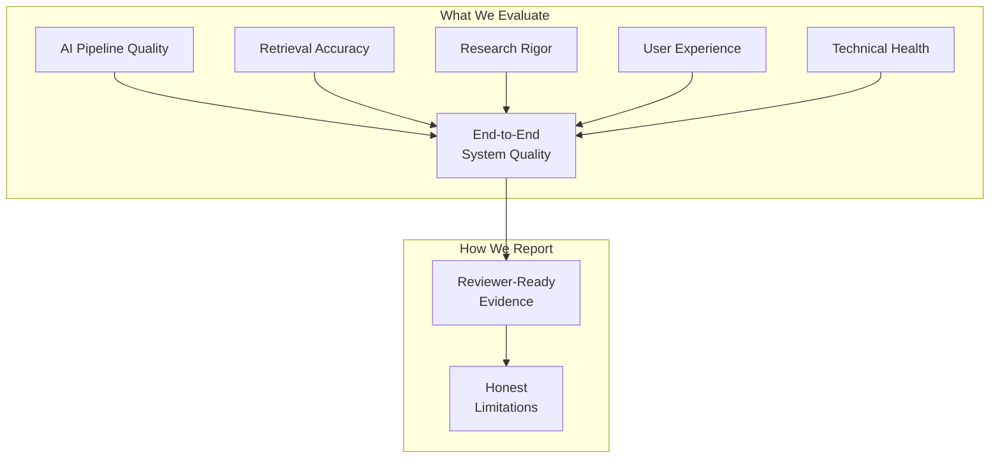

# Evaluation Framework — Google Photos Vague-Memory Retrieval

> Defines **what** is measured, **how** it is measured, **when** it is measured, and **what constitutes pass/fail** for every evaluable component of the system.
>
> **Reference**: [problemstatement.md](file:///d:/DRIVE%20F/GRAD_GOOGLEPICS/DOCS/problemstatement.md) · [architecture.md](file:///d:/DRIVE%20F/GRAD_GOOGLEPICS/DOCS/architecture.md) · [implementation-plan.md](file:///d:/DRIVE%20F/GRAD_GOOGLEPICS/DOCS/implementation-plan.md) · [edge-cases.md](file:///d:/DRIVE%20F/GRAD_GOOGLEPICS/DOCS/edge-cases.md)

---

## Table of Contents

- [1. Evaluation Philosophy](#1-evaluation-philosophy)
- [2. Reviewer Requirement Traceability](#2-reviewer-requirement-traceability)
- [3. Discovery Engine Evaluation](#3-discovery-engine-evaluation)
- [4. Retrieval Engine Evaluation](#4-retrieval-engine-evaluation)
- [5. Research Quality Evaluation](#5-research-quality-evaluation)
- [6. MVP Functional Evaluation](#6-mvp-functional-evaluation)
- [7. User Testing Evaluation](#7-user-testing-evaluation)
- [8. Metric Framework Evaluation](#8-metric-framework-evaluation)
- [9. Code & Architecture Quality](#9-code--architecture-quality)
- [10. Performance Benchmarks](#10-performance-benchmarks)
- [11. UX & Reviewer Experience Evaluation](#11-ux--reviewer-experience-evaluation)
- [12. Security & Privacy Audit](#12-security--privacy-audit)
- [13. Data Integrity Evaluation](#13-data-integrity-evaluation)
- [14. End-to-End Acceptance Tests](#14-end-to-end-acceptance-tests)
- [15. Evaluation Schedule](#15-evaluation-schedule)
- [16. Evaluation Artifacts Checklist](#16-evaluation-artifacts-checklist)

---

## 1. Evaluation Philosophy

### Core Principles

| Principle | Meaning | Anti-Pattern |
|-----------|---------|-------------|
| **Measure retrieval success, not engagement** | The primary metric is whether the user found the photo, not how long they interacted (§50) | Optimizing for time-on-app, click count, or "exploration" |
| **Honest reporting over favorable reporting** | Present actual results including failures; no inflated numbers (§46) | Hiding contradictory evidence, claiming statistical significance from 3 users |
| **Evaluate the chain, not just the endpoints** | Each pipeline stage has its own quality metrics; end-to-end success is necessary but not sufficient | Only measuring final success rate without understanding where failures occur |
| **Qualitative ≠ weak, Quantitative ≠ strong** | With 3–6 users, qualitative depth is more valuable than quantitative breadth (§31) | Presenting percentages as statistical findings from tiny samples |
| **Evidence-backed evaluation** | Every evaluation claim must reference its data source (§35) | "The system works well" without supporting data |

### Evaluation Dimensions



---

## 2. Reviewer Requirement Traceability

> Every evaluation maps back to the 8 reviewer requirements. If an evaluation doesn't serve a requirement, question whether it's needed.

### Requirement → Evaluation Matrix

| # | Reviewer Requirement | Evaluation Section | Key Metrics | Pass Criteria |
|---|---------------------|-------------------|-------------|---------------|
| 1 | AI-powered discovery engine | §3 | Extraction accuracy, classification precision, clustering coherence | Pipeline processes evidence end-to-end; insights traceable to source |
| 2 | Break down the business metric | §8.1 | Tree completeness, branch coverage | Metric tree has ≥5 decomposed branches with measurable sub-metrics |
| 3 | Validate through 5–6 interviews | §5 | Interview completeness, coding coverage, synthesis depth | ≥5 interviews with coded themes; cross-interview synthesis produced |
| 4 | Define the problem | §5.3 | Template completeness, evidence linkage | All 8 dimensions addressed; each linked to ≥1 evidence source |
| 5 | Build functional AI-native MVP | §4, §6 | Retrieval accuracy, functional completeness | Another person can complete a retrieval task end-to-end |
| 6 | Test with ≥3 users | §7 | Session completeness, event coverage | ≥3 users tested on ≥3 tasks each; all 12 event types logged |
| 7 | Define success metrics | §8 | Metric definition coverage | Primary, leading, diagnostic, guardrail metrics all defined and computed |
| 8 | Identify risks and mitigations | §8.4 | Risk coverage | ≥9 risks identified with specific mitigations |

---

## 3. Discovery Engine Evaluation

### 3.1 Evidence Ingestion Quality

| Metric | Definition | Measurement Method | Target | Min Acceptable |
|--------|-----------|-------------------|--------|----------------|
| **Ingestion success rate** | % of submitted items that create valid records | `successful_items / total_submitted × 100` | ≥98% | ≥90% |
| **Format coverage** | All 4 input methods functional | Manual test: text, CSV, JSON, URL | 4/4 | 4/4 |
| **Batch throughput** | Items processed per minute (CSV/JSON) | Time 100-item batch ingestion | ≥50/min | ≥20/min |
| **Metadata capture rate** | % of items with source platform + URL | `items_with_metadata / total_items × 100` | ≥90% | ≥70% |
| **Raw text preservation** | Original text always stored unmodified | Compare `raw_statement` against input for 20 random items | 100% | 100% |

**Test Protocol:**
1. Prepare 100 evidence items (60 text, 20 CSV, 10 JSON, 10 URL)
2. Ingest all items via respective methods
3. Verify record counts match expected
4. Spot-check 20 items for raw text fidelity
5. Verify metadata on all items

---

### 3.2 Relevance Classification

| Metric | Definition | Measurement Method | Target | Min Acceptable |
|--------|-----------|-------------------|--------|----------------|
| **Precision** | % of items classified as relevant that truly are | Manual review of 50 "relevant" items | ≥85% | ≥70% |
| **Recall** | % of truly relevant items that were classified as relevant | Manual review of 50 "not relevant" items for false negatives | ≥90% | ≥80% |
| **F1 Score** | Harmonic mean of precision and recall | Computed from above | ≥0.87 | ≥0.75 |
| **Confidence calibration** | High-confidence items are more likely correct than low-confidence | Compare accuracy at confidence ≥0.8 vs ≤0.5 | High-conf accuracy > Low-conf accuracy | Monotonic relationship |

**Test Protocol:**
1. Prepare a labeled test set: 50 retrieval-related + 50 non-retrieval items
2. Run classifier on all 100
3. Compute precision, recall, F1
4. Stratify accuracy by confidence bucket (0–0.3, 0.3–0.6, 0.6–1.0)
5. Document false positive and false negative patterns

**Gold Standard Labels:**

| Category | Example | Label |
|----------|---------|-------|
| Clear retrieval complaint | "I spent 20 minutes searching for a photo from my trip" | Relevant |
| Retrieval adjacent | "Google Photos search is terrible" | Relevant |
| Feature request about retrieval | "They should add the ability to search by memory" | Relevant |
| Non-retrieval complaint | "Google Photos is eating my storage" | Not Relevant |
| Ambiguous | "I can never find anything in this app" | Relevant (broad, but retrieval-related) |

---

### 3.3 Structured Extraction Accuracy

| Metric | Definition | Measurement Method | Target | Min Acceptable |
|--------|-----------|-------------------|--------|----------------|
| **Field extraction rate** | % of applicable fields correctly populated | Human review of 30 extracted items against raw text | ≥80% | ≥60% |
| **Hallucination rate** | % of extracted fields containing info NOT in raw text | Human review: any extracted field with no source in raw text | ≤5% | ≤15% |
| **Asset type accuracy** | Correct asset type classification | Compare against manually labeled test set | ≥85% | ≥70% |
| **Memory cue extraction** | Correct cue type and value | Compare against manually labeled test set | ≥75% | ≥60% |
| **Failure stage accuracy** | Correct failure stage from §6.3 taxonomy | Compare against manually labeled test set | ≥70% | ≥55% |

**Evaluation Rubric for Extraction Quality:**

| Score | Criteria |
|-------|---------|
| ✅ **Correct** | Extracted value matches raw text meaning and maps to correct category |
| ⚠️ **Partial** | Extracted value is approximately correct but imprecise or incomplete |
| ❌ **Incorrect** | Extracted value contradicts raw text or is fabricated |
| ➖ **Missing** | Field should have been populated but wasn't |
| ⬜ **N/A** | Field is not applicable for this evidence item |

**Test Protocol:**
1. Select 30 evidence items spanning diverse categories
2. Manually extract all fields as gold standard
3. Run AI extraction pipeline
4. Compare field-by-field using rubric above
5. Compute per-field accuracy rates
6. Document systematic errors (e.g., "consistently misclassifies screenshots as documents")

---

### 3.4 Deduplication Quality

| Metric | Definition | Measurement Method | Target | Min Acceptable |
|--------|-----------|-------------------|--------|----------------|
| **True duplicate detection** | % of exact/near duplicates correctly flagged | Insert 10 known duplicate pairs | ≥90% | ≥80% |
| **False duplicate rate** | % of unique items incorrectly flagged as duplicates | Check flagged duplicates: are they truly duplicates? | ≤5% | ≤10% |
| **Similar-but-distinct preservation** | Similar complaints from different users are NOT flagged | Insert 10 similar-but-distinct pairs | ≥90% kept separate | ≥80% kept separate |

---

### 3.5 Clustering & Theme Coherence

| Metric | Definition | Measurement Method | Target | Min Acceptable |
|--------|-----------|-------------------|--------|----------------|
| **Intra-cluster coherence** | Items within a cluster are semantically related | Human rates 3 random items per cluster: "Do these belong together?" (Y/N) | ≥80% "Yes" | ≥65% "Yes" |
| **Inter-cluster separation** | Different clusters address different themes | Human compares cluster summaries: "Are these distinct?" | ≥85% distinct | ≥70% distinct |
| **Theme label quality** | LLM-generated theme labels are accurate and descriptive | Human rates labels: Accurate / Partially accurate / Inaccurate | ≥80% accurate | ≥60% accurate |
| **Optimal k selection** | Number of clusters is reasonable for dataset size | Silhouette score ≥ 0.3 | ≥0.3 | ≥0.2 |

---

### 3.6 Opportunity Generation Quality

| Metric | Definition | Measurement Method | Target | Min Acceptable |
|--------|-----------|-------------------|--------|----------------|
| **Evidence grounding** | Every opportunity links to ≥1 evidence item | Verify `OpportunityEvidence` records | 100% | 100% |
| **Actionability** | Opportunities describe addressable product problems | Human rates: Actionable / Vague / Not actionable | ≥80% actionable | ≥60% actionable |
| **Overlap** | Opportunities are distinct from each other | Human rates: Distinct / Overlapping / Duplicate | ≤20% overlapping | ≤30% overlapping |
| **Coverage** | Major themes from evidence are represented | Compare opportunity set against theme clusters | ≥80% themes covered | ≥60% themes covered |

---

## 4. Retrieval Engine Evaluation

### 4.1 Retrieval Accuracy Metrics

> These metrics evaluate whether the system returns the correct target photo.

| Metric | Definition | Formula | Target | Min Acceptable |
|--------|-----------|---------|--------|----------------|
| **Recall@5** | Target photo appears in top 5 results | `tasks_with_target_in_top5 / total_tasks` | ≥60% | ≥40% |
| **Recall@10** | Target photo appears in top 10 results | `tasks_with_target_in_top10 / total_tasks` | ≥75% | ≥55% |
| **Recall@20** | Target photo appears in top 20 results | `tasks_with_target_in_top20 / total_tasks` | ≥85% | ≥65% |
| **MRR** (Mean Reciprocal Rank) | Average of 1/rank_of_target across tasks | `mean(1/rank_of_target)` for tasks where target found | ≥0.35 | ≥0.20 |
| **Success rate** | % of tasks where user ultimately finds target | `successful_tasks / total_tasks` | ≥70% | ≥50% |
| **Time to target** | Median seconds from query to target selection | Median of `retrieval_success.timestamp - retrieval_started.timestamp` | ≤90s | ≤180s |
| **Interactions to target** | Median number of interactions before success | Median of `total_interactions` for successful sessions | ≤5 | ≤10 |

### 4.2 Retrieval Task Design for Evaluation

> Tasks must represent realistic vague-memory scenarios (§21).

**Task Difficulty Tiers:**

| Tier | Description | Example Query | Expected Difficulty |
|------|-------------|---------------|-------------------|
| **Easy** | Distinctive photo, multiple strong clues | "The photo of the Taj Mahal I took during my trip" | Low — unique landmark + travel context |
| **Medium** | Common subject, partial temporal/spatial clue | "A photo of food I took maybe last year at a restaurant" | Medium — many food photos, vague time |
| **Hard** | Vague subject, uncertain clues, common category | "I think I took a screenshot of something important, maybe a medicine name" | High — many screenshots, uncertain content |
| **Adversarial** | Deliberately misleading or incomplete clues | "There was a photo with blue in it" | Very High — insufficient differentiation |

**Minimum evaluation set: 20 tasks** (5 per tier) against the demo library.

**Task Template:**

```
Task ID:        T-001
Tier:           Medium
Target Photo:   IMG_00234 (beach sunset in Goa)
Prompt:         "I took a photo of the sunset somewhere on a beach trip. I think it was in India."
Expected Clues: {scene: "sunset", location: "beach/India", type: "photo"}
Challenge:      Multiple beach photos exist; "India" narrows but doesn't uniquely identify
```

---

### 4.3 Per-Signal Contribution Analysis

> Measures how much each retrieval signal contributes to finding the target.

| Signal | Evaluation Method | Metric |
|--------|------------------|--------|
| **CLIP semantic** | Run retrieval with CLIP only | Recall@10 from CLIP alone |
| **Caption text** | Run retrieval with caption search only | Recall@10 from captions alone |
| **OCR text** | Run retrieval with OCR search only | Recall@10 from OCR alone |
| **EXIF temporal** | Run retrieval with date filter only | Recall@10 from temporal alone |
| **EXIF location** | Run retrieval with location filter only | Recall@10 from location alone |
| **Metadata** | Run retrieval with filename/metadata only | Recall@10 from metadata alone |
| **Fusion (all signals)** | Run full multi-signal retrieval | Recall@10 combined |
| **Fusion + reranking** | Run full pipeline including AI reranking | Recall@10 after reranking |

**Expected outcome:** Fusion > any single signal. If not, investigate signal weighting.

**Signal ablation matrix:**

| Configuration | Signals Used | Expected Recall@10 |
|--------------|-------------|-------------------|
| CLIP only | CLIP | Baseline |
| CLIP + Caption | CLIP, Caption | > CLIP only |
| All signals, no rerank | All 6 signals | > any pair |
| Full pipeline | All 6 + reranking | ≥ all signals no rerank |

---

### 4.4 Clue Extraction Quality

| Metric | Definition | Measurement Method | Target | Min Acceptable |
|--------|-----------|-------------------|--------|----------------|
| **Clue recall** | % of human-identified clues that AI also extracts | Compare AI clues vs human-labeled clues on 20 queries | ≥80% | ≥60% |
| **Clue precision** | % of AI-extracted clues that are valid | Human verifies each AI clue against query text | ≥85% | ≥70% |
| **Clue type accuracy** | Correct clue type (person, place, time, object, etc.) | Compare AI type vs human type | ≥80% | ≥65% |
| **Confidence calibration** | "Certain" clues are actually reliable, "uncertain" are not | Accuracy stratified by confidence bucket | Monotonic | Monotonic |
| **Hedge detection accuracy** | Correctly identifies uncertain language | Test on 20 queries with known hedge phrases | ≥85% | ≥70% |

**Test Queries with Expected Clue Extraction:**

| Query | Expected Clues | Expected Uncertainty |
|-------|---------------|---------------------|
| "The photo of my dog at the park last Sunday" | dog (object, certain), park (location, certain), last Sunday (time, certain) | All certain |
| "I think there was a photo from maybe Goa, around 2022" | Goa (location, uncertain), 2022 (time, uncertain) | All uncertain |
| "That screenshot of the medicine, not the one from the pharmacy" | screenshot (type, certain), medicine (object, certain), NOT pharmacy (negative, certain) | Negative clue |
| "Some food photo" | food (object, certain) | Certain but vague |
| "I don't remember much, but it was blue-ish" | blue color (visual, uncertain) | Uncertain visual |

---

### 4.5 Uncertainty Handling Evaluation

| Scenario | Test | Expected Behavior | Pass? |
|----------|------|-------------------|-------|
| Certain clue, correct | "The Taj Mahal photo" → library has Taj Mahal | Hard filter returns target in top 5 | ⬜ |
| Certain clue, incorrect | "The Taj Mahal photo" → library has NO Taj Mahal | Hard filter returns 0 → fallback message | ⬜ |
| Uncertain clue, correct | "Maybe from Goa" → library has Goa photos | Soft boost raises Goa photos but doesn't exclude others | ⬜ |
| Uncertain clue, incorrect | "Maybe from Goa" → target is actually from Kerala | Kerala photo still in results (not excluded by soft filter) | ⬜ |
| Mixed certain + uncertain | "Dog photo, maybe from 2022" → target is dog photo from 2023 | Dog = hard filter, 2022 = soft boost. 2023 photo still appears. | ⬜ |
| All uncertain | "I think it was food, maybe at a restaurant, around last year" | Broad results, weighted by clue combination. No hard exclusions. | ⬜ |
| Negative clue | "Not a screenshot" → target is a regular photo | Screenshots deprioritized. Regular photos ranked higher. | ⬜ |
| No usable clues | "I don't remember anything" | Graceful message: "Try describing any detail you remember." | ⬜ |

---

### 4.6 Fusion & Reranking Evaluation

| Metric | Definition | Target |
|--------|-----------|--------|
| **RRF vs best single signal** | Improvement in Recall@10 from fusion over best individual signal | ≥+10% absolute |
| **Reranking lift** | Improvement in MRR from reranking over raw fusion | ≥+0.05 MRR |
| **Reranking consistency** | Reranking doesn't drop correct targets out of top-10 | ≤5% target drops |
| **Score distribution** | Fused scores are well-spread (not all clustered near 0) | Score range has ≥3 distinct tiers |

---

## 5. Research Quality Evaluation

### 5.1 Interview Completeness

| Metric | Definition | Target | Min Acceptable |
|--------|-----------|--------|----------------|
| **Interview count** | Total interviews conducted | ≥5 | ≥5 (hard req §12) |
| **Participant diversity** | Distinct participant segments represented | ≥2 segments | ≥2 |
| **Field completion rate** | % of §15 data fields populated per interview | ≥80% | ≥60% |
| **Transcript presence** | % of interviews with transcripts entered | 100% | ≥80% |
| **Quote count** | Total tagged quotes across all interviews | ≥30 | ≥15 |
| **Observation count** | Total researcher observations | ≥20 | ≥10 |
| **Retrieval incident** | % of interviews with a specific retrieval incident discussed | ≥80% | ≥60% |

---

### 5.2 Coding Quality

| Metric | Definition | Measurement Method | Target |
|--------|-----------|-------------------|--------|
| **Label completeness** | Every quote and observation has a label | `unlabeled_items / total_items = 0` | 100% labeled |
| **Label accuracy** | Labels correctly applied per §35 definitions | Reviewer spot-check of 10 items | ≥90% correct |
| **Theme coverage** | Major retrieval themes from §6 represented | Compare coded themes against taxonomy | ≥70% taxonomy covered |
| **AI vs Human agreement** | AI-coded themes match human-coded themes | Cohen's Kappa on 20 overlapping items | κ ≥ 0.6 (substantial) |
| **Inter-coder reliability** | (If multiple coders) Agreement between coders | Cohen's Kappa | κ ≥ 0.7 |

**Label Accuracy Spot-Check Protocol:**
1. Select 10 random tagged quotes
2. For each, verify:
   - Is the label correct? (`DIRECT_QUOTE` for verbatim, `RESEARCHER_OBSERVATION` for interpretation, etc.)
   - Does the quote actually appear in the transcript?
   - Is the assigned theme reasonable?
3. Score: correct / partially correct / incorrect

---

### 5.3 Problem Definition Evaluation

| Dimension | Evaluation Question | Pass Criteria |
|-----------|-------------------|---------------|
| **Target Segment** | Is the segment specific and derived from research? | Named segment with recruiting criteria |
| **Retrieval Scenario** | Does it describe a realistic retrieval situation? | Matches a pattern observed in ≥2 interviews |
| **Root Cause** | Is the root cause evidence-backed? | Linked to ≥3 pieces of evidence |
| **Workaround** | Is the existing workaround documented? | Observed in ≥2 interviews |
| **Product Outcome** | Does it map to a branch of the metric tree? | Explicit link to metric tree node |
| **Evidence chain** | Can a reviewer trace every claim to source? | Every field has ≥1 evidence link |
| **No fabrication** | No invented or speculated evidence | All links resolve to real records (not demo data if in research mode) |
| **Falsifiability** | Could the problem definition be wrong? | Limitations/uncertainty acknowledged |

---

### 5.4 Synthesis Quality

| Metric | Evaluation Question | Target |
|--------|-------------------|--------|
| **Pattern prevalence** | How many participants exhibit each pattern? | Stated as "N of M participants" |
| **Divergence documented** | Are disagreements between participants noted? | All major contradictions highlighted |
| **No over-generalization** | Avoids "users always" from 5 interviews | No universal claims from small samples |
| **Confidence indicated** | Patterns labeled with confidence per §36 | 🟢🟡🔴 on each finding |
| **Actionability** | Do findings inform the problem definition? | ≥3 findings directly referenced in problem definition |

---

## 6. MVP Functional Evaluation

### 6.1 Functional Completeness Checklist

> From §20 — "Another person must be able to…"

| # | Capability | Test Method | Pass? |
|---|-----------|-------------|-------|
| F1 | Access the prototype via URL | Open `localhost:3000/mvp` in browser | ⬜ |
| F2 | See the photo library | Library grid loads with ≥50 photos | ⬜ |
| F3 | Enter a vague memory query | Text input accepts natural language | ⬜ |
| F4 | See AI-powered ranked results | Results grid displays after query | ⬜ |
| F5 | Understand why photos were ranked | Match explanations shown per result | ⬜ |
| F6 | Refine the query | Refinement input modifies results | ⬜ |
| F7 | Inspect a result at full size | Photo lightbox opens on click | ⬜ |
| F8 | Select "this is the photo" | Target selection button works | ⬜ |
| F9 | Complete the retrieval task | Session marked as success/failure | ⬜ |
| F10 | Abandon and try a different approach | Abandonment path exists | ⬜ |

**All 10 must pass.** Failure on any item means the MVP is not functional per requirements.

---

### 6.2 Baseline vs MVP Differentiation

| Aspect | Baseline Must Have | MVP Must Have Beyond Baseline |
|--------|-------------------|-------------------------------|
| Query input | Text search box | Same + natural language understanding |
| Result ranking | Semantic similarity only | Multi-signal fusion + reranking |
| Clue handling | Literal keyword match | Intent extraction + uncertainty handling |
| Refinement | New query replaces old | Contextual refinement building on previous |
| Explanation | None / basic score | Match reasoning per result |
| User guidance | None | (If research supports) Clarifying questions or suggestions |

**Evaluation:** Side-by-side same query on baseline vs MVP. MVP should produce measurably different (ideally better) ranking.

---

## 7. User Testing Evaluation

### 7.1 Test Session Validity

| Criterion | Requirement | Verification |
|-----------|------------|-------------|
| **Participant count** | ≥3 distinct users (§28) | Count unique `participant_id` in test sessions |
| **Task count** | ≥3 tasks per participant | Count tasks per participant |
| **Baseline included** | Both baseline and MVP sessions exist | Count sessions by `session_type` |
| **Real participants** | Not fabricated (§46) | Researcher attestation; IRB if required |
| **Consistent tasks** | Same tasks for baseline and MVP | Compare task lists across session types |
| **No coaching** | Researcher did not guide participant | Researcher observations don't mention coaching |

---

### 7.2 Event Tracking Completeness

| Event Type | Minimum Expected per Session | Verification Query |
|------------|-----------------------------|--------------------|
| `retrieval_started` | Exactly 1 | `COUNT WHERE event_type = 'retrieval_started' AND session_id = ?` |
| `query_submitted` | ≥1 | Must have at least one query |
| `results_shown` | ≥1 | Results must render at least once |
| `candidate_opened` | ≥0 | Zero is valid (user may not inspect) |
| `query_refined` | ≥0 | Zero is valid (may succeed on first query) |
| `target_selected` OR `retrieval_abandoned` | Exactly 1 | Session must end with one or the other |
| `task_completed` | Exactly 1 | Every session must complete |

**Validation query:**
```sql
SELECT session_id,
  SUM(CASE WHEN event_type = 'retrieval_started' THEN 1 ELSE 0 END) as starts,
  SUM(CASE WHEN event_type = 'query_submitted' THEN 1 ELSE 0 END) as queries,
  SUM(CASE WHEN event_type IN ('retrieval_success', 'retrieval_abandoned') THEN 1 ELSE 0 END) as endings
FROM metric_events
GROUP BY session_id
HAVING starts != 1 OR queries = 0 OR endings != 1;
-- Should return 0 rows (no invalid sessions)
```

---

### 7.3 Post-Task Survey Completeness

| Metric | Definition | Target |
|--------|-----------|--------|
| **Survey completion rate** | % of completed tasks with ≥1 survey response | ≥80% |
| **Question coverage** | % of 7 questions answered per survey | ≥70% (≥5 of 7 questions) |
| **Response quality** | Responses are substantive (not just "yes"/"no") | ≥60% have >10 words |

---

### 7.4 Comparison Validity

| Check | Description | Pass Criteria |
|-------|-------------|---------------|
| **Same tasks** | Baseline and MVP use identical retrieval tasks | Task ID sets are identical |
| **Same library** | Photo library unchanged between sessions | No indexing changes between baseline/MVP |
| **Same participants** (preferred) | Same users do both baseline and MVP | ≥60% of participants do both |
| **Order counterbalanced** | Not all participants do baseline first | At least 1 participant does MVP first |
| **No learning effect accounted** | If same user does both, acknowledge learning | Documented in results limitations |

---

## 8. Metric Framework Evaluation

### 8.1 Metric Tree Completeness

| Evaluation | Question | Pass |
|-----------|----------|------|
| Primary metric defined | Is there a single north-star metric? | Yes = ✅ |
| Primary metric measurable | Can the primary metric be computed from test data? | Yes = ✅ |
| Leading metrics (≥3) | Are there ≥3 leading indicator metrics? | ≥3 = ✅ |
| Diagnostic metrics (≥3) | Are there ≥3 diagnostic metrics? | ≥3 = ✅ |
| Guardrail metrics (≥2) | Are there ≥2 guardrail metrics? | ≥2 = ✅ |
| All metrics computed | Do all defined metrics have computed values from test data? | Yes = ✅ |
| Metrics match MVP | Do metrics reflect the actual MVP built (not a hypothetical)? (§32) | Yes = ✅ |

---

### 8.2 Metric Computation Accuracy

| Metric | Verification Method |
|--------|-------------------|
| Success rate | Manually count successful sessions. Compare against computed value. |
| Time to target | Manually compute duration for 3 sessions. Compare. |
| Target rank | Check rank from query_turn data for 3 sessions. Compare. |
| Refinement count | Count `query_refined` events for 3 sessions. Compare. |
| Abandonment rate | Count `retrieval_abandoned` events. Compare. |

**Tolerance:** Computed value must match manual calculation exactly (these are deterministic counts, not estimates).

---

### 8.3 Metric Framework Quality

| Criterion | Question | Pass |
|-----------|----------|------|
| **Aligned to goal** | Does the primary metric measure "retrieval of vaguely remembered photos"? | ⬜ |
| **Leading → Primary** | Would improving leading metrics likely improve the primary? | ⬜ |
| **Diagnostic → Actionable** | Do diagnostics point to specific system improvements? | ⬜ |
| **Guardrails bound risk** | Do guardrails catch safety/quality violations? | ⬜ |
| **No vanity metrics** | Are there metrics measuring things that don't matter? Remove them. | ⬜ |

---

### 8.4 Risk Register Evaluation

| Criterion | Requirement | Pass |
|-----------|------------|------|
| ≥9 risks documented | Count of risk entries | ≥9 = ✅ |
| All §33 risks included | The 9 risks from problem statement are present | 9/9 = ✅ |
| MVP-specific risks added | Risks unique to the actual MVP built | ≥1 = ✅ |
| Every risk has mitigation | `mitigation` field non-empty | 100% = ✅ |
| Severity + likelihood rated | Both fields populated | 100% = ✅ |
| Risks linked to opportunities | `related_opportunity_id` populated where relevant | Where applicable = ✅ |

---

## 9. Code & Architecture Quality

### 9.1 Architecture Compliance

| Principle (Architecture §2) | Verification | Pass |
|----------------------------|-------------|------|
| AI provider abstraction | Changing `AI_PROVIDER` env var switches provider without code changes | ⬜ |
| Demo/Research separation | `data_mode` column on all required tables; mode toggle works | ⬜ |
| Evidence provenance | Every insight links to source via foreign key | ⬜ |
| Label enforcement | Quotes/observations cannot be saved without label | ⬜ |
| Modular retrieval signals | Each signal can be independently disabled/enabled | ⬜ |
| Local-first privacy | No external API calls with photos without explicit user action | ⬜ |

---

### 9.2 Code Quality Metrics

| Metric | Tool | Target | Min Acceptable |
|--------|------|--------|----------------|
| **TypeScript strict mode** | `tsconfig.json` strict: true | All files compile | All files compile |
| **Zero lint errors** | ESLint | 0 errors | 0 errors, ≤20 warnings |
| **Test coverage (unit)** | Vitest + coverage | ≥60% | ≥40% |
| **Test coverage (integration)** | Vitest | Key pipelines covered | Discovery, Retrieval pipelines |
| **E2E test count** | Playwright | ≥10 critical flows | ≥5 critical flows |
| **Build success** | `npm run build` | Zero errors | Zero errors |
| **No runtime type errors** | TypeScript + Zod validation | 0 | 0 |

---

### 9.3 API Contract Verification

| Endpoint Group | Test Method | Pass Criteria |
|---------------|------------|---------------|
| `/api/evidence/*` | CRUD operations + edge cases | All endpoints return correct status codes |
| `/api/discovery/*` | Pipeline trigger + data retrieval | Pipeline completes; dashboard data returns |
| `/api/research/*` | Participant + interview CRUD | All CRUD operations succeed |
| `/api/photos/*` | Upload + indexing + serving | Photos upload, index, and serve correctly |
| `/api/retrieval/*` | Search + refine | Queries return ranked results |
| `/api/testing/*` | Session management + events | Sessions create; events log correctly |
| `/api/results/*` | Comparison data | Metrics compute from test data |
| `/api/system/*` | Status + reset | Reset clears all data; status returns correctly |

**For each endpoint, verify:**
- Correct HTTP status codes (200, 201, 400, 404, 500)
- Response shape matches expected TypeScript type
- Error responses include descriptive messages
- No stack traces leaked in production error responses

---

## 10. Performance Benchmarks

### 10.1 Response Time Targets

| Operation | Target | Max Acceptable | Measurement |
|-----------|--------|----------------|-------------|
| Page load (any screen) | ≤1.5s | ≤3s | Lighthouse / DevTools |
| Evidence list (100 items, filtered) | ≤500ms | ≤1.5s | API response time |
| Discovery pipeline (1 item) | ≤10s | ≤20s | API response time |
| Discovery pipeline (100 items batch) | ≤5min | ≤10min | Total batch time |
| Photo upload (single, 5MB) | ≤2s | ≤5s | API response time |
| Photo indexing (single) | ≤15s | ≤30s | Full pipeline (EXIF + OCR + CLIP + caption) |
| Photo indexing (100 photos batch) | ≤15min | ≤30min | Total batch time |
| Retrieval query (200-photo library) | ≤3s | ≤8s | API response time |
| Retrieval query (500-photo library) | ≤5s | ≤12s | API response time |
| Retrieval refinement | ≤3s | ≤8s | API response time |
| Dashboard aggregation | ≤1s | ≤3s | API response time |
| Database seed (demo data) | ≤10s | ≤30s | Seed script time |

---

### 10.2 Resource Consumption

| Resource | Target | Max Acceptable | Measurement |
|----------|--------|----------------|-------------|
| SQLite DB size (500 photos, 200 evidence) | ≤50MB | ≤200MB | File size |
| Chroma storage (500 photos) | ≤500MB | ≤1GB | Directory size |
| Memory usage (idle) | ≤300MB | ≤500MB | Process monitor |
| Memory usage (during indexing) | ≤1GB | ≤2GB | Process monitor |
| CLIP model size (on disk) | ≤500MB | ≤1GB | Model cache size |
| Upload storage (500 photos) | ≤2GB | ≤5GB | Directory size |

---

### 10.3 Scalability Boundary Tests

| Scenario | Test | Expected Outcome |
|----------|------|-----------------|
| 1,000 evidence items | Ingest 1,000 items, run dashboard | Dashboard loads in ≤3s |
| 500 photos | Upload and index 500 photos | Indexing completes; retrieval works |
| 50 retrieval refinements | Refine 50 times in one session | No memory leak; responses stay ≤8s |
| 20 test sessions | Create 20 test sessions with events | Results comparison computes correctly |
| 10 concurrent browser tabs | Open 10 tabs to different screens | No SQLite lock errors |

---

## 11. UX & Reviewer Experience Evaluation

### 11.1 UX Compliance Checklist (§44)

| # | Requirement | Verification | Pass? |
|---|-----------|-------------|-------|
| U1 | Clean layout | Visual inspection: no cluttered screens | ⬜ |
| U2 | Strong information hierarchy | H1 → H2 → H3 hierarchy; clear section separation | ⬜ |
| U3 | Restrained visual design | No excessive decoration; professional tone | ⬜ |
| U4 | Readable charts | Chart labels legible; colors distinguishable; axes labeled | ⬜ |
| U5 | Easy evidence inspection | Click any insight → see supporting evidence ≤2 clicks | ⬜ |
| U6 | Clear research/hypothesis distinction | Labels visually distinct and always present | ⬜ |
| U7 | Responsive interaction | No action takes >3s without loading indicator | ⬜ |
| U8 | Useful empty states | Every screen has helpful empty state with guidance | ⬜ |
| U9 | Clear error handling | Errors show user-friendly message + recovery suggestion | ⬜ |
| U10 | No excessive gradients | Visual inspection | ⬜ |
| U11 | No random animations | No gratuitous motion; only purposeful transitions | ⬜ |
| U12 | No decorative AI elements | No AI sparkles, brains, or robot icons | ⬜ |
| U13 | No fake statistics | All numbers come from real data or are labeled DEMO | ⬜ |
| U14 | No meaningless dashboards | Every chart serves an analytical purpose | ⬜ |

---

### 11.2 Reviewer Flow Test (§45)

> A reviewer should be able to understand the project by following this exact sequence.

| Step | Action | Screen | Pass Criteria |
|------|--------|--------|---------------|
| 1 | Read the reviewer challenge | `/dashboard` | Challenge is prominently displayed | 
| 2 | Explore metric decomposition | `/metrics` | Tree is interactive, branches are labeled |
| 3 | Review discovery evidence | `/discovery` | Dashboard shows aggregate insights from evidence |
| 4 | Understand failure patterns | `/discovery/failures` | Funnel shows where retrieval breaks down |
| 5 | See investigated opportunity | `/opportunities` | ≥1 opportunity with evidence links |
| 6 | Read interview findings | `/research/interviews` | ≥5 interviews with coded themes visible |
| 7 | Understand root cause | `/research/synthesis` | Cross-interview patterns identified |
| 8 | Read problem definition | `/problem` | Template filled with evidence links |
| 9 | Use the MVP | `/mvp` | Complete a retrieval task end-to-end |
| 10 | See test results | `/results` | Comparison table with actual data |
| 11 | Review success metrics | `/metrics/framework` | All 4 metric categories populated |
| 12 | Read risks | `/risks` | ≥9 risks with mitigations |

**Navigation test:** Can the reviewer reach step N+1 from step N without using the sidebar? (Progressive links/CTAs between screens)

**Comprehension test:** At each step, is it obvious why this step follows the previous one?

---

### 11.3 Empty State Audit

> Every one of the 16 screens must have a useful empty state.

| Screen | Empty State Must Include |
|--------|------------------------|
| Dashboard | "Welcome" + links to start with evidence ingestion |
| Metric Tree | Default tree structure pre-loaded |
| Evidence Ingestion | Guidance on what types of evidence to ingest |
| Discovery Dashboard | "No evidence processed yet. Start by ingesting evidence." |
| Evidence Explorer | "No evidence items. Ingest evidence first." + link |
| Memory Cue Analysis | "Insufficient data for memory analysis." |
| Retrieval Failure Map | "No failure data yet. Process evidence to see patterns." |
| Opportunity Areas | "No opportunities identified yet." |
| User Interviews | "No interviews recorded. Add your first participant." |
| Research Synthesis | "At least 2 interviews needed for synthesis." |
| Problem Definition | Template with empty fields + "Awaiting research" labels |
| MVP | "Photo library empty. Upload photos or load demo library." |
| User Testing | "No test sessions. Create a session to begin testing." |
| Results | "No test data. Complete user testing first." |
| Metrics Framework | Default metric definitions pre-loaded |
| Risks | Pre-seeded risk register from §33 |

---

## 12. Security & Privacy Audit

| # | Check | Verification Method | Pass? |
|---|-------|-------------------|-------|
| S1 | API keys not in client bundle | `grep -r "GEMINI_API_KEY\|OPENAI_API_KEY\|GROQ_API_KEY" .next/` → 0 results | ⬜ |
| S2 | `.env.local` in `.gitignore` | `grep "env.local" .gitignore` → present | ⬜ |
| S3 | No `dangerouslySetInnerHTML` on user content | `grep -r "dangerouslySetInnerHTML" components/` → only on trusted content | ⬜ |
| S4 | No SQL concatenation | `grep -r "SELECT.*\+" lib/` → 0 results; all queries via Drizzle ORM | ⬜ |
| S5 | Path traversal prevention | Test: `GET /api/photos/../../.env.local` → 400/404, not file content | ⬜ |
| S6 | Photo upload consent notice | Upload page shows privacy notice before first upload | ⬜ |
| S7 | System reset deletes files | After `POST /api/system/reset`, `data/uploads/` is empty | ⬜ |
| S8 | No photo auto-sent to AI | Search `analyzeImage` calls — all behind explicit user action | ⬜ |
| S9 | EXIF stripping option | Toggle exists on upload page | ⬜ |
| S10 | No PII in analytics events | Review `metric_events` table — no names, queries stored in `event_data` are anonymized | ⬜ |

---

## 13. Data Integrity Evaluation

### 13.1 Provenance Chain

> Every insight must be traceable to source evidence (§7, §35).

**Test procedure:**
1. Select 5 random findings from Research Synthesis
2. For each, click "View supporting evidence"
3. Verify each evidence link resolves to a real record
4. Verify the linked evidence actually supports the finding

| Finding | Evidence Links Resolve? | Evidence Supports Finding? | Pass? |
|---------|------------------------|---------------------------|-------|
| Finding 1 | ⬜ | ⬜ | ⬜ |
| Finding 2 | ⬜ | ⬜ | ⬜ |
| Finding 3 | ⬜ | ⬜ | ⬜ |
| Finding 4 | ⬜ | ⬜ | ⬜ |
| Finding 5 | ⬜ | ⬜ | ⬜ |

---

### 13.2 Label Integrity

| Check | Query | Expected |
|-------|-------|----------|
| No unlabeled quotes | `SELECT COUNT(*) FROM interview_quotes WHERE label IS NULL` | 0 |
| No unlabeled observations | `SELECT COUNT(*) FROM interview_observations WHERE label IS NULL` | 0 |
| No unlabeled findings | `SELECT COUNT(*) FROM research_findings WHERE label IS NULL` | 0 |
| Valid label values only | `SELECT DISTINCT label FROM interview_quotes` | Only: DIRECT_QUOTE, RESEARCHER_OBSERVATION, AI_INTERPRETATION, HYPOTHESIS |
| Demo data labeled | `SELECT COUNT(*) FROM evidence_items WHERE data_mode IS NULL` | 0 |

---

### 13.3 Referential Integrity

| Relationship | Validation Query | Expected |
|-------------|-----------------|----------|
| Evidence → Source | `SELECT COUNT(*) FROM evidence_items WHERE source_id NOT IN (SELECT id FROM evidence_sources)` | 0 |
| Interview → Participant | `SELECT COUNT(*) FROM interviews WHERE participant_id NOT IN (SELECT id FROM participants)` | 0 |
| Opportunity → Evidence | `SELECT COUNT(*) FROM opportunity_evidence WHERE evidence_id NOT IN (SELECT id FROM evidence_items)` | 0 |
| Retrieval Session → Task | `SELECT COUNT(*) FROM retrieval_sessions WHERE task_id NOT IN (SELECT id FROM retrieval_tasks)` | 0 |
| Candidate → Photo | `SELECT COUNT(*) FROM candidate_results WHERE asset_id NOT IN (SELECT id FROM photo_assets)` | 0 |
| Metric Event → Session | `SELECT COUNT(*) FROM metric_events WHERE session_id NOT IN (SELECT id FROM retrieval_sessions)` | 0 |

---

### 13.4 Demo/Research Mode Isolation

| Test | Procedure | Expected |
|------|----------|----------|
| Demo data in research mode | Set `APP_MODE=research`, check if demo evidence appears in dashboard counts | Demo data excluded from counts |
| Research data in demo mode | Set `APP_MODE=demo`, check if research evidence appears | Research data hidden |
| Cross-mode contamination | Ingest evidence in demo mode, switch to research mode | Demo evidence not in research analysis |
| Mode badge rendering | View demo evidence item | Shows `⚠️ DEMO / SYNTHETIC DATA` badge |

---

## 14. End-to-End Acceptance Tests

### 14.1 Critical User Journeys

| Journey | Steps | Pass Criteria |
|---------|-------|---------------|
| **J1: Evidence → Insight** | Ingest 10 evidence items → Run pipeline → View dashboard → Explore opportunities | Opportunities generated with evidence links |
| **J2: Interview → Synthesis** | Add participant → Create interview → Enter transcript → AI-code → View synthesis | Cross-interview patterns shown |
| **J3: Problem Definition** | Complete J1 + J2 → Fill problem template → Link evidence | All template fields have evidence links |
| **J4: Photo → Retrieval** | Upload 50 photos → Index → Query "sunset at beach" → Get ranked results | Target photo in top-10 |
| **J5: Full Test Session** | Create test session → Assign tasks → Run baseline → Run MVP → Post-survey → View results | Comparison metrics computed and displayed |
| **J6: Demo Mode Full Flow** | Seed data → Navigate all 16 screens → Each screen shows data | No empty screens; all demo-labeled |
| **J7: Reset & Rebuild** | Reset system → Verify clean → Re-seed → Verify data restored | Clean slate → functional demo |

---

### 14.2 Regression Test Suite

| Test ID | Test | Expected | Automated? |
|---------|------|----------|-----------|
| R1 | App starts from clean state | No errors, database created | ✅ |
| R2 | All 16 routes are accessible | 200 status on all routes | ✅ |
| R3 | Evidence ingestion (text) | Record created, raw text preserved | ✅ |
| R4 | Evidence ingestion (CSV, 10 rows) | 10 records created | ✅ |
| R5 | Discovery pipeline (1 item) | Structured extraction + memory cues + failure modes | ✅ |
| R6 | Photo upload (JPEG) | Photo stored, record created | ✅ |
| R7 | Photo indexing | Metadata, OCR, CLIP embedding generated | ✅ |
| R8 | Retrieval query | Returns ranked results | ✅ |
| R9 | Retrieval refinement | Results change after refinement | ✅ |
| R10 | Test session creation | Session with tasks created | ✅ |
| R11 | Event logging | Events stored in database | ✅ |
| R12 | Results comparison | Metrics computed from events | ✅ |
| R13 | System reset | All data deleted, files removed | ✅ |
| R14 | Demo seed | Demo data loaded correctly | ✅ |
| R15 | Mode switch | Demo/research toggle works | ✅ |

---

## 15. Evaluation Schedule

### When to Run Each Evaluation

| Phase Complete | Evaluations to Run | Blocking? |
|---------------|-------------------|-----------|
| **Phase 1** | Architecture compliance (§9.1), Build success (§9.2), Empty states (§11.3) | Yes — foundation must be solid |
| **Phase 2** | Discovery engine (§3 all), Code quality (§9.2) | Yes — pipeline quality gates |
| **Phase 3** | Research quality (§5.1, §5.2) | Yes — interview quality gates |
| **Phase 4** | Problem definition (§5.3), Provenance (§13.1) | Yes — evidence chain must be valid |
| **Phase 5** | Performance benchmarks (§10.1), Indexing quality | Yes — retrieval infra must work |
| **Phase 6** | Retrieval accuracy (§4 all), Functional MVP (§6) | Yes — MVP must be functional |
| **Phase 7** | Testing validity (§7), Event tracking (§7.2) | Yes — test data must be valid |
| **Phase 8** | Metrics (§8), Risk register (§8.4), Results (§7.4) | Yes — final deliverable quality |
| **Phase 9** | Full E2E (§14), Security (§12), UX (§11), Reviewer flow (§11.2) | Yes — release readiness |

---

### Evaluation Cadence

| Evaluation Type | Frequency | Automation |
|----------------|-----------|-----------|
| Build & lint | Every commit | CI |
| Unit tests | Every commit | CI |
| Integration tests | Every PR / phase completion | CI |
| E2E acceptance tests | Phase completion | Semi-automated (Playwright) |
| Performance benchmarks | Phase 5+ completion | Manual + scripted |
| Security audit | Phase 6 completion + final | Manual checklist |
| UX audit | Phase 2, 6, 9 | Manual inspection |
| Retrieval accuracy | Phase 6 + after tuning | Scripted evaluation suite |
| Reviewer flow test | Phase 9 | Manual walkthrough |
| Data integrity checks | Every phase completion | SQL queries (scriptable) |

---

## 16. Evaluation Artifacts Checklist

> These artifacts should be produced as evidence of evaluation.

| Artifact | Description | Created By |
|----------|-------------|-----------|
| `docs/EVAL_RESULTS.md` | Summary of all evaluation results | Automated + manual |
| `tests/eval/relevance_test_set.json` | 100 labeled evidence items for classification testing | Manual curation |
| `tests/eval/extraction_gold_standard.json` | 30 manually extracted evidence items | Manual curation |
| `tests/eval/retrieval_tasks.json` | 20 retrieval tasks across 4 difficulty tiers | Manual creation |
| `tests/eval/retrieval_results.json` | Per-task retrieval accuracy results | Automated |
| `tests/eval/signal_ablation.json` | Per-signal contribution analysis | Automated |
| `tests/eval/performance_benchmarks.json` | Response time and resource measurements | Automated |
| `tests/eval/data_integrity_checks.sql` | SQL queries for referential integrity | Scripted |
| `tests/eval/security_checklist.md` | Security audit results | Manual |
| `tests/eval/ux_audit.md` | UX compliance checklist results | Manual |
| `tests/eval/reviewer_walkthrough.md` | Reviewer flow test results | Manual |

---

> **Cross-reference**: This evaluation framework validates all requirements from [problemstatement.md](file:///d:/DRIVE%20F/GRAD_GOOGLEPICS/DOCS/problemstatement.md) §1–§51. Each section traces to specific reviewer requirements via the [traceability matrix](#2-reviewer-requirement-traceability).
