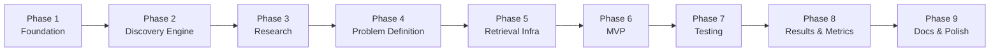
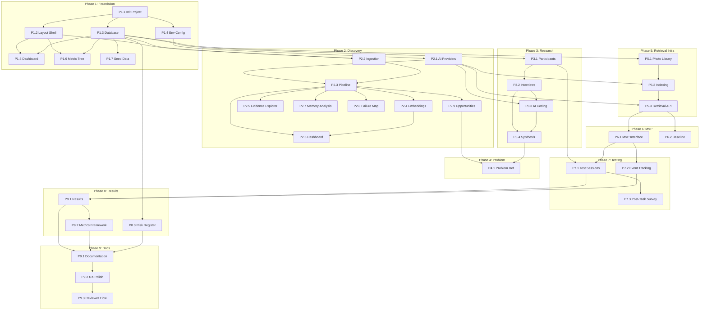

# Implementation Plan — Google Photos Vague-Memory Retrieval

> Derived from [problemstatement.md](file:///d:/DRIVE%20F/GRAD_GOOGLEPICS/DOCS/problemstatement.md) and [architecture.md](file:///d:/DRIVE%20F/GRAD_GOOGLEPICS/DOCS/architecture.md). Each task traces to a specific reviewer requirement and architecture section.

---

## Table of Contents

- [Overview](#overview)
- [Phase 1 — Foundation](#phase-1--foundation)
- [Phase 2 — Discovery Engine](#phase-2--discovery-engine)
- [Phase 3 — Research & Interviews](#phase-3--research--interviews)
- [Phase 4 — Problem Definition](#phase-4--problem-definition)
- [Phase 5 — Retrieval Infrastructure](#phase-5--retrieval-infrastructure)
- [Phase 6 — MVP Retrieval Experience](#phase-6--mvp-retrieval-experience)
- [Phase 7 — Testing Framework](#phase-7--testing-framework)
- [Phase 8 — Results, Metrics & Risks](#phase-8--results-metrics--risks)
- [Phase 9 — Documentation & Polish](#phase-9--documentation--polish)
- [Cross-Phase Concerns](#cross-phase-concerns)
- [Dependency Graph](#dependency-graph)
- [Risk Log](#risk-log)

---

## Overview

### Reviewer Requirements → Phase Mapping

| # | Reviewer Requirement | Primary Phase | Supporting Phases |
|---|---------------------|---------------|-------------------|
| 1 | Build an AI-powered discovery engine | **Phase 2** | Phase 1 (DB) |
| 2 | Break down the business metric | **Phase 1** | — |
| 3 | Validate opportunity through 5–6 user interviews | **Phase 3** | Phase 2 (opportunities) |
| 4 | Define the problem | **Phase 4** | Phase 2, 3 (evidence) |
| 5 | Build a functional AI-native MVP | **Phase 6** | Phase 5 (infrastructure) |
| 6 | Test the MVP with at least 3 users | **Phase 7** | Phase 6 (MVP) |
| 7 | Define success metrics | **Phase 8** | Phase 7 (test data) |
| 8 | Identify risks and mitigation steps | **Phase 8** | All phases |

### Build Sequence Principle (§2)



> [!IMPORTANT]
> The build sequence **mirrors the research-first principle** from §2. The MVP (Phase 6) does not begin until the problem definition (Phase 4) is complete, ensuring the solution is research-driven rather than assumed.

### Conventions

- **Files** are listed as clickable paths relative to the project root
- **AC** = Acceptance Criteria
- **Ref** = Reference to architecture.md or problemstatement.md section
- Each task has a unique ID (`P1.1`, `P2.3`, etc.) for dependency tracking

---

## Phase 1 — Foundation

> **Goal**: Working application shell with navigation, database, project overview, and metric tree.
> **Reviewer Requirement**: #2 (Break down the business metric)
> **Architecture Ref**: §4, §5, §6, §13, §15

### P1.1 — Initialize Next.js Project

| Attribute | Detail |
|-----------|--------|
| **Action** | Scaffold Next.js 15 app with TypeScript, Tailwind CSS v4, App Router |
| **Command** | `npx -y create-next-app@latest ./ --typescript --tailwind --eslint --app --src-dir=false --import-alias="@/*"` |
| **Depends on** | — |

**Files created:**
```
package.json
tsconfig.json
next.config.ts
tailwind.config.ts
app/layout.tsx
app/page.tsx
```

**Post-scaffold:**
- Install core dependencies:
  ```
  npm install drizzle-orm better-sqlite3 nanoid zod nuqs lucide-react recharts papaparse
  npm install -D drizzle-kit @types/better-sqlite3 vitest
  ```
- Configure `tailwind.config.ts` with project design tokens
- Configure path aliases in `tsconfig.json`

**AC:**
- [ ] `npm run dev` starts without errors
- [ ] Tailwind styles render
- [ ] All production dependencies installed

---

### P1.2 — Design System & Layout Shell

| Attribute | Detail |
|-----------|--------|
| **Action** | Build root layout with sidebar navigation, header, content area |
| **Depends on** | P1.1 |
| **Ref** | Architecture §13 (Screen Map), §44 (UX Requirements) |

**Files:**

| File | Purpose |
|------|---------|
| `app/layout.tsx` | Root layout with sidebar + content area |
| `app/globals.css` | Design tokens, Tailwind layers, custom utilities |
| `components/layout/sidebar.tsx` | Sidebar navigation with 16 screen links |
| `components/layout/header.tsx` | Page header with breadcrumbs + mode indicator |
| `components/layout/page-container.tsx` | Consistent page wrapper with max-width |
| `components/ui/button.tsx` | Button primitive (primary, secondary, ghost, danger) |
| `components/ui/card.tsx` | Card container |
| `components/ui/input.tsx` | Text input |
| `components/ui/badge.tsx` | Status / label badge |
| `components/ui/tabs.tsx` | Tab navigation |
| `components/ui/dialog.tsx` | Modal dialog |
| `components/ui/empty-state.tsx` | Empty state placeholder |
| `components/ui/data-table.tsx` | Sortable, filterable table |
| `components/shared/mode-indicator.tsx` | DEMO / RESEARCH mode badge (§42) |
| `components/shared/evidence-label.tsx` | EVIDENCE / OBSERVATION / HYPOTHESIS / DECISION label (§35) |
| `components/shared/confidence-badge.tsx` | 🟢 High / 🟡 Medium / 🔴 Low confidence badge (§36) |

**Navigation structure:**
```
Research
  ├── Project Overview      /dashboard
  ├── Metric Tree           /metrics
  ├── Evidence Ingestion    /evidence/ingest
  ├── Discovery Dashboard   /discovery
  ├── Evidence Explorer     /evidence
  ├── Memory Cue Analysis   /discovery/memory
  ├── Retrieval Failure Map /discovery/failures
  ├── Opportunity Areas     /opportunities
  ├── User Interviews       /research/interviews
  ├── Research Synthesis    /research/synthesis
  └── Problem Definition    /problem
MVP & Testing
  ├── MVP                   /mvp
  ├── User Testing          /testing
  ├── Results               /results
  ├── Metrics Framework     /metrics/framework
  └── Risks                 /risks
```

**UX constraints from §44:**
- ✅ Clean layout, strong hierarchy, restrained design
- ✅ Readable charts, useful empty states
- ❌ No excessive gradients, random animations, decorative AI elements

**AC:**
- [ ] Sidebar renders all 16 navigation items
- [ ] Active route highlighted in sidebar
- [ ] Mode indicator shows current `APP_MODE`
- [ ] Responsive layout works on 1024px+ screens
- [ ] Empty state renders on all pages (placeholder)

---

### P1.3 — Database Setup & Schema

| Attribute | Detail |
|-----------|--------|
| **Action** | Define Drizzle ORM schema for all entities, create SQLite database, run initial migration |
| **Depends on** | P1.1 |
| **Ref** | Architecture §6 (Database Schema) |

**Files:**

| File | Purpose |
|------|---------|
| `lib/database/client.ts` | Drizzle + better-sqlite3 connection singleton |
| `lib/database/schema.ts` | All entity table definitions (20 tables) |
| `lib/database/migrations/` | Generated migration files |
| `lib/utils/ids.ts` | `nanoid`-based ID generator |
| `lib/utils/dates.ts` | ISO date formatting utilities |
| `drizzle.config.ts` | Drizzle Kit configuration |

**Entities to define (from Architecture §6):**

| Entity Group | Tables |
|-------------|--------|
| Discovery | `evidence_sources`, `evidence_items`, `memory_cues`, `failure_modes` |
| Opportunities | `opportunities`, `opportunity_evidence` |
| Research | `participants`, `interviews`, `interview_quotes`, `interview_observations`, `research_findings` |
| Photos | `photo_assets`, `photo_metadata`, `photo_embeddings` |
| Retrieval | `retrieval_tasks`, `retrieval_sessions`, `query_turns`, `candidate_results` |
| Testing | `test_sessions`, `user_feedback`, `metric_events` |
| System | `risks`, `metric_definitions` |

**Key schema decisions to implement:**
- `data_mode` column (`demo` | `research`) on: `evidence_items`, `participants`, `interviews`, `photo_assets`, `retrieval_tasks`, `test_sessions`
- `label` column on: `interview_quotes`, `interview_observations`, `research_findings`
- `ai_confidence` as `real` on: `evidence_items`, `memory_cues`, `failure_modes`

**AC:**
- [ ] `npx drizzle-kit generate` produces migration
- [ ] `npx drizzle-kit push` creates SQLite database at `data/app.db`
- [ ] All 20+ tables created with correct columns and foreign keys
- [ ] Database client connects and performs basic CRUD

---

### P1.4 — Environment Configuration

| Attribute | Detail |
|-----------|--------|
| **Action** | Create `.env.example` with all variables, set up config module |
| **Depends on** | P1.1 |
| **Ref** | Architecture §16 (Environment Variables), §40 (AI Safety) |

**Files:**

| File | Purpose |
|------|---------|
| `.env.example` | Documented template with all variables |
| `.env.local` | Local instance (git-ignored) |
| `lib/config.ts` | Typed config module with validation |
| `.gitignore` | Ensure `.env.local`, `data/app.db`, `node_modules` are ignored |

**Config validation with Zod:**
```typescript
const ConfigSchema = z.object({
  APP_MODE: z.enum(["demo", "research"]).default("demo"),
  AI_PROVIDER: z.enum(["gemini", "openai", "groq"]).default("gemini"),
  DATABASE_URL: z.string().default("file:./data/app.db"),
  // ... all vars from Architecture §16
});
```

**AC:**
- [ ] `.env.example` documents every variable with comments
- [ ] App starts in demo mode by default
- [ ] Missing optional variables degrade gracefully
- [ ] API keys never appear in client bundles

---

### P1.5 — Project Overview Screen (Screen 1)

| Attribute | Detail |
|-----------|--------|
| **Action** | Build the `/dashboard` page showing project status |
| **Depends on** | P1.2, P1.3 |
| **Ref** | Problemstatement §34 (Screen 1), Architecture §13 |

**Files:**

| File | Purpose |
|------|---------|
| `app/dashboard/page.tsx` | Project overview page |
| `components/dashboard/status-card.tsx` | Status card (stage, count, progress) |
| `components/dashboard/stage-progress.tsx` | Visual stage indicator (§2 sequence) |
| `api/system/status/route.ts` | API: aggregate counts from all tables |

**Display (from §34):**
- Reviewer challenge statement
- Business goal
- Current project stage indicator
- Research status (evidence count, interview count)
- Selected opportunity (if any)
- MVP status
- Test status
- Quick-link cards to each major section

**AC:**
- [ ] Dashboard renders with all sections
- [ ] Counts pull from database (show 0 in demo mode initially)
- [ ] Stage progress visually shows the §2 research-first sequence
- [ ] Each section links to its corresponding screen

---

### P1.6 — Metric Tree Screen (Screen 2)

| Attribute | Detail |
|-----------|--------|
| **Action** | Build the `/metrics` page with interactive metric decomposition tree |
| **Depends on** | P1.2, P1.3 |
| **Ref** | Problemstatement §9 (Metric Decomposition), Architecture §13 |

**Files:**

| File | Purpose |
|------|---------|
| `app/metrics/page.tsx` | Metric tree page |
| `components/metrics/metric-tree.tsx` | Interactive tree visualization |
| `components/metrics/metric-node.tsx` | Individual tree node (expand/collapse, edit) |
| `api/metrics/tree/route.ts` | API: CRUD for metric tree data |
| `data/seed/metric-tree.json` | Default tree structure from §9 |

**Default tree (from §9):**
```
Successful Vague Retrieval
├── User can express remembered information
├── Product understands remembered information
├── Relevant candidates are retrieved
├── Relevant candidates are ranked appropriately
├── User can evaluate / recognize candidates
├── User can refine after failure
└── User eventually identifies intended photo
```

**Interactions:**
- Expand/collapse branches
- Add/edit/remove nodes
- Mark nodes with diagnostic metrics from §11
- Visual indicator of which branches research has validated

**AC:**
- [ ] Tree renders with default decomposition from §9
- [ ] Nodes are editable (add, edit, remove)
- [ ] Tree persists to database
- [ ] Collapsible branches with smooth animation

---

### P1.7 — Seed Data Setup

| Attribute | Detail |
|-----------|--------|
| **Action** | Create demo/synthetic seed data for development mode |
| **Depends on** | P1.3 |
| **Ref** | Problemstatement §41 (Demo Data), §42 (Development Mode) |

**Files:**

| File | Purpose |
|------|---------|
| `data/seed/evidence.json` | 20–30 synthetic evidence items (labeled DEMO) |
| `data/seed/interviews.json` | 2 template interview stubs (labeled DEMO) |
| `data/seed/tasks.json` | 5 demo retrieval tasks |
| `data/seed/metric-tree.json` | Default metric tree from §9 |
| `data/seed/risks.json` | Initial risk register from §33 |
| `lib/database/seed.ts` | Seed script that loads all demo data |
| `api/system/seed/route.ts` | API: trigger seed via POST |

**Labeling requirement (§41):**
- All demo records have `data_mode = "demo"`
- UI displays `⚠️ DEMO / SYNTHETIC DATA` badge on demo records
- Real research data has `data_mode = "research"` and no badge

**AC:**
- [ ] `POST /api/system/seed` populates database with demo data
- [ ] Demo data is clearly labeled in UI
- [ ] Demo data is visually distinct from research data
- [ ] Seed is idempotent (can be re-run safely)

---

### Phase 1 — Completion Checklist

- [ ] Next.js app starts and serves all 16 route stubs
- [ ] Database schema created with all entities
- [ ] Sidebar navigation works across all screens
- [ ] Project Overview dashboard renders
- [ ] Metric tree is interactive and persisted
- [ ] Demo mode seed data is loadable
- [ ] Mode indicator shows DEMO/RESEARCH
- [ ] Evidence labels (EVIDENCE/OBSERVATION/HYPOTHESIS/DECISION) are available as shared components

---

## Phase 2 — Discovery Engine

> **Goal**: Full AI-powered evidence analysis pipeline with dashboard, evidence explorer, and opportunity comparison.
> **Reviewer Requirement**: #1 (Build an AI-powered discovery engine)
> **Architecture Ref**: §7, §8, §9

### P2.1 — AI Provider Abstraction Layer

| Attribute | Detail |
|-----------|--------|
| **Action** | Implement provider-agnostic AI interface with Gemini, OpenAI, and Groq adapters |
| **Depends on** | P1.4 |
| **Ref** | Architecture §7 (AI Provider Abstraction) |

**Files:**

| File | Purpose |
|------|---------|
| `lib/ai/provider.ts` | `AIProvider` interface definition |
| `lib/ai/factory.ts` | `AIProviderFactory` — creates provider from config |
| `lib/ai/gemini.ts` | Gemini adapter (Google Generative AI SDK) |
| `lib/ai/openai.ts` | OpenAI adapter |
| `lib/ai/groq.ts` | Groq adapter |
| `lib/ai/schemas/evidence.ts` | Zod schema for structured evidence extraction |
| `lib/ai/schemas/clues.ts` | Zod schema for memory cue extraction |

**Interface (from Architecture §7):**
```typescript
interface AIProvider {
  generateText(prompt: string, options?: GenerateOptions): Promise<string>;
  generateStructured<T>(prompt: string, schema: ZodSchema<T>, options?: GenerateOptions): Promise<T>;
  generateEmbedding(text: string): Promise<number[]>;
  analyzeImage(image: Buffer, prompt: string): Promise<string>;
  chat(messages: ChatMessage[], options?: GenerateOptions): Promise<string>;
}
```

**AC:**
- [ ] At least one provider (Gemini) fully functional
- [ ] Factory creates correct provider from `AI_PROVIDER` env var
- [ ] Structured output returns validated Zod objects
- [ ] Text embedding returns float array
- [ ] Graceful error when API key missing

---

### P2.2 — Evidence Ingestion (Screen 3)

| Attribute | Detail |
|-----------|--------|
| **Action** | Build `/evidence/ingest` with 4 input methods |
| **Depends on** | P1.2, P1.3 |
| **Ref** | Problemstatement §4.1 (Sources), Architecture §8 |

**Files:**

| File | Purpose |
|------|---------|
| `app/evidence/ingest/page.tsx` | Evidence ingestion page |
| `components/evidence/ingest-text-form.tsx` | Manual text paste form |
| `components/evidence/ingest-csv-form.tsx` | CSV upload form |
| `components/evidence/ingest-json-form.tsx` | JSON upload form |
| `components/evidence/ingest-url-form.tsx` | URL + copied content form |
| `components/evidence/source-metadata-form.tsx` | Source platform, URL, date fields |
| `api/evidence/ingest/text/route.ts` | API: ingest from text |
| `api/evidence/ingest/csv/route.ts` | API: ingest from CSV |
| `api/evidence/ingest/json/route.ts` | API: ingest from JSON |
| `api/evidence/ingest/url/route.ts` | API: ingest from URL |

**Each input method captures (§5):**
- Source platform (dropdown: Play Store, App Store, Reddit, etc.)
- Source URL (optional)
- Date (optional)
- Raw user statement(s)

**CSV format:**
```csv
source_platform,source_url,date,raw_statement
"reddit","https://reddit.com/...","2024-03-15","I spent 20 minutes looking for..."
```

**AC:**
- [ ] All 4 ingestion methods work (text, CSV, JSON, URL)
- [ ] Source metadata captured with each item
- [ ] Batch CSV/JSON handles 100+ records
- [ ] Raw user statement always preserved
- [ ] Records created with `data_mode` based on `APP_MODE`
- [ ] Upload progress indicator for batch operations

---

### P2.3 — Discovery Pipeline Core

| Attribute | Detail |
|-----------|--------|
| **Action** | Implement the 10-stage AI analysis pipeline |
| **Depends on** | P2.1, P2.2 |
| **Ref** | Architecture §8 (Discovery Engine Pipeline), Problemstatement §7 |

**Files:**

| File | Purpose |
|------|---------|
| `lib/discovery/pipeline.ts` | Pipeline orchestrator — runs all stages |
| `lib/discovery/normalizer.ts` | Stage 1: Clean text, strip HTML, normalize whitespace |
| `lib/discovery/deduplicator.ts` | Stage 2: SimHash-based near-duplicate detection |
| `lib/discovery/classifier.ts` | Stage 3: LLM retrieval-relevance classification |
| `lib/discovery/extractor.ts` | Stage 4: LLM structured extraction (§5 schema) |
| `lib/discovery/theme-detector.ts` | Stage 5: LLM cluster summarization → themes |
| `lib/discovery/failure-classifier.ts` | Stage 6: Map to failure taxonomy (§6.3) |
| `lib/discovery/memory-analyzer.ts` | Stage 7: Map to memory cue taxonomy (§6.1, §6.2) |
| `lib/discovery/opportunity-generator.ts` | Stage 8: Synthesize themes → opportunity areas |
| `api/discovery/process/route.ts` | API: trigger pipeline on a batch of evidence |

**Pipeline stages (from Architecture §8):**

| # | Stage | Input | Output | AI? |
|---|-------|-------|--------|-----|
| 1 | Normalize | Raw text | Clean text + metadata | No |
| 2 | Deduplicate | Clean text batch | Deduplicated set | No |
| 3 | Classify relevance | Clean text | `is_retrieval_related` boolean | Yes |
| 4 | Extract structure | Relevant text | Full `EvidenceItem` fields per §5 | Yes |
| 5 | Detect themes | Clustered items | Theme labels + descriptions | Yes |
| 6 | Classify failures | Structured items | `FailureMode` records per §6.3 | Yes |
| 7 | Analyze memory cues | Structured items | `MemoryCue` records per §6.1/§6.2 | Yes |
| 8 | Generate opportunities | Themes + failures | `Opportunity` records | Yes |

**LLM prompt strategy:**
- Use structured output (JSON mode / Zod schemas) for all extraction
- Include taxonomy lists from §6 in prompts as reference categories
- Allow "other" category for emerging themes
- Request confidence score (0–1) for each extraction

**AC:**
- [ ] Pipeline runs end-to-end on a batch of text evidence
- [ ] Structured extraction populates all §5 schema fields
- [ ] Memory cues classified against §6.1 taxonomy
- [ ] Failure modes classified against §6.3 taxonomy
- [ ] Opportunities generated with evidence links
- [ ] AI confidence scores captured
- [ ] Original raw text always preserved alongside AI interpretation
- [ ] Pipeline handles errors gracefully (partial failure doesn't lose data)

---

### P2.4 — Embedding Generation & Clustering

| Attribute | Detail |
|-----------|--------|
| **Action** | Generate text embeddings for evidence items, cluster semantically |
| **Depends on** | P2.3 |
| **Ref** | Architecture §7 (Embedding Strategy), §8 (Pipeline stages) |

**Files:**

| File | Purpose |
|------|---------|
| `lib/embeddings/text.ts` | Text embedding via AI provider |
| `lib/embeddings/store.ts` | Chroma client wrapper (connect, upsert, query) |
| `lib/discovery/clusterer.ts` | k-means clustering on embedding vectors |
| `api/discovery/clusters/route.ts` | API: get cluster assignments + themes |

**Implementation:**
- Generate embeddings for each `EvidenceItem.raw_statement`
- Store in Chroma with metadata: `evidence_id`, `source_platform`, `is_retrieval_related`
- Cluster using k-means (auto-determine k via silhouette score, range 3–15)
- Label clusters using LLM summarization of cluster members

**AC:**
- [ ] Embeddings generated and stored in Chroma
- [ ] Clustering produces semantically coherent groups
- [ ] Cluster labels are human-readable
- [ ] Similar evidence items can be retrieved via vector search

---

### P2.5 — Evidence Explorer (Screen 5)

| Attribute | Detail |
|-----------|--------|
| **Action** | Build `/evidence` page with filtering, search, and detail inspection |
| **Depends on** | P2.3 |
| **Ref** | Problemstatement §8.2 (Evidence Explorer), Architecture §13 |

**Files:**

| File | Purpose |
|------|---------|
| `app/evidence/page.tsx` | Evidence explorer page |
| `components/evidence/evidence-table.tsx` | Filterable evidence table |
| `components/evidence/evidence-filters.tsx` | Filter sidebar (source, type, failure, etc.) |
| `components/evidence/evidence-detail.tsx` | Detail panel: raw text + AI interpretation side-by-side |
| `components/evidence/review-toggle.tsx` | Mark as human-reviewed |
| `api/evidence/route.ts` | API: list evidence with filters |
| `api/evidence/[id]/route.ts` | API: get/update single evidence item |

**Filters (from §8.2):**
- Source platform
- Asset type
- Remembered clue type
- Forgotten information type
- Failure stage
- Workaround type
- Success / failure outcome
- AI confidence level
- Human-reviewed status

**Key UX requirement (§5, §35):**
- Side-by-side display: original raw text (left) vs AI interpretation (right)
- Labels: AI fields show `AI INTERPRETATION` badge
- Raw text shows `EVIDENCE` badge

**AC:**
- [ ] Evidence table loads with pagination
- [ ] All 9 filter types work independently and combined
- [ ] Detail view shows raw text alongside AI interpretation
- [ ] Evidence labels (EVIDENCE vs AI INTERPRETATION) clearly distinguished
- [ ] Human review toggle persists
- [ ] URL state preserved via `nuqs` (shareable filtered views)

---

### P2.6 — Discovery Dashboard (Screen 4)

| Attribute | Detail |
|-----------|--------|
| **Action** | Build `/discovery` page with aggregate insights and visualizations |
| **Depends on** | P2.3, P2.4 |
| **Ref** | Problemstatement §8.1 (Overview), Architecture §13 |

**Files:**

| File | Purpose |
|------|---------|
| `app/discovery/page.tsx` | Discovery dashboard page |
| `components/discovery/overview-stats.tsx` | Summary stat cards |
| `components/discovery/source-distribution.tsx` | Pie/bar chart by source |
| `components/discovery/asset-type-chart.tsx` | Asset type distribution |
| `components/discovery/clue-frequency.tsx` | Most common remembered clues |
| `components/discovery/forgotten-frequency.tsx` | Most common forgotten info |
| `components/discovery/failure-distribution.tsx` | Failure stage breakdown |
| `components/discovery/workaround-chart.tsx` | Workaround distribution |
| `api/discovery/overview/route.ts` | API: aggregate counts and distributions |

**Metrics displayed (from §8.1):**

| Metric | Chart Type |
|--------|-----------|
| Total evidence items | Stat card |
| Relevant to vague retrieval | Stat card + percentage |
| Distribution by source | Horizontal bar chart |
| Common asset types | Bar chart |
| Common remembered clues | Horizontal bar chart (ranked) |
| Common forgotten information | Horizontal bar chart (ranked) |
| Common failure stages | Bar chart |
| Common workarounds | Bar chart |

**AC:**
- [ ] All 8 aggregate metrics display
- [ ] Charts render with Recharts
- [ ] Dashboard updates when new evidence is processed
- [ ] Empty state when no evidence exists
- [ ] Charts use restrained color palette (§44)

---

### P2.7 — Memory Cue Analysis (Screen 6)

| Attribute | Detail |
|-----------|--------|
| **Action** | Build `/discovery/memory` page visualizing remember vs forget patterns |
| **Depends on** | P2.3 |
| **Ref** | Problemstatement §8.3 (Memory Analysis) |

**Files:**

| File | Purpose |
|------|---------|
| `app/discovery/memory/page.tsx` | Memory cue analysis page |
| `components/discovery/memory-comparison.tsx` | Remember vs Forget comparison visualization |
| `components/discovery/cue-detail.tsx` | Drill-down: click cue type → see evidence |
| `api/discovery/memory-cues/route.ts` | API: aggregated memory cue data |

**Visualization:**
- Two-column or diverging bar chart: "What users remember" vs "What users forget"
- Click any cue category → filtered evidence list
- Confidence indicator on each pattern

> Do not infer exact percentages unless the dataset supports them (§8.3)

**AC:**
- [ ] Remember vs forget visualization renders
- [ ] Click-through to supporting evidence
- [ ] Confidence levels shown
- [ ] No fabricated percentages

---

### P2.8 — Retrieval Failure Map (Screen 7)

| Attribute | Detail |
|-----------|--------|
| **Action** | Build `/discovery/failures` page with failure funnel visualization |
| **Depends on** | P2.3 |
| **Ref** | Problemstatement §8.4 (Retrieval Failure Funnel) |

**Files:**

| File | Purpose |
|------|---------|
| `app/discovery/failures/page.tsx` | Retrieval failure map page |
| `components/discovery/failure-funnel.tsx` | Funnel visualization (§8.4 stages) |
| `components/discovery/failure-stage-detail.tsx` | Stage detail: evidence count + examples |
| `api/discovery/failure-map/route.ts` | API: failure stage distribution |

**Funnel stages (from §8.4):**
```
User remembers photo exists
  → Attempts to express memory
    → Creates search query
      → System interprets query
        → Candidate photos retrieved
          → User evaluates candidates
            → User refines or browses
              → Target found / abandoned
```

- Each stage shows count of evidence items where failure occurred
- Click stage → view supporting evidence
- Evidence-backed (not assumed) — only show data if evidence exists

**AC:**
- [ ] Funnel renders with all 8 stages
- [ ] Stages show evidence counts (0 if no evidence)
- [ ] Click-through to supporting evidence at each stage
- [ ] Visual proportions reflect actual evidence distribution

---

### P2.9 — Opportunity Explorer (Screen 8)

| Attribute | Detail |
|-----------|--------|
| **Action** | Build `/opportunities` page for comparing identified opportunity areas |
| **Depends on** | P2.3 |
| **Ref** | Problemstatement §8.5 (Opportunity Explorer) |

**Files:**

| File | Purpose |
|------|---------|
| `app/opportunities/page.tsx` | Opportunity areas page |
| `components/discovery/opportunity-card.tsx` | Opportunity summary card |
| `components/discovery/opportunity-comparison.tsx` | Side-by-side comparison table |
| `components/discovery/opportunity-evidence-list.tsx` | Supporting evidence list per opportunity |
| `api/opportunities/route.ts` | API: list, create opportunities |
| `api/opportunities/[id]/route.ts` | API: get opportunity with evidence |

**Key constraints (§8.5):**
- ❌ Do NOT auto-select a winner solely using AI
- ✅ Show evidence count and confidence for each opportunity
- ✅ Allow manual comparison and selection
- ✅ Each opportunity links to its supporting evidence

**AC:**
- [ ] Multiple opportunities displayed as cards
- [ ] Comparison view shows side-by-side metrics
- [ ] Evidence links are clickable (navigate to Evidence Explorer filtered)
- [ ] Manual selection/prioritization supported
- [ ] No auto-winner selection

---

### Phase 2 — Completion Checklist

- [ ] AI provider abstraction works with at least one provider
- [ ] All 4 ingestion methods functional
- [ ] Full pipeline processes evidence end-to-end
- [ ] Evidence Explorer with 9 filter types
- [ ] Discovery Dashboard with 8 aggregate visualizations
- [ ] Memory Cue Analysis renders remember/forget patterns
- [ ] Retrieval Failure Map shows evidence-backed funnel
- [ ] Opportunity Explorer allows comparison without auto-selection
- [ ] Every insight is clickable to reveal supporting evidence (§7)
- [ ] AI interpretations never replace original source text (§5)

---

## Phase 3 — Research & Interviews

> **Goal**: Interview repository with AI-assisted coding, cross-interview synthesis.
> **Reviewer Requirement**: #3 (Validate opportunity through 5–6 user interviews)
> **Architecture Ref**: §11

### P3.1 — Participant Management

| Attribute | Detail |
|-----------|--------|
| **Action** | CRUD for research participants |
| **Depends on** | P1.3 |
| **Ref** | Problemstatement §13 (Target Participant Recruitment) |

**Files:**

| File | Purpose |
|------|---------|
| `components/research/participant-form.tsx` | Add/edit participant form |
| `components/research/participant-list.tsx` | Participant list view |
| `api/research/participants/route.ts` | API: list, create participants |
| `api/research/participants/[id]/route.ts` | API: get, update participant |

**Fields:** Participant ID, alias, segment, demographics, recruiting criteria, `data_mode`

**AC:**
- [ ] Add, edit, view participants
- [ ] Demo mode shows template participants
- [ ] Recruiting criteria from §13 pre-populated as defaults

---

### P3.2 — Interview Repository (Screen 9)

| Attribute | Detail |
|-----------|--------|
| **Action** | Build `/research/interviews` with full interview data entry |
| **Depends on** | P3.1 |
| **Ref** | Problemstatement §15 (Interview Repository) |

**Files:**

| File | Purpose |
|------|---------|
| `app/research/interviews/page.tsx` | Interview list page |
| `app/research/interviews/[id]/page.tsx` | Interview detail page |
| `components/research/interview-form.tsx` | Interview creation/edit form |
| `components/research/transcript-entry.tsx` | Transcript text entry with auto-save |
| `components/research/quote-tagger.tsx` | Select text → tag as quote with label |
| `components/research/observation-entry.tsx` | Add researcher observation with label |
| `api/research/interviews/route.ts` | API: list, create interviews |
| `api/research/interviews/[id]/route.ts` | API: get, update interview |
| `api/research/interviews/[id]/quotes/route.ts` | API: add/list quotes |
| `api/research/interviews/[id]/observations/route.ts` | API: add/list observations |

**Data entry fields (from §15):**
- Participant ID (linked)
- Interview date
- Transcript
- Notes
- Retrieval incident description
- Target asset
- Initial memory
- Query sequence
- Observed behavior
- Workaround
- Outcome
- Tagged quotes (with labels)

**Label enforcement (§35, §15):**
- Every quote gets a label: `DIRECT_QUOTE`
- Every observation gets a label: `RESEARCHER_OBSERVATION`
- Every AI interpretation gets a label: `AI_INTERPRETATION`
- Every hypothesis gets a label: `HYPOTHESIS`

**AC:**
- [ ] Full interview CRUD
- [ ] Transcript entry with auto-save
- [ ] Quote tagging with mandatory label
- [ ] Observation entry with mandatory label
- [ ] All §15 fields captured
- [ ] Interview detail page shows all data

---

### P3.3 — AI-Assisted Interview Coding

| Attribute | Detail |
|-----------|--------|
| **Action** | LLM-powered analysis of interview transcripts |
| **Depends on** | P2.1, P3.2 |
| **Ref** | Problemstatement §15 (AI-assisted coding) |

**Files:**

| File | Purpose |
|------|---------|
| `lib/research/interview-coder.ts` | AI-assisted coding: extract themes, cues, failures from transcript |
| `api/research/interviews/[id]/analyze/route.ts` | API: trigger AI analysis |
| `components/research/ai-analysis-panel.tsx` | Display AI-extracted themes with `AI_INTERPRETATION` labels |

**AI coding extracts:**
- Remembered cues (mapped to §6.1 taxonomy)
- Forgotten information (mapped to §6.2 taxonomy)
- Failure stages (mapped to §6.3 taxonomy)
- Workarounds used
- Emotional context
- Key moments

**AC:**
- [ ] AI analysis runs on transcript text
- [ ] Extracted themes displayed with `AI_INTERPRETATION` label
- [ ] AI suggestions are separate from researcher observations
- [ ] Researcher can accept, reject, or modify AI suggestions

---

### P3.4 — Cross-Interview Synthesis (Screen 10)

| Attribute | Detail |
|-----------|--------|
| **Action** | Build `/research/synthesis` page with cross-participant patterns |
| **Depends on** | P3.2, P3.3 |
| **Ref** | Problemstatement §16 (Cross-Interview Analysis) |

**Files:**

| File | Purpose |
|------|---------|
| `app/research/synthesis/page.tsx` | Research synthesis page |
| `lib/research/synthesizer.ts` | Cross-interview pattern aggregation |
| `components/research/pattern-matrix.tsx` | Pattern comparison across participants |
| `components/research/theme-frequency.tsx` | Theme frequency chart |
| `components/research/participant-comparison.tsx` | Differences between participants |
| `api/research/synthesis/route.ts` | API: computed synthesis data |

**Patterns to identify (from §16):**
- Repeated remembered cues across participants
- Repeated forgotten attributes
- Repeated search behaviors
- Repeated failure stages
- Repeated workarounds
- Moments when users remembered additional information
- Abandonment patterns
- Key differences between participants

**Constraints (§16):**
- ❌ Do not claim generalizability from 5–6 interviews
- ✅ Present as qualitative patterns, not statistical conclusions
- ✅ Show confidence level (how many participants exhibited each pattern)

**AC:**
- [ ] Synthesis page aggregates across all interviews
- [ ] Pattern matrix shows per-participant presence of each theme
- [ ] Frequency charts for common themes
- [ ] Differences highlighted
- [ ] No claims of statistical significance

---

### Phase 3 — Completion Checklist

- [ ] Participant CRUD functional
- [ ] Full interview data entry with all §15 fields
- [ ] Quote tagging with labels enforced
- [ ] AI-assisted coding labels clearly as `AI_INTERPRETATION`
- [ ] Cross-interview synthesis shows patterns
- [ ] Demo mode shows template interviews (labeled DEMO)
- [ ] Research mode stores real interview data

---

## Phase 4 — Problem Definition

> **Goal**: Evidence-backed problem definition generated from research.
> **Reviewer Requirement**: #4 (Define the problem)
> **Architecture Ref**: §11

### P4.1 — Problem Definition Builder (Screen 11)

| Attribute | Detail |
|-----------|--------|
| **Action** | Build `/problem` page with template-based problem definition builder |
| **Depends on** | P2.9, P3.4 |
| **Ref** | Problemstatement §17, §18 (Problem Definition + Template) |

**Files:**

| File | Purpose |
|------|---------|
| `app/problem/page.tsx` | Problem definition page |
| `lib/research/problem-builder.ts` | AI-assisted problem definition generator |
| `components/research/problem-template.tsx` | Fill-in template from §18 |
| `components/research/evidence-linker.tsx` | Link evidence to each template field |
| `components/research/research-finding-card.tsx` | Research finding display with label |
| `api/problem/route.ts` | API: get/update problem definition |
| `api/research/findings/route.ts` | API: list/create research findings |

**Template from §18:**
```
For [target segment],
when they are trying to retrieve [scenario],
they often remember [memory cues]
but have forgotten [searchable attributes].
Because [root cause],
their initial retrieval attempt results in [failure behavior].
Users then resort to [workaround],
creating [consequence].
Improving [product behavior]
should increase [retrieval component].
```

**Eight dimensions from §17:**

| Dimension | Source |
|-----------|--------|
| Target User Segment | Interviews (Phase 3) |
| Retrieval Scenario | Interviews + Discovery (Phase 2, 3) |
| Product Outcome | Metric tree (Phase 1) |
| Root Cause | Synthesis (Phase 3) |
| Existing Workaround | Interviews + Discovery (Phase 2, 3) |
| User Value | Interviews (Phase 3) |
| Business Value | Business metric (Phase 1) |
| Evidence | All research (Phase 2, 3) |

**Constraints (§18):**
- ❌ Do not fill with invented findings
- ✅ Each field links to supporting evidence
- ✅ Empty fields remain empty until evidence exists

**AC:**
- [ ] Template renders with all 8 dimensions
- [ ] Each field linkable to evidence/interviews/findings
- [ ] AI can suggest fill-ins based on research data
- [ ] Empty fields show "awaiting research" state
- [ ] Problem definition persists

---

### Phase 4 — Completion Checklist

- [ ] Problem definition template functional
- [ ] Evidence linking works
- [ ] AI-assisted generation available but not mandatory
- [ ] Empty fields clearly show "awaiting research"

---

## Phase 5 — Retrieval Infrastructure

> **Goal**: Photo library, image indexing pipeline, retrieval API.
> **Reviewer Requirement**: #5 foundation (infrastructure for functional MVP)
> **Architecture Ref**: §9, §10

### P5.1 — Photo Library & Demo Dataset

| Attribute | Detail |
|-----------|--------|
| **Action** | Create photo upload system and demo library |
| **Depends on** | P1.3 |
| **Ref** | Problemstatement §21 (Representative Photo Library), §22 (User Photo Import) |

**Files:**

| File | Purpose |
|------|---------|
| `api/photos/upload/route.ts` | API: upload photos |
| `api/photos/seed/route.ts` | API: load demo library |
| `api/photos/route.ts` | API: list photos |
| `api/photos/[id]/route.ts` | API: get photo details |
| `api/photos/[id]/image/route.ts` | API: serve photo file |
| `data/demo-library/` | Demo photos organized by category |

**Demo library categories (from §21):**

| Category | Min Count | Example Items |
|----------|-----------|---------------|
| travel | 30 | Landmarks, streets, hotel rooms |
| food | 20 | Restaurants, home cooking, street food |
| screenshots | 20 | App screens, messages, receipts |
| medicines | 5 | Medicine bottles, prescriptions |
| receipts | 10 | Store receipts, bills |
| documents | 10 | Letters, forms, certificates |
| people | 20 | Group photos, selfies |
| pets | 10 | Dogs, cats |
| events | 15 | Parties, weddings, celebrations |
| landmarks | 10 | Famous places, monuments |
| duplicates | 10 | Similar/near-duplicate photos |

**Total: ~160 photos minimum** (use freely-licensed images from Unsplash/Pexels or generate with AI)

**AC:**
- [ ] Photo upload works (single + batch)
- [ ] Demo library has 150+ photos across all categories
- [ ] Photos served via API route
- [ ] Photo metadata displayed (filename, size, dimensions)
- [ ] Privacy notice shown on user upload

---

### P5.2 — Image Indexing Pipeline

| Attribute | Detail |
|-----------|--------|
| **Action** | Extract all retrieval signals from each photo |
| **Depends on** | P2.1, P5.1 |
| **Ref** | Problemstatement §23 (Image Indexing Pipeline), Architecture §9 |

**Files:**

| File | Purpose |
|------|---------|
| `lib/indexing/pipeline.ts` | Indexing orchestrator — runs all extractors |
| `lib/indexing/metadata.ts` | File metadata (dimensions, size, format) via `sharp` |
| `lib/indexing/exif.ts` | EXIF parsing (date, GPS) via `exifr` |
| `lib/indexing/ocr.ts` | OCR text extraction via `tesseract.js` |
| `lib/indexing/captioner.ts` | Semantic captioning via multimodal LLM |
| `lib/embeddings/clip.ts` | CLIP embedding via `@xenova/transformers` |
| `api/photos/index/route.ts` | API: trigger indexing on uploaded photos |

**Pipeline (parallel where possible):**

```
Photo uploaded
├── [parallel] File metadata (sharp)
├── [parallel] EXIF parsing (exifr)
├── [parallel] OCR (tesseract.js)
├── [parallel] CLIP embedding (transformers.js)
└── [sequential, after above] Semantic captioning (multimodal LLM)
    ├── Objects extracted from caption
    ├── Scene classified from caption
    └── Document category (from caption + OCR)
```

**Storage:**
- Metadata → `photo_metadata` table (SQLite)
- CLIP embedding → `photo_embeddings` table + Chroma
- Caption embedding → Chroma

**AC:**
- [ ] All extraction stages work independently
- [ ] Indexing handles JPEG, PNG, WEBP formats
- [ ] EXIF date/location parsed when present
- [ ] OCR extracts text from screenshots and documents
- [ ] CLIP embedding generated for each photo
- [ ] Semantic caption generated for each photo
- [ ] Indexing is idempotent (re-indexing same photo updates, doesn't duplicate)
- [ ] Progress reporting for batch indexing

---

### P5.3 — Retrieval API

| Attribute | Detail |
|-----------|--------|
| **Action** | Build multi-signal retrieval engine with fusion and reranking |
| **Depends on** | P2.1, P5.2 |
| **Ref** | Problemstatement §25 (Retrieval Engine), §26 (Uncertainty), Architecture §10 |

**Files:**

| File | Purpose |
|------|---------|
| `lib/retrieval/engine.ts` | Retrieval orchestrator |
| `lib/retrieval/clue-extractor.ts` | LLM-based intent + clue extraction from vague query |
| `lib/retrieval/uncertainty.ts` | Confidence tagger (certain vs uncertain clues) |
| `lib/retrieval/candidate-generator.ts` | Multi-signal candidate generation |
| `lib/retrieval/fusion.ts` | Reciprocal Rank Fusion across signals |
| `lib/retrieval/reranker.ts` | LLM-based reranking of top candidates |
| `api/retrieval/search/route.ts` | API: execute retrieval query |
| `api/retrieval/refine/route.ts` | API: refine previous query |
| `api/retrieval/clues/route.ts` | API: extract clues from text (debug) |

**Retrieval flow (from Architecture §10):**

```
User query → Clue extraction → Confidence tagging →
  → CLIP semantic search (Chroma)
  → Caption text search (Chroma)
  → OCR full-text search (SQLite FTS)
  → Metadata filter (SQLite)
  → Temporal filter (soft/hard)
  → Location filter (soft/hard)
→ RRF Fusion → AI Reranking → Ranked results
```

**Uncertainty handling (§26):**

| Hedge Language | Confidence | Filter Type |
|---------------|------------|-------------|
| "It was in Goa" | Certain | Hard filter |
| "Maybe during 2022" | Uncertain | Soft boost (weighted) |
| "I think Rahul was there" | Uncertain | Soft boost (reduced weight) |

**AC:**
- [ ] Natural language query returns ranked photo results
- [ ] Multiple retrieval signals contribute to ranking
- [ ] Uncertain clues treated as soft signals, not hard filters
- [ ] Refinement works (narrows/adjusts previous results)
- [ ] Response includes candidate rank, score, match explanation
- [ ] Latency < 5s for libraries of 200 photos

---

### Phase 5 — Completion Checklist

- [ ] Demo photo library with 150+ categorized photos
- [ ] User photo upload with privacy notice
- [ ] Full indexing pipeline (metadata, EXIF, OCR, CLIP, caption)
- [ ] Multi-signal retrieval returns ranked results
- [ ] Uncertainty-aware filtering
- [ ] RRF fusion + AI reranking

---

## Phase 6 — MVP Retrieval Experience

> **Goal**: Functional AI-native retrieval interface + baseline comparison.
> **Reviewer Requirement**: #5 (Build a functional AI-native MVP)
> **Architecture Ref**: §10

### P6.1 — MVP Retrieval Interface (Screen 12)

| Attribute | Detail |
|-----------|--------|
| **Action** | Build `/mvp` page with the AI-native retrieval experience |
| **Depends on** | P5.3 |
| **Ref** | Problemstatement §19, §20 (MVP Requirements) |

**Files:**

| File | Purpose |
|------|---------|
| `app/mvp/page.tsx` | MVP retrieval page |
| `components/retrieval/search-input.tsx` | Vague memory query input |
| `components/retrieval/results-grid.tsx` | Photo results grid with ranking |
| `components/retrieval/result-card.tsx` | Individual result (thumbnail, score, match reason) |
| `components/retrieval/clue-display.tsx` | Extracted clues shown to user |
| `components/retrieval/refinement-panel.tsx` | Query refinement interface |
| `components/retrieval/photo-lightbox.tsx` | Full-size photo viewer |
| `components/retrieval/target-selector.tsx` | "This is the photo" selection |

**Functional requirements (§20) — another person must be able to:**
1. ✅ Access the prototype
2. ✅ Use the demo photo library
3. ✅ Enter a vague memory query
4. ✅ See AI-powered ranked results
5. ✅ Interact with refinement
6. ✅ Inspect results at full size
7. ✅ Select the target photo
8. ✅ Complete the retrieval task

> [!IMPORTANT]
> The specific interaction pattern (chatbot, guided search, filter UI, or hybrid) is determined by research findings from Phases 2–4. The architecture supports all patterns via the retrieval API. **Implement the pattern that the research supports.**

**AC:**
- [ ] User can enter a vague natural-language query
- [ ] Results display as a ranked grid of photos
- [ ] Each result shows match explanation
- [ ] User can refine/adjust query
- [ ] User can select a photo as "the one I was looking for"
- [ ] Retrieval session is recorded (for Phase 7)
- [ ] Interface is functional, not a static mockup

---

### P6.2 — Baseline Comparison Mode

| Attribute | Detail |
|-----------|--------|
| **Action** | Build a simple semantic-search baseline for comparison |
| **Depends on** | P5.3 |
| **Ref** | Problemstatement §27 (Baseline Experience) |

**Files:**

| File | Purpose |
|------|---------|
| `components/retrieval/baseline-search.tsx` | Simple search box → ranked results (no AI features) |
| `api/retrieval/baseline/route.ts` | API: basic semantic search without AI enhancement |

**Baseline = simple keyword/semantic search:**
- Text query → CLIP similarity + caption match
- No clue extraction, no uncertainty handling, no AI reranking, no refinement
- Results displayed in same grid format as MVP

**AC:**
- [ ] Baseline search returns results from same library
- [ ] No AI enhancement (no clue extraction, reranking, refinement)
- [ ] Same result display format as MVP for fair comparison
- [ ] Session type recorded as `baseline` for comparison in Phase 7

---

### Phase 6 — Completion Checklist

- [ ] MVP interface is fully functional end-to-end
- [ ] Another person can complete a retrieval task
- [ ] Baseline mode works for comparison
- [ ] Both modes record sessions for analysis

---

## Phase 7 — Testing Framework

> **Goal**: Structured testing mode with event tracking, task management, and post-task surveys.
> **Reviewer Requirement**: #6 (Test the MVP with at least 3 users)
> **Architecture Ref**: §12

### P7.1 — Test Session Management (Screen 13)

| Attribute | Detail |
|-----------|--------|
| **Action** | Build `/testing` page for structured test session management |
| **Depends on** | P3.1, P6.1 |
| **Ref** | Problemstatement §28, §29 (Testing Mode) |

**Files:**

| File | Purpose |
|------|---------|
| `app/testing/page.tsx` | Test session management page |
| `app/testing/[sessionId]/page.tsx` | Active test session runner |
| `components/testing/session-setup.tsx` | Create test session: select participant, assign tasks |
| `components/testing/task-card.tsx` | Task description (hidden target) |
| `components/testing/session-runner.tsx` | Run tasks sequentially (baseline then MVP or vice versa) |
| `api/testing/sessions/route.ts` | API: list, create test sessions |
| `api/testing/sessions/[id]/route.ts` | API: get session details |
| `api/testing/tasks/route.ts` | API: list, create retrieval tasks |

**Test task format (from §21):**
```
Task:      "Find the medicine photo you took when you were sick."
Target:    IMG_00482  (hidden from participant, visible to researcher)
```

**Session captures (from §29):**

All 18 fields: Participant ID, Task ID, Target asset ID, Initial query, Time started, Results displayed, Target rank, User interactions, Refinement attempts, Search changes, AI Q&A, Candidates opened, Final selection, Success/failure, Time to target, Total interactions, User comments, Researcher observations.

**AC:**
- [ ] Create test session with participant and task list
- [ ] Tasks show prompt but hide target from participant
- [ ] Researcher can see target ID
- [ ] Session runs baseline then MVP (or configurable order)
- [ ] All 18 §29 fields captured

---

### P7.2 — Event Tracking

| Attribute | Detail |
|-----------|--------|
| **Action** | Instrument all retrieval interactions with analytics events |
| **Depends on** | P6.1 |
| **Ref** | Problemstatement §43 (Analytics Events), Architecture §12 |

**Files:**

| File | Purpose |
|------|---------|
| `lib/analytics/tracker.ts` | Client-side event tracker |
| `api/testing/events/route.ts` | API: log metric events |

**Events to instrument (from §43):**

| Event | Trigger |
|-------|---------|
| `retrieval_started` | Session begins |
| `query_submitted` | User submits a query |
| `results_shown` | Results rendered |
| `candidate_opened` | User clicks to inspect a result |
| `query_refined` | User modifies query |
| `filter_applied` | User applies a filter |
| `ai_question_shown` | AI asks clarifying question |
| `ai_question_answered` | User responds to AI |
| `target_selected` | User selects final result |
| `retrieval_success` | Selected result matches target |
| `retrieval_abandoned` | User gives up |
| `task_completed` | Task ends |

**Event metadata:** anonymous session ID, task ID, timestamp, interaction number, result rank, latency

**AC:**
- [ ] All 12 event types logged during retrieval
- [ ] Events stored in `metric_events` table
- [ ] No private content in event data (§43)
- [ ] Events link to session and task

---

### P7.3 — Post-Task Survey

| Attribute | Detail |
|-----------|--------|
| **Action** | Post-task questionnaire after each retrieval task |
| **Depends on** | P7.1 |
| **Ref** | Problemstatement §30 (Post-Task Questions) |

**Files:**

| File | Purpose |
|------|---------|
| `components/testing/post-task-survey.tsx` | Survey form |
| `api/testing/feedback/route.ts` | API: store survey responses |

**Questions (from §30):**
1. "What helped you most?"
2. "What was confusing?"
3. "Did the system ask anything unnecessary?"
4. "Did anything shown by the system help you remember more?"
5. "Did you trust the results?"
6. "What would you change?"
7. "How would you normally have tried to find this photo?"

**AC:**
- [ ] Survey appears after each task completion/abandonment
- [ ] All 7 questions displayed
- [ ] Responses stored as `user_feedback` records
- [ ] Researcher can add observations alongside

---

### Phase 7 — Completion Checklist

- [ ] Test sessions create and manage properly
- [ ] Tasks display prompt, hide target
- [ ] All 12 analytics events instrumented
- [ ] Post-task survey with 7 questions
- [ ] Baseline vs MVP sessions distinguishable
- [ ] All data stored for Phase 8 analysis

---

## Phase 8 — Results, Metrics & Risks

> **Goal**: Results comparison, success metric framework, risk register.
> **Reviewer Requirements**: #7 (Define success metrics), #8 (Identify risks)
> **Architecture Ref**: §12

### P8.1 — Results Dashboard (Screen 14)

| Attribute | Detail |
|-----------|--------|
| **Action** | Build `/results` page comparing baseline vs MVP retrieval |
| **Depends on** | P7.1, P7.2 |
| **Ref** | Problemstatement §31 (Experiment Comparison) |

**Files:**

| File | Purpose |
|------|---------|
| `app/results/page.tsx` | Results page |
| `lib/analytics/comparator.ts` | Baseline vs MVP metric computation |
| `components/results/comparison-table.tsx` | Side-by-side metric comparison (§31 table) |
| `components/results/per-task-breakdown.tsx` | Per-task results |
| `components/results/per-participant.tsx` | Per-participant results |
| `components/results/survey-summary.tsx` | Aggregated post-task survey responses |
| `api/results/comparison/route.ts` | API: computed comparison data |

**Comparison metrics (from §31):**

| Metric | Computation |
|--------|------------|
| Success rate | `successful / total` |
| Time to target | Median duration for successful retrievals |
| Query/refinement count | Mean number of `query_submitted` + `query_refined` events |
| Target rank | Mean rank of target in result lists |
| Abandonment rate | `abandoned / total` |
| Subjective difficulty | Mean survey difficulty rating |

**Constraints (§31):**
- ❌ Do NOT claim statistical significance with small samples
- ✅ Present directional qualitative evidence honestly
- ✅ Show per-task and per-participant breakdowns

**AC:**
- [ ] Comparison table renders with 6 metrics
- [ ] Per-task and per-participant breakdowns available
- [ ] Survey responses summarized
- [ ] No claims of statistical significance
- [ ] Data sourced from actual test sessions

---

### P8.2 — Metrics Framework (Screen 15)

| Attribute | Detail |
|-----------|--------|
| **Action** | Build `/metrics/framework` page for defining the success metric framework |
| **Depends on** | P8.1 |
| **Ref** | Problemstatement §32 (Define Success) |

**Files:**

| File | Purpose |
|------|---------|
| `app/metrics/framework/page.tsx` | Metrics framework page |
| `lib/analytics/calculator.ts` | Metric computation engine |
| `components/metrics/metric-definition-form.tsx` | Define metric: name, formula, category, type |
| `components/metrics/metric-category-section.tsx` | Group by: primary, leading, diagnostic, guardrail |
| `components/metrics/metric-value-card.tsx` | Computed metric value from test data |
| `api/metrics/definitions/route.ts` | API: metric definitions CRUD |
| `api/results/metrics/route.ts` | API: computed metric values |

**Metric categories (from §32):**

| Category | Purpose | Examples |
|----------|---------|---------|
| **Primary** | North star metric | Vague-memory retrieval success rate |
| **Leading** | Early indicators | Target Recall@K, time to target, successful refinement rate |
| **Diagnostic** | Debug and tune | Clue extraction accuracy, AI latency, candidate quality |
| **Guardrail** | Safety bounds | Hallucination rate, privacy, cost per session, latency |

**AC:**
- [ ] Define metrics with name, formula, category
- [ ] Metric values computed from test data
- [ ] Four category sections rendered
- [ ] Metrics correspond to actual MVP (§32)

---

### P8.3 — Risk Register (Screen 16)

| Attribute | Detail |
|-----------|--------|
| **Action** | Build `/risks` page with risk register |
| **Depends on** | P1.3 |
| **Ref** | Problemstatement §33 (Risks and Mitigation) |

**Files:**

| File | Purpose |
|------|---------|
| `app/risks/page.tsx` | Risk register page |
| `components/risks/risk-form.tsx` | Add/edit risk |
| `components/risks/risk-table.tsx` | Risk register table |
| `components/risks/risk-matrix.tsx` | Severity × Likelihood matrix |
| `api/risks/route.ts` | API: list, create risks |
| `api/risks/[id]/route.ts` | API: update risk |
| `data/seed/risks.json` | Pre-seeded risks from §33 |

**Pre-seeded risks (from §33):**

| Category | Description | Mitigation |
|----------|-------------|------------|
| Privacy | Photo libraries are deeply personal | Local processing, consent, deletion |
| Incorrect AI Interpretation | Misunderstand partial memory | Editable assumptions, fallback |
| Hallucination | LLM invents info | Ground in indexed assets |
| Retrieval Quality | Relevant assets missed | Hybrid retrieval, multiple signals |
| Latency | Multimodal AI slow | Preprocess, cache, async |
| Cost | Multimodal expensive | Preprocessing, selective LLM |
| User Trust | Users don't understand surfacing | Transparent reasoning |
| Research Bias | Over-represent unhappy users | Multiple sources, interviews |
| Interview Bias | Poor recall of past behavior | Real tasks, think-aloud |

**AC:**
- [ ] 9 pre-seeded risks from §33
- [ ] CRUD for adding MVP-specific risks
- [ ] Severity × Likelihood matrix visualization
- [ ] Mitigation strategies editable
- [ ] Risk linked to related opportunity (if applicable)

---

### Phase 8 — Completion Checklist

- [ ] Results comparison dashboard functional
- [ ] 6 comparison metrics computed
- [ ] Metrics framework with 4 categories
- [ ] Risk register with 9 pre-seeded + custom risks
- [ ] No fabricated results or inflated significance

---

## Phase 9 — Documentation & Polish

> **Goal**: Complete all required documentation, polish UX, verify all requirements met.

### P9.1 — Required Documentation

| Attribute | Detail |
|-----------|--------|
| **Action** | Create all 15 required project documents |
| **Depends on** | All previous phases |
| **Ref** | Problemstatement §47 (Required Final Outputs) |

**Files to create (from §47):**

| Document | Content Source |
|----------|--------------|
| `README.md` | Project overview, setup instructions (§48) |
| `docs/PROJECT_BRIEF.md` | Reviewer challenge + business context |
| `docs/RESEARCH_METHOD.md` | Methodology documentation |
| `docs/DISCOVERY_ENGINE.md` | AI discovery engine documentation |
| `docs/METRIC_TREE.md` | Business metric decomposition |
| `docs/INTERVIEW_GUIDE.md` | Interview protocol + questions from §14 |
| `docs/RESEARCH_FINDINGS.md` | Template — filled after real research |
| `docs/PROBLEM_DEFINITION.md` | Template — filled after research |
| `docs/MVP_HYPOTHESIS.md` | Template — filled after problem definition |
| `docs/MVP_ARCHITECTURE.md` | Technical architecture of retrieval MVP |
| `docs/USER_TEST_PLAN.md` | Testing methodology + tasks |
| `docs/USER_TEST_RESULTS.md` | Template — filled after testing |
| `docs/METRICS.md` | Success metric framework |
| `docs/RISKS.md` | Risk register snapshot |
| `docs/NEXT_ITERATION.md` | Future recommendations |

**README content (from §48):**
- Project overview, reviewer challenge, product objective
- Architecture diagram, technical stack
- Installation, environment variables, database setup
- Seed/demo data setup, AI provider configuration
- Running locally, research workflow, testing workflow
- Privacy notes, limitations

> [!NOTE]
> Documents marked "Template" must remain templates until real research is completed. Do not fill with invented data (§47).

**AC:**
- [ ] All 15 documents created
- [ ] README enables a new developer to set up and run the project
- [ ] Template documents clearly labeled as templates
- [ ] Architecture diagram in README

---

### P9.2 — UX Polish & Verification

| Attribute | Detail |
|-----------|--------|
| **Action** | Final UX review against §44 requirements, empty states, error handling |
| **Depends on** | All screens built |
| **Ref** | Problemstatement §44 (UX Requirements), §45 (Reviewer Experience) |

**Checklist:**

| Requirement | Status |
|-------------|--------|
| Clean layout | ⬜ |
| Strong information hierarchy | ⬜ |
| Restrained visual design | ⬜ |
| Readable charts | ⬜ |
| Easy evidence inspection | ⬜ |
| Clear distinction between research and hypotheses | ⬜ |
| Responsive interaction | ⬜ |
| Useful empty states on all 16 screens | ⬜ |
| Clear error handling | ⬜ |
| No excessive gradients | ⬜ |
| No random animations | ⬜ |
| No decorative AI elements | ⬜ |
| No fake statistics | ⬜ |
| No meaningless dashboards | ⬜ |

---

### P9.3 — Reviewer Flow Verification

| Attribute | Detail |
|-----------|--------|
| **Action** | Verify the 12-step reviewer experience flow from §45 |
| **Depends on** | All phases |
| **Ref** | Problemstatement §45 (Reviewer Experience) |

**Reviewer should understand the project in this order:**

| Step | Screen | Verification |
|------|--------|-------------|
| 1 | Read the challenge | Dashboard shows reviewer challenge ⬜ |
| 2 | Metric decomposition | Metric tree is interactive ⬜ |
| 3 | AI discovery evidence | Discovery dashboard shows insights ⬜ |
| 4 | Failure patterns | Failure map shows evidence-backed patterns ⬜ |
| 5 | Opportunity investigated | Opportunity explorer shows comparison ⬜ |
| 6 | Interview findings | Interviews show real/template data ⬜ |
| 7 | Root cause | Synthesis shows identified root cause ⬜ |
| 8 | Problem definition | Problem definition filled from evidence ⬜ |
| 9 | Use MVP | MVP is functional end-to-end ⬜ |
| 10 | Test results | Results show comparison data ⬜ |
| 11 | Success metrics | Metrics framework defined ⬜ |
| 12 | Risks & next steps | Risk register + next iteration ⬜ |

> The reviewer should **never need to guess** how one stage led to another (§45).

**AC:**
- [ ] All 12 steps are navigable in sequence
- [ ] Each step clearly connects to the next
- [ ] No gaps in the evidence chain

---

### Phase 9 — Completion Checklist

- [ ] All 15 required documents created
- [ ] README enables full project setup
- [ ] UX polish checklist passed
- [ ] 12-step reviewer flow verified
- [ ] All 8 reviewer requirements addressed

---

## Cross-Phase Concerns

### Evidence Labeling (§35) — All Phases

| Label | Used In |
|-------|---------|
| `EVIDENCE` | Evidence Explorer, Discovery Dashboard, Opportunity Explorer |
| `OBSERVATION` | Research Synthesis, Cross-Interview Analysis |
| `HYPOTHESIS` | Problem Definition, Opportunity Areas |
| `DECISION` | MVP choice, Metric selection |

**Implementation:** `components/shared/evidence-label.tsx` — used everywhere information is displayed.

### Data Mode Separation (§41, §42) — All Phases

| Concern | Implementation |
|---------|---------------|
| `data_mode` column | On: `evidence_items`, `participants`, `interviews`, `photo_assets`, `retrieval_tasks`, `test_sessions` |
| Mode indicator | `components/shared/mode-indicator.tsx` — shown in header |
| Query filtering | All list queries filter by current `APP_MODE` or show both with labels |
| Demo badge | `⚠️ DEMO / SYNTHETIC DATA` badge on all demo records |

### "What NOT to Do" Guardrails (§46) — All Phases

| Guardrail | Enforced By |
|-----------|------------|
| No fabricated research | Empty states instead of invented data |
| No fabricated quotes | Label enforcement on interview quotes |
| No auto-selected winner | Opportunity explorer requires manual selection |
| No claims of significance | Results dashboard explicitly disclaims |
| Not just a static UI | MVP must execute retrieval end-to-end |
| Not just a chatbot | Solution determined by research, not assumed |

### Development Rule Questions (§50) — All Phases

Before each task, ask:

1. **Which requirement from the reviewer brief does this support?**
2. **What evidence supports this conclusion?**
3. **Why is intelligence required here?**
4. **Did the user actually retrieve the intended target?**

---

## Dependency Graph



---

## Risk Log

### Implementation Risks

| Risk | Impact | Likelihood | Mitigation |
|------|--------|-----------|------------|
| **AI provider API downtime** | Blocks pipeline, retrieval | Medium | Multi-provider fallback; graceful degradation in demo mode |
| **CLIP model too slow on CPU** | Indexing takes hours | Medium | Batch processing; pre-compute embeddings; offer GPU instructions |
| **Tesseract.js OCR quality** | Poor text extraction from screenshots | Medium | Fall back to multimodal LLM for OCR; allow manual correction |
| **Demo photo licensing** | Legal issues with demo images | Low | Use Unsplash/Pexels (free license) or generate with AI |
| **SQLite concurrent writes** | Errors during batch processing | Low | WAL mode; sequential writes; queue operations |
| **Chroma local instability** | Vector search failures | Low | Fallback to brute-force cosine similarity on stored embeddings |
| **Scope creep in MVP** | Overbuilding before research | High | Enforce solution-agnostic architecture; build retrieval API first, UI last |
| **Large file uploads** | Memory exhaustion | Medium | Streaming uploads; 50MB limit; batch processing |

### Mitigations Built Into Architecture

| Architectural Decision | Risk It Mitigates |
|----------------------|-------------------|
| AI provider abstraction | Single-provider lock-in / downtime |
| SQLite + Drizzle ORM | Database setup complexity for reviewers |
| Demo/Research mode separation | Fabricated research confusion |
| Evidence label enforcement | Reviewer credibility |
| Solution-agnostic retrieval API | Premature solution commitment |
| Local-first processing | Privacy concerns |
