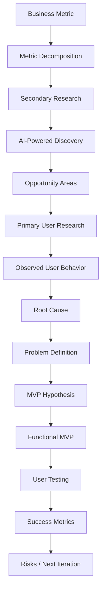
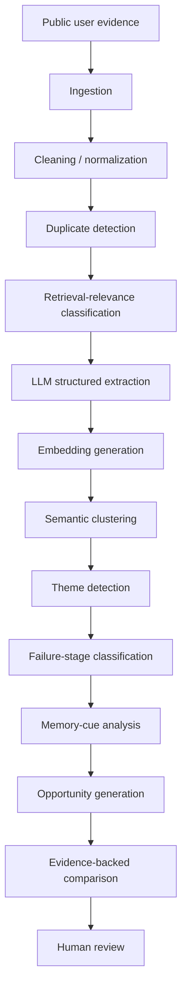
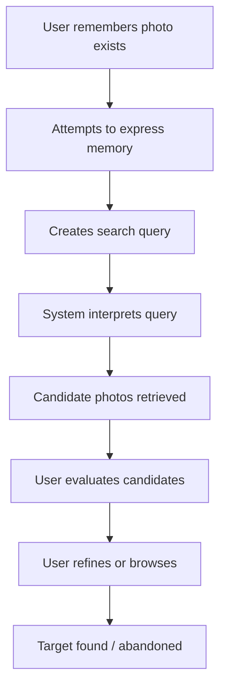
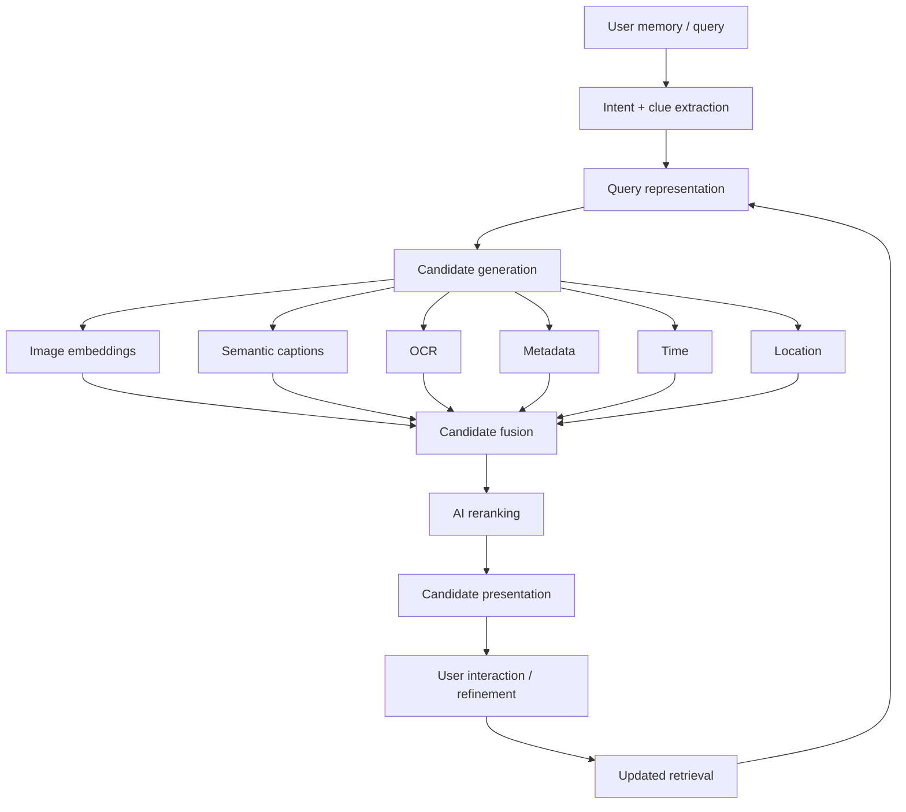
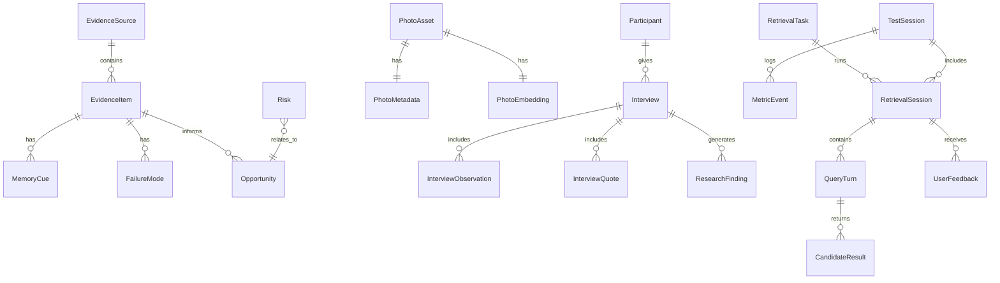

# Google Photos Core Experience — AI-Native Product Project

> **Source of Truth**: The reviewer-provided problem statement is the absolute source of truth. Do not reinterpret, narrow, expand, or fabricate any part of this assignment.

---

## Table of Contents

| # | Section | Part |
|---|---------|------|
| 1 | [Project Objective](#1-project-objective) | — |
| 2 | [Core Build Principle](#2-core-build-principle) | — |
| 3 | [Product Questions](#3-product-questions-the-project-must-answer) | — |
| 4 | [AI-Powered Discovery Engine](#4-part-1--ai-powered-discovery-engine) | Part 1 |
| 5 | [Discovery Engine Data Schema](#5-discovery-engine-data-schema) | Part 1 |
| 6 | [Research Taxonomy](#6-research-taxonomy) | Part 1 |
| 7 | [Discovery Engine Pipeline](#7-discovery-engine-pipeline) | Part 1 |
| 8 | [Research Dashboard](#8-research-dashboard) | Part 1 |
| 9 | [Business Metric Decomposition](#9-part-2--business-metric-decomposition) | Part 2 |
| 10 | [Define Retrieval Session](#10-define-retrieval-session) | Part 2 |
| 11 | [Metrics for Each Stage](#11-metrics-for-each-stage) | Part 2 |
| 12 | [Primary User Research](#12-part-3--primary-user-research) | Part 3 |
| 13 | [Target Participant Recruitment](#13-target-participant-recruitment) | Part 3 |
| 14 | [Interview Methodology](#14-interview-methodology) | Part 3 |
| 15 | [Interview Repository](#15-interview-repository) | Part 3 |
| 16 | [Cross-Interview Analysis](#16-cross-interview-analysis) | Part 3 |
| 17 | [Problem Definition](#17-part-4--problem-definition) | Part 4 |
| 18 | [Problem Definition Template](#18-problem-definition-template) | Part 4 |
| 19 | [Build an AI-Native MVP](#19-part-5--build-an-ai-native-mvp) | Part 5 |
| 20 | [MVP Minimum Requirement](#20-mvp-minimum-requirement) | Part 5 |
| 21 | [Representative Photo Library](#21-representative-photo-library) | Part 5 |
| 22 | [Optional User Photo Import](#22-optional-user-photo-import) | Part 5 |
| 23 | [Image Indexing Pipeline](#23-image-indexing-pipeline) | Part 5 |
| 24 | [Possible AI Components](#24-possible-ai-components) | Part 5 |
| 25 | [Retrieval Engine Architecture](#25-retrieval-engine-architecture) | Part 5 |
| 26 | [Uncertainty Handling](#26-uncertainty-handling) | Part 5 |
| 27 | [Baseline Experience](#27-baseline-experience) | Part 5 |
| 28 | [MVP User Testing](#28-part-6--mvp-user-testing) | Part 6 |
| 29 | [Testing Mode](#29-testing-mode) | Part 6 |
| 30 | [Post-Task Questions](#30-post-task-questions) | Part 6 |
| 31 | [Experiment Comparison](#31-experiment-comparison) | Part 6 |
| 32 | [Define Success](#32-part-7--define-success) | Part 7 |
| 33 | [Risks and Mitigation](#33-part-8--risks-and-mitigation) | Part 8 |
| 34 | [Required Web Application](#34-required-web-application) | Build |
| 35 | [Evidence Labeling](#35-evidence-labeling) | Build |
| 36 | [Research Confidence](#36-research-confidence) | Build |
| 37 | [Technology](#37-technology) | Build |
| 38 | [Project Structure](#38-project-structure) | Build |
| 39 | [Database Entities](#39-database-entities) | Build |
| 40 | [AI Safety / Data Principles](#40-ai-safety--data-principles) | Build |
| 41 | [Demo Data](#41-demo-data) | Build |
| 42 | [Development Mode](#42-development-mode) | Build |
| 43 | [Analytics Events](#43-analytics-events) | Build |
| 44 | [UX Requirements](#44-ux-requirements) | Build |
| 45 | [Reviewer Experience](#45-reviewer-experience) | Review |
| 46 | [What NOT to Do](#46-what-not-to-do) | Guardrails |
| 47 | [Required Final Outputs](#47-required-final-outputs) | Deliverables |
| 48 | [README Content](#48-readme-content) | Deliverables |
| 49 | [Implementation Order](#49-implementation-order) | Execution |
| 50 | [Important Development Rule](#50-important-development-rule) | Execution |
| 51 | [First Task for the Coding Agent](#51-first-task-for-the-coding-agent) | Execution |

---

## Reviewer Requirements Checklist

The final project must directly address **every** requirement in the reviewer brief:

| # | Requirement | Status |
|---|-------------|--------|
| 1 | Build an AI-powered discovery engine | ⬜ |
| 2 | Break down the business metric | ⬜ |
| 3 | Validate the opportunity through 5–6 user interviews | ⬜ |
| 4 | Define the problem | ⬜ |
| 5 | Build a functional AI-native MVP | ⬜ |
| 6 | Test the MVP with at least 3 users | ⬜ |
| 7 | Define success metrics | ⬜ |
| 8 | Identify risks and mitigation steps | ⬜ |

**Product Context**: Google Photos Core Experience

**Strategic Business Goal**:

> **Increase the percentage of users who successfully retrieve a photo they remember but cannot precisely describe when they start searching.**

This project is specifically about **retrieval when memory is incomplete**. It is NOT about improving Google Photos search in general.

---

## 1. Project Objective

Build a complete end-to-end product case study and functional prototype that investigates:

> **Why do users fail to retrieve a photo that they know exists when they remember something about it but cannot precisely describe it?**

The project must **discover** the answer through research rather than assuming it.

### Example Scenarios

| Scenario | User Memory |
|----------|-------------|
| *"That small café we went to during our Goa trip."* | Place + Trip |
| *"The picture of the medicine I took when I was sick last year."* | Object + Approximate time |

### What Users May NOT Remember

- Exact date
- Exact location
- Exact name
- Album
- Filename
- Exact searchable text
- Exact event
- Exact visual details

### What Users May INSTEAD Remember

- Rough time
- People involved
- Trip or event
- Visual appearance
- Reason the photo was taken
- Something that happened around the photo
- Approximate place
- Object category
- Text fragment
- Emotion
- Purpose
- Sequence relative to another event
- Whether it was a screenshot/photo/document

> [!IMPORTANT]
> These are examples only. The research must determine the real patterns.

---

## 2. Core Build Principle

> **Do not start with a solution.**

The required sequence is:



- The implementation should **visibly preserve** this sequence.
- The final reviewer should be able to understand **why the MVP exists** based on the preceding evidence.

---

## 3. Product Questions the Project Must Answer

### 3.1 Memory

- What do people remember about old visual information?
- What do they forget?
- Which clues remain strong after months or years?
- Do users remember: who, where, why, approximately when, visual appearance, event context, surrounding activities, text, source, relationship to another memory?

### 3.2 Search Behavior

- What does the user type when they cannot remember the correct search term?
- Do they start broad?
- Do they change dates?
- Do they use people?
- Do they browse manually?
- Do they try multiple synonyms?
- Do they give up?

### 3.3 Failure

Where does retrieval actually fail? Possibilities include:

| Failure Point | Description |
|---------------|-------------|
| Expression failure | User cannot express the memory |
| Misunderstanding | System misunderstands their clues |
| Missing results | Relevant photo never appears |
| Buried results | Relevant photo appears but is buried |
| Recognition failure | User cannot recognize the correct result |
| Refinement failure | User cannot refine the query |
| Literal interpretation | System treats uncertain information too literally |
| Context gap | System cannot use contextual/relational clues |

> [!WARNING]
> Do not assume which failure point is dominant.

### 3.4 Workarounds

What do users do when search fails?

- Manually scrolling timeline
- Browsing albums
- Searching locations
- Searching people
- Checking WhatsApp
- Asking another person
- Searching Google Maps
- Checking calendar
- Searching screenshots
- Trying multiple keywords
- Abandoning the task

> **Discover rather than assume.**

---

## 4. Part 1 — AI-Powered Discovery Engine

Build an actual research-analysis system. This must be **more sophisticated** than:

- ❌ Sentiment analysis
- ❌ Keyword counts
- ❌ Positive/negative review classification
- ❌ Generic review summaries

The system should extract **structured evidence specifically about photo retrieval behavior**.

### 4.1 Sources

Design the system to ingest evidence from public sources:

| Source Type | Examples |
|-------------|----------|
| App stores | Google Play Store reviews, Apple App Store reviews |
| Community | Reddit, Google Photos Community, Google support discussions |
| Social | YouTube comments, public social media discussions |
| Other | Forums, public product discussions, other relevant public conversations |

**Fallback import methods** (where automatic collection is difficult):

- CSV import
- JSON import
- Manual text input
- URL + copied content input

> [!CAUTION]
> Do not make the entire project dependent on unstable scraping.

---

## 5. Discovery Engine Data Schema

For each relevant public statement, capture:

| Field | Description |
|-------|-------------|
| **Evidence ID** | Unique identifier |
| **Source platform** | Where the evidence was found |
| **Source URL** | Direct link |
| **Date** | When the statement was made |
| **Raw user statement** | Original text (always retained) |
| **Retrieval-related?** | Yes / No |
| **What was the user trying to find?** | Target description |
| **Asset type** | Photo · Video · Screenshot · Document · Receipt · Medicine · Place · Person · Food · Other |
| **What did the user remember?** | Memory cues |
| **What had the user forgotten?** | Missing information |
| **What information was uncertain?** | Hedged / uncertain clues |
| **What query did the user attempt?** | Search terms used |
| **What did the system apparently return?** | System response |
| **Where did retrieval fail?** | Failure point |
| **What did the user try next?** | Follow-up action |
| **Did the user eventually succeed?** | Outcome |
| **What workaround was used?** | Alternative approach |
| **Apparent user cost** | Time · Effort · Frustration · Abandonment · No result |
| **Potential failure category** | Classified failure type |
| **Potential opportunity category** | Identified opportunity |
| **Confidence in AI interpretation** | AI confidence level |
| **Human-reviewed?** | Yes / No |

> [!IMPORTANT]
> - Always retain the original user text.
> - AI-generated interpretations must **never replace** source evidence.

---

## 6. Research Taxonomy

Create **editable taxonomies** rather than hard-coded conclusions.

### 6.1 Possible Remembered Clue Types

`person` · `object` · `general location` · `exact location` · `approximate time` · `exact time` · `trip` · `event` · `activity` · `appearance` · `color` · `environment` · `text fragment` · `purpose` · `source` · `relationship` · `social context` · `before/after event` · `screenshot context` · `emotional context` · `document type`

### 6.2 Possible Forgotten Information

`exact date` · `exact place` · `name` · `text` · `filename` · `album` · `person` · `event` · `year` · `source`

### 6.3 Possible Retrieval Failure Points

`memory articulation failure` · `query formulation failure` · `intent-understanding failure` · `semantic matching failure` · `metadata failure` · `ranking failure` · `candidate overload` · `recognition failure` · `refinement failure` · `browsing burden` · `abandonment`

> These categories are starting points only. The system should allow **new themes to emerge**.

---

## 7. Discovery Engine Pipeline



- Use **RAG or equivalent evidence retrieval** so that generated conclusions can be traced back to original source records.
- Every important insight should be **clickable to reveal supporting evidence**.

---

## 8. Research Dashboard

### 8.1 Overview

| Metric | Description |
|--------|-------------|
| Total evidence items | Number of public evidence items |
| Relevant items | Number relevant to vague retrieval |
| Source distribution | Breakdown by source platform |
| Asset types | Common asset types mentioned |
| Remembered clues | Common remembered clues |
| Forgotten information | Common forgotten information |
| Failure stages | Common retrieval failure stages |
| Workarounds | Common workarounds |

### 8.2 Evidence Explorer

**Filters**: source · asset type · remembered clue · forgotten clue · failure stage · workaround · success/failure · confidence

Show the original evidence alongside AI interpretation.

### 8.3 Memory Analysis

Visualize: **What users remember vs. what they forget.**

> Do not infer exact percentages unless the dataset supports them.

### 8.4 Retrieval Failure Funnel / Map



Use the evidence to identify **where failures occur**.

### 8.5 Opportunity Explorer

- Allow multiple opportunity areas to be compared.
- Do NOT automatically select a winner solely using AI.
- Show the evidence supporting each opportunity.

---

## 9. Part 2 — Business Metric Decomposition

**Starting metric**: Successful retrieval of vaguely remembered photos

Build a **metric tree**. Do not assume retrieval success depends only on search relevance. Investigate the full behavior chain.

```
Successful Vague Retrieval
│
├── User can express remembered information
│
├── Product understands remembered information
│
├── Relevant candidates are retrieved
│
├── Relevant candidates are ranked appropriately
│
├── User can evaluate / recognize candidates
│
├── User can refine after failure
│
└── User eventually identifies intended photo
```

> This is a starting framework. Research may modify it.

---

## 10. Define Retrieval Session

A **vague-memory retrieval session** occurs when:

1. The user believes a specific visual asset exists.
2. The user wants to retrieve it.
3. At the beginning of the task, the user lacks enough precise information to identify it directly.

**Successful retrieval**: The intended target asset is found.

> For controlled testing, each task should have a **known target image** where possible.

---

## 11. Metrics for Each Stage

### Query Formation

| Metric | Type |
|--------|------|
| Time to first query | Latency |
| Number of clues expressed | Count |
| Query length | Count |
| Uncertainty expressed | Boolean/Scale |
| Number of reformulations | Count |

### Understanding

| Metric | Type |
|--------|------|
| Extracted clue accuracy | Rate |
| Incorrect interpretation rate | Rate |
| Unresolved clue rate | Rate |

### Candidate Retrieval

| Metric | Type |
|--------|------|
| Target Recall@5 | Rate |
| Target Recall@10 | Rate |
| Target Recall@20 | Rate |
| Target rank | Position |

### Candidate Evaluation

| Metric | Type |
|--------|------|
| Number of candidates inspected | Count |
| Time spent evaluating candidates | Duration |
| Target recognition rate | Rate |

### Refinement

| Metric | Type |
|--------|------|
| Refinement attempts | Count |
| Successful refinement percentage | Rate |
| Rank improvement after refinement | Delta |
| Abandonment after failed attempt | Rate |

### Final Outcome

| Metric | Type |
|--------|------|
| Retrieval success rate | Rate |
| Time to retrieve | Duration |
| Number of interactions | Count |
| Abandonment rate | Rate |

> [!NOTE]
> Do not finalize the metric framework before the MVP is determined.

---

## 12. Part 3 — Primary User Research

The assignment requires interviews with **5–6 actual users**.

> [!CAUTION]
> - Do not fabricate participants.
> - Do not generate fake quotes.
> - Do not create fake interview findings.

The product should provide a **research workspace** where real interviews can be stored and analyzed.

---

## 13. Target Participant Recruitment

The final target segment should be chosen based on research. A reasonable **initial recruiting criterion** is users who:

- Have used a photo-management app for several years
- Have accumulated a large visual library
- Have attempted to find old photos/screenshots/documents
- Have experienced difficulty retrieving something they knew existed

> Do not over-segment initially without evidence.

---

## 14. Interview Methodology

Use a combination of:

1. **Critical Incident Technique**
2. **Contextual Inquiry / Retrieval Task**

The interview should focus on **actual past behavior** rather than hypothetical feature preferences.

### Sample Questions

| Phase | Question |
|-------|----------|
| Recall | *"What was the last photo you remember trying to find but had difficulty finding?"* |
| Memory | *"What did you remember about it before you started searching?"* |
| Gaps | *"What didn't you remember?"* |
| Action | *"What did you type first?"* |
| Reasoning | *"Why did you type that?"* |
| Response | *"What appeared?"* |
| Iteration | *"What did you do next?"* |
| Clues | *"What other clues did you try?"* |
| Recognition | *"Did seeing results remind you of anything?"* |
| Outcome | *"Did you eventually find the photo? How?"* |
| Duration | *"How long did it roughly take?"* |
| Fallback | *"What would you normally do if search failed?"* |

**Where possible**: Ask the user to recreate the retrieval task inside their actual photo application. Observe their behavior. **Do not lead them toward the MVP concept.**

---

## 15. Interview Repository

Build a module for storing:

- Participant ID
- Participant segment information
- Interview date
- Transcript
- Notes
- Retrieval incident
- Target asset
- Initial memory
- Query sequence
- Observed behavior
- Workaround
- Outcome
- Quotes

Use AI to assist coding and synthesis. Clearly distinguish:

| Label | Meaning |
|-------|---------|
| **Direct Quote** | Verbatim user words |
| **Researcher Observation** | What the researcher saw/noted |
| **AI Interpretation** | AI-generated analysis |
| **Hypothesis** | Unvalidated explanation |

---

## 16. Cross-Interview Analysis

Once real interview data is entered, automatically help identify:

- Repeated remembered cues
- Repeated forgotten attributes
- Repeated search behaviors
- Repeated failure stages
- Repeated workarounds
- Moments users remembered additional information
- Abandonment patterns
- Differences between participants

Create a **synthesis page**.

> [!WARNING]
> Do not claim generalizability from 5–6 interviews. Use qualitative findings appropriately.

---

## 17. Part 4 — Problem Definition

Only **after** secondary and primary research, generate the final problem definition.

It must answer:

| Dimension | Question |
|-----------|----------|
| **Target User Segment** | Who specifically experiences the problem? |
| **Retrieval Scenario** | Under what circumstances are they searching? |
| **Product Outcome** | What behavior/outcome should improve? |
| **Root Cause** | Why does retrieval fail even though the user retains some memory? |
| **Existing Workaround** | What does the user currently do? |
| **User Value** | Why does successful retrieval matter? |
| **Business Value** | Why is improving this useful for Google Photos? |
| **Evidence** | Which secondary and primary research observations support the conclusion? |

---

## 18. Problem Definition Template

Use this structure once evidence is available:

```
For [target segment],

when they are trying to retrieve [specific type/scenario of remembered visual asset],

they often remember [specific types of memory cues]

but have forgotten [specific searchable attributes].

Because [validated root cause],

their initial retrieval attempt results in [observed failure behavior].

Users then resort to [observed workaround],

creating [time/effort/friction/consequence].

Improving [specific product behavior/outcome]

should increase [relevant component of successful vague-memory retrieval].
```

> [!CAUTION]
> Do not fill this with invented findings.

---

## 19. Part 5 — Build an AI-Native MVP

The MVP must follow the **final research finding**.

Do NOT assume from the beginning that the answer is:

- ❌ Chatbot
- ❌ Conversational search
- ❌ Vector search
- ❌ Visual search
- ❌ Timeline search
- ❌ Filters
- ❌ Photo assistant

The **research should determine** where intelligence is actually required. However, architect the application flexibly enough that an AI-based retrieval experience **can be built after research**.

---

## 20. MVP Minimum Requirement

The MVP must be **functional**. Another person should be able to:

1. Access the prototype
2. Use a representative photo library
3. Receive a retrieval task or choose a known target
4. Attempt retrieval
5. Interact with the AI functionality
6. Inspect results
7. Identify/select the target
8. Complete the retrieval task

> A static Figma-style interface alone is **insufficient**.

---

## 21. Representative Photo Library

Support a demo dataset with categories:

| Category | Examples |
|----------|----------|
| Personal | travel, restaurants, food, people, pets, events |
| Utility | screenshots, medicines, receipts, documents |
| Visual | landmarks, similar-looking photos, duplicate/near-duplicate photos |

### Test Task Format

```
Task:      "Find the medicine photo you took when you were sick."
Target:    IMG_00482  (hidden from participant)
```

---

## 22. Optional User Photo Import

- If technically practical, support a **private local upload mode**.
- Users may upload a folder of images for testing.
- Privacy should be explicit.
- Do not require real Google Photos account integration for the MVP unless absolutely necessary.
- A representative local dataset is acceptable for demonstrating the core experience.

---

## 23. Image Indexing Pipeline

The prototype may need to derive:

| Signal | Description |
|--------|-------------|
| File metadata | Basic file properties |
| EXIF date | Timestamp from photo metadata |
| EXIF location | GPS coordinates from photo metadata |
| OCR | Extracted text from images |
| Image embeddings | Vector representations |
| Semantic caption | AI-generated description |
| Objects | Detected objects |
| Scenes | Scene classification |
| Text | Visible text content |
| Document category | Type classification |

> Keep these as **modular retrieval signals**. Do not assume any single representation is enough.

---

## 24. Possible AI Components

Based on final research findings, the MVP may potentially use:

| Component | Purpose |
|-----------|---------|
| Multimodal embeddings | Image + text representation |
| Semantic retrieval | Meaning-based search |
| OCR | Text extraction |
| LLM query interpretation | Understanding vague queries |
| Contextual reasoning | Connecting related information |
| Query expansion | Broadening search scope |
| Conversational refinement | Interactive narrowing |
| Adaptive questioning | Smart follow-up questions |
| Re-ranking | Intelligent result ordering |
| Confidence estimation | Uncertainty quantification |
| Candidate comparison | Side-by-side evaluation |
| Metadata reasoning | Using file/EXIF data |
| Temporal reasoning | Time-based inference |
| Location reasoning | Place-based inference |
| Multimodal RAG | Grounded generation |

> **Use only what the problem requires.**

---

## 25. Retrieval Engine Architecture

Use a **hybrid architecture** where appropriate.



> Do not implement components that are unnecessary for the validated problem.

---

## 26. Uncertainty Handling

Users may not be certain about what they remember. The product should **avoid treating every clue as absolute truth**.

| Input | Confidence |
|-------|------------|
| *"Maybe during 2022."* | **Uncertain** — use soft filter |
| *"I think Rahul was there."* | **Uncertain** — use soft filter |
| *"It may have been Goa."* | **Uncertain** — use soft filter |
| *"It was in Goa."* | **Certain** — use hard filter |

> Allow retrieval logic to use **soft confidence** rather than hard filters when appropriate.

---

## 27. Baseline Experience

Create a simple **baseline** so the MVP can be evaluated properly.

**Potential baseline**: A normal semantic-search interface where the user enters a query and receives ranked results.

Then compare the **AI-native MVP against the baseline** on the same retrieval tasks. The project must demonstrate whether the new intelligence improves retrieval behavior.

---

## 28. Part 6 — MVP User Testing

- Return to at least **3 users** from the selected target segment.
- Preferably use participants from the original interviews where possible.
- Do not fabricate test results.
- The application should provide a **testing mode**.

---

## 29. Testing Mode

For each retrieval task, capture:

| Field | Description |
|-------|-------------|
| Participant ID | User identifier |
| Task ID | Task identifier |
| Target asset ID | Ground-truth target |
| Initial memory/query | Starting input |
| Time started | Timestamp |
| Results displayed | What was shown |
| Target rank | Position of target in results |
| User interactions | All interactions logged |
| Refinement attempts | Query changes |
| Search changes | Filter/scope changes |
| AI questions/responses | If applicable |
| Candidates opened | Which results were inspected |
| Final selected asset | What the user chose |
| Success / failure | Outcome |
| Time to target | Duration |
| Total interactions | Count |
| User comments | Verbal feedback |
| Researcher observations | Notes |

---

## 30. Post-Task Questions

After the participant finishes, ask:

- *"What helped you most?"*
- *"What was confusing?"*
- *"Did the system ask anything unnecessary?"*
- *"Did anything shown by the system help you remember more?"*
- *"Did you trust the results?"*
- *"What would you change?"*
- *"How would you normally have tried to find this photo?"*

> Store **actual answers only**.

---

## 31. Experiment Comparison

Where feasible, compare **Baseline retrieval** vs. **AI-native MVP retrieval**.

| Metric | Baseline | MVP |
|--------|----------|-----|
| Success rate | — | — |
| Time to target | — | — |
| Query/refinement count | — | — |
| Target rank | — | — |
| Abandonment rate | — | — |
| Subjective difficulty | — | — |

> [!WARNING]
> With a small sample, do not claim statistical significance. Present **directional qualitative evidence** honestly.

---

## 32. Part 7 — Define Success

The final metric framework must correspond to the **actual MVP**.

### Primary Metric

> **Vague-memory retrieval success rate**

### Leading Metrics

- Target Recall@K
- Time to target
- Target rank
- Successful refinement rate
- Interactions to target
- Percentage of users completing task
- Recovery rate after unsuccessful first attempt

### Diagnostics

- Clue extraction accuracy
- Candidate quality
- Clarification response rate
- Search reformulation count
- Result inspection count
- Abandoned sessions
- AI latency
- Retrieval latency

### Guardrails

- Incorrect-result confidence
- Hallucination
- Sensitive-content exposure
- Privacy
- Cost per session
- Response latency

> Final selection must reflect the **MVP actually built**.

---

## 33. Part 8 — Risks and Mitigation

### Risk Register

| Risk Category | Description | Mitigation |
|---------------|-------------|------------|
| **Privacy** | Photo libraries are deeply personal | Local processing, explicit consent, deletion controls, minimal retention, no training usage, clear data policy |
| **Incorrect AI Interpretation** | System might misunderstand partial memory | Editable assumptions, confidence representation, refinement, fallback retrieval |
| **Hallucination** | LLMs may invent information not in the library | Ground responses in indexed assets, provenance, avoid unsupported claims |
| **Retrieval Quality** | Relevant assets may never enter candidate pool | Hybrid retrieval, multiple signals, larger candidate generation before reranking |
| **Latency** | Multimodal AI can be slow | Preprocess library, cache embeddings, async indexing, lightweight reranking |
| **Cost** | Multimodal models can be expensive | Preprocessing, embedding reuse, selective LLM calls, smaller models for classification |
| **User Trust** | Users may not understand why photos are surfaced | Transparent reasoning, clear controls, user correction |
| **Research Bias** | Public complaints may over-represent unhappy users | Multiple sources, validate with interviews, distinguish prevalence from severity |
| **Interview Bias** | Users may poorly recall past retrieval behavior | Real retrieval tasks, screen sharing / think-aloud, Critical Incident Technique |

> Add risks specific to the final MVP.

---

## 34. Required Web Application

Build **one integrated project application** with the following screens:

| # | Screen | Purpose |
|---|--------|---------|
| 1 | **Project Overview** | Reviewer challenge, business goal, project stage, research status, selected opportunity, MVP status, test status |
| 2 | **Metric Tree** | Interactive decomposition of successful retrieval of vaguely remembered photos |
| 3 | **Evidence Ingestion** | Pasted text, CSV, JSON, URLs, source metadata |
| 4 | **Discovery Dashboard** | Secondary-research insights |
| 5 | **Evidence Explorer** | Inspect individual pieces of evidence |
| 6 | **Memory Cue Analysis** | What users remember vs forget |
| 7 | **Retrieval Failure Map** | Where failure occurs in the journey |
| 8 | **Opportunity Areas** | Compare identified opportunity areas |
| 9 | **User Interviews** | Store 5–6 real interviews |
| 10 | **Research Synthesis** | Cross-participant findings |
| 11 | **Problem Definition** | Final research-backed problem |
| 12 | **MVP** | Functional AI retrieval experience |
| 13 | **User Testing** | Run structured retrieval tests |
| 14 | **Results** | Compare retrieval behavior and outcomes |
| 15 | **Metrics** | Success framework |
| 16 | **Risks** | Risk and mitigation register |

---

## 35. Evidence Labeling

Throughout the interface, explicitly label information as:

| Label | Definition |
|-------|------------|
| **EVIDENCE** | Something directly observed in source material or research |
| **OBSERVATION** | A repeated pattern seen in evidence |
| **HYPOTHESIS** | A possible explanation that has not yet been validated |
| **DECISION** | A product choice made based on available evidence |

> [!CAUTION]
> Never merge these categories. This is critical for reviewer credibility.

---

## 36. Research Confidence

Where useful, indicate confidence levels:

| Level | Basis |
|-------|-------|
| 🟢 **High** | Strong evidence, source diversity, cross-source agreement, primary research support |
| 🟡 **Medium** | Moderate evidence, some corroboration |
| 🔴 **Low** | Limited evidence, single source, no primary validation |

> Do not pretend qualitative evidence provides population-level certainty.

---

## 37. Technology

### Frontend
- Next.js
- TypeScript
- React
- Tailwind CSS

### Backend
- Next.js API routes or FastAPI

### Database
- PostgreSQL / Supabase *(production)*
- SQLite *(lightweight local version)*

### Vector Search
- pgvector, Qdrant, or Chroma

### AI
- Create **provider abstraction** (Gemini · OpenAI · Groq)
- Do not tightly couple the architecture to one provider if avoidable

### Image Understanding
- Multimodal model and/or CLIP-style embeddings

### OCR
- Reliable OCR provider/library

---

## 38. Project Structure

```
/app
  /dashboard
  /discovery
  /evidence
  /metrics
  /research
  /interviews
  /opportunities
  /problem
  /mvp
  /testing
  /results
  /risks

/components

/lib
  /ai
  /retrieval
  /research
  /embeddings
  /analytics
  /database

/api

/data
  /seed
  /demo-library

/tests

/docs
```

> Adjust if technically justified.

---

## 39. Database Entities



**Entities**: `EvidenceSource` · `EvidenceItem` · `MemoryCue` · `FailureMode` · `Opportunity` · `Participant` · `Interview` · `InterviewObservation` · `InterviewQuote` · `ResearchFinding` · `PhotoAsset` · `PhotoMetadata` · `PhotoEmbedding` · `RetrievalTask` · `RetrievalSession` · `QueryTurn` · `CandidateResult` · `UserFeedback` · `TestSession` · `MetricEvent` · `Risk`

> Use relational links so every insight can retain **provenance**.

---

## 40. AI Safety / Data Principles

- ❌ Never send private photos to an external API without clear user action
- ❌ Do not persist uploaded personal photos unnecessarily
- ❌ Do not expose API keys
- ✅ Use `.env` / `.env.example` / server-side secrets
- ✅ Provide delete/reset dataset functionality

---

## 41. Demo Data

- Seed enough synthetic research and photo data for application development.
- Label development data clearly: **DEMO / SYNTHETIC DATA**
- Never display it as actual research.
- Once real secondary research is entered, clearly separate it from demo records.
- Once interviews are conducted, clearly separate real interviews from sample/template records.

---

## 42. Development Mode

The project should work **even before all real research is completed**.

| Mode | Data Source |
|------|------------|
| **Demo mode** | Clearly labeled synthetic data |
| **Research mode** | Actual evidence and interview data |

> This allows development without falsifying research.

---

## 43. Analytics Events

### Instrumented Events

| Event | Description |
|-------|-------------|
| `retrieval_started` | Session begins |
| `query_submitted` | User submits a query |
| `results_shown` | Results are displayed |
| `candidate_opened` | User inspects a result |
| `query_refined` | User modifies query |
| `filter_applied` | User applies a filter |
| `ai_question_shown` | AI asks a clarifying question |
| `ai_question_answered` | User responds to AI question |
| `target_selected` | User selects a result |
| `retrieval_success` | Target found |
| `retrieval_abandoned` | User gives up |
| `task_completed` | Task ends |

### Event Metadata

- Anonymous session ID
- Task ID
- Timestamp
- Interaction number
- Result rank
- Latency

> Avoid storing unnecessary private content in analytics.

---

## 44. UX Requirements

The application should feel like a **serious product research prototype**.

### Prioritize

- ✅ Clean layout
- ✅ Strong information hierarchy
- ✅ Restrained visual design
- ✅ Readable charts
- ✅ Easy evidence inspection
- ✅ Clear distinction between research and hypotheses
- ✅ Responsive interaction
- ✅ Useful empty states
- ✅ Clear error handling

### Avoid

- ❌ Excessive gradients
- ❌ Random animations
- ❌ Decorative AI elements
- ❌ Fake statistics
- ❌ Meaningless dashboards
- ❌ Excessive cards with no analytical purpose

---

## 45. Reviewer Experience

Design the project so a reviewer can understand it in this order:


> The reviewer should **never need to guess** how one stage led to another.

---

## 46. What NOT to Do

| ❌ Prohibited | Reason |
|--------------|--------|
| Replace the reviewers' challenge with a new one | Scope violation |
| Change the business metric | Scope violation |
| Make "AI search" the predetermined solution | Violates research-first principle |
| Fabricate research | Academic dishonesty |
| Fabricate interview participants | Academic dishonesty |
| Fabricate quotes | Academic dishonesty |
| Fabricate user-test results | Academic dishonesty |
| Claim statistical significance from tiny samples | Methodological error |
| Create only a static UI | Insufficient deliverable |
| Create only an LLM chatbot | Insufficient deliverable |
| Create only a semantic-search demo | Insufficient deliverable |
| Focus only on sentiment | Misses the point |
| Confuse retrieval relevance with retrieval success | Conceptual error |
| Optimize engagement instead of task completion | Wrong metric |
| Hide contradictory research | Research integrity |
| Remove uncertainty from qualitative findings | Research integrity |

---

## 47. Required Final Outputs

The repository should eventually contain:

| Document | Purpose |
|----------|---------|
| `README.md` | Project overview and setup |
| `PROJECT_BRIEF.md` | Reviewer challenge and business context |
| `RESEARCH_METHOD.md` | Research methodology documentation |
| `DISCOVERY_ENGINE.md` | AI discovery engine documentation |
| `METRIC_TREE.md` | Business metric decomposition |
| `INTERVIEW_GUIDE.md` | Interview protocol and questions |
| `RESEARCH_FINDINGS.md` | Synthesis of research results |
| `PROBLEM_DEFINITION.md` | Evidence-backed problem statement |
| `MVP_HYPOTHESIS.md` | Solution hypothesis from research |
| `MVP_ARCHITECTURE.md` | Technical architecture of MVP |
| `USER_TEST_PLAN.md` | Testing methodology and tasks |
| `USER_TEST_RESULTS.md` | Results from user testing |
| `METRICS.md` | Success metric framework |
| `RISKS.md` | Risk register and mitigation |
| `NEXT_ITERATION.md` | Future iteration recommendations |

> [!NOTE]
> Some documents must remain templates until real research is completed. Do not fill missing evidence with invented data.

---

## 48. README Content

The README should include:

- Project overview
- Reviewer challenge
- Product objective
- Architecture diagram
- Technical stack
- Installation
- Environment variables
- Database setup
- Seed/demo data setup
- AI provider configuration
- Running locally
- Research workflow
- Testing workflow
- Privacy notes
- Limitations

---

## 49. Implementation Order

### Phase 1 — Foundation

- Application shell
- Database
- Navigation
- Project overview
- Metric-tree screen

### Phase 2 — Discovery Engine

- Evidence ingestion
- AI classification
- Structured extraction
- Evidence explorer
- Clustering
- Insight dashboard
- Opportunity explorer

### Phase 3 — Research

- Participant management
- Interview template
- Transcript entry
- AI-assisted coding
- Synthesis

### Phase 4 — Problem Definition

- Finding synthesis
- Evidence-backed problem-definition builder

### Phase 5 — Retrieval Infrastructure

- Image upload / demo library
- Metadata processing
- OCR
- Embeddings
- Retrieval API

### Phase 6 — MVP

- Implement the solution supported by the research

### Phase 7 — Testing

- Retrieval test mode
- Task setup
- Event tracking
- Target success detection
- Post-test survey

### Phase 8 — Results

- Test results
- Success metrics
- Risks
- Iteration recommendations

---

## 50. Important Development Rule

Before implementing a feature, ask:

> **Which requirement from the reviewer brief does this support?**
> If no clear answer exists, do not prioritize it.

Before showing a research conclusion, ask:

> **What evidence supports this?**
> If none exists, label it a hypothesis.

Before building an AI capability, ask:

> **Why is intelligence required here?**
> If deterministic software can solve it equally well, use deterministic software.

Before reporting success, ask:

> **Did the user actually retrieve the intended target?**
> Do not use engagement as a substitute for retrieval success.

---

## 51. First Task for the Coding Agent

> [!IMPORTANT]
> Do NOT build the entire application immediately.

**First produce these artifacts:**

1. Proposed system architecture
2. Database schema
3. Page/screen map
4. Research evidence schema
5. AI discovery-engine pipeline
6. Metric-tree representation
7. MVP architecture that remains solution-agnostic until research
8. Repository/file structure
9. Implementation phases
10. Dependencies
11. Environment variables
12. Development assumptions

**Then begin implementation.**

- Do not ask unnecessary questions.
- When a reasonable technical choice is needed, make one, document it, and continue.
- Preserve every requirement from the reviewer brief.
